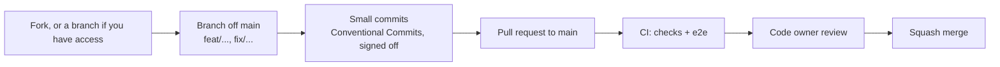

# Contributing to Pulse

Thanks for wanting to help. Pulse is a self-hosted, one-user-per-instance app, and contributions of every
size are welcome: bug reports, docs, fixes, new screens and better algorithms.

## Before you start

- **Licence.** Pulse is source-available under [PolyForm Noncommercial 1.0.0](LICENSE), not an OSI open-source
  licence. By contributing, you agree that your contribution is licensed under the same terms, and that the
  maintainer may relicense the project in the future. Scoring code ported from
  [noop](https://github.com/ryanbr/noop) keeps noop's notice (see [NOTICE](NOTICE)).
- **Talk first for big changes.** Open an issue before a large feature or a change to how a score is
  computed, so we agree on the approach before you write the code.
- **Security issues** go through [SECURITY.md](SECURITY.md), never a public issue.
- Be kind: see the [Code of Conduct](CODE_OF_CONDUCT.md).

## Set up

You need Node 24 and pnpm (the version pinned in `package.json`; `corepack enable` picks it up).

```sh
pnpm install
cp .env.example .env    # demo mode: no Google account needed
pnpm dev                # http://localhost:3000, then "Continue with demo data"
```

Demo mode generates 180 days of realistic data, so every screen works without a Fitbit. To work against
real data, follow [docs/setup.md](docs/setup.md).

## How changes land



`main` is protected: nobody pushes to it directly, not even the maintainer. Every change is a pull request
that passes CI and gets a review, and it lands as one squashed commit.

1. Branch off `main`: `feat/short-name`, `fix/short-name`, `docs/short-name`.
2. Commit in small steps with [Conventional Commits](https://www.conventionalcommits.org/)
   (`feat(journal): ...`, `fix(sync): ...`, `docs: ...`) and sign off each commit with `git commit -s`
   ([Developer Certificate of Origin](https://developercertificate.org/)).
3. Before you push, run:

   ```sh
   pnpm typecheck && pnpm lint && pnpm test
   pnpm e2e   # for UI changes; needs `docker compose -f compose.dev.yaml up -d`, runs its own servers on :3300 and :3301
   ```

   While iterating, `pnpm vitest related <file>` or `pnpm vitest --changed main` runs only the tests your
   change can reach. Unit tests need no Docker: they run on PGlite (Postgres in
   process). The seeded 180-day test database is built once per run and cached in `node_modules/.cache/pulse-test`
   until a source file changes.

4. Open a pull request and fill in the template. CI must be green.

## The rules of the codebase

[AGENTS.md](AGENTS.md) is the guide for both people and coding agents. The short version:

- **Honest states.** Every nullable metric is `{ value, reason, provisional }` with a reason code. Never show a
  made-up number.
- **Causality.** A day's scores depend only on that day and earlier days.
- **UI from the kit.** Screens are built from the shells and kit components with the design tokens in
  `src/app/globals.css`; no new CSS files. Check every UI change at 361 px (a phone) and 1440 px (a laptop),
  in a browser, before you open the pull request: a layout read from the code is a guess. Check touch too (tap,
  drag, scroll) where the change has it. The UI contract is [docs/design/spec.md](docs/design/spec.md).
- **App icons and launch screens are generated.** Edit their sources and run `pnpm pwa:assets`; never edit the
  PNGs in `public/icons` or `public/splash` by hand ([docs/pwa.md](docs/pwa.md#rebrand-it-for-your-fork)).
- **Tests beside the code.** Algorithms get golden-value or property tests; queries get tests on an in-process
  Postgres (`src/server/testing.ts`). Every query is scoped to a user; extend `queries/isolation.test.ts` for new screens.
- **Database changes** go through `pnpm db:generate`; migrations run at boot.

## Privacy and assets

- Use demo data in issues, screenshots and test fixtures. Never commit or post real health data, OAuth
  tokens, `.env` files or databases.
- Never commit third-party screenshots (from any other app). Describe them in words or keep them in the
  gitignored `docs/design/reference/`.
- Fixtures from the Google Health API must be synthetic or scrubbed of anything personal.

## Reporting bugs and ideas

Use the issue templates. A good bug report says what happened, what you expected, how to reproduce it in
demo mode, and which version you run (More › About).
