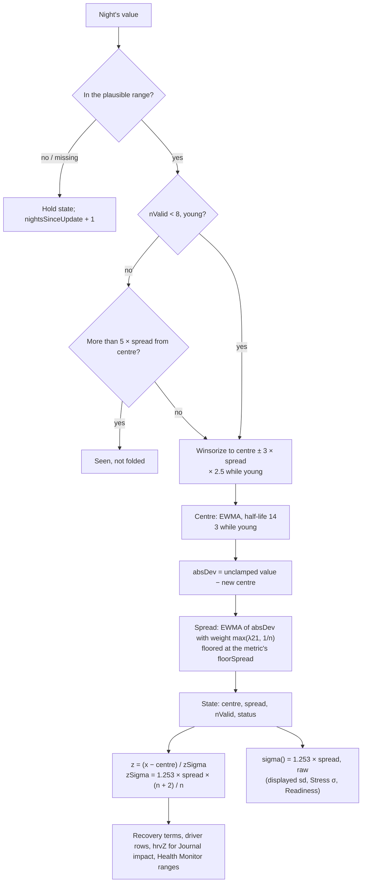

# Personal baselines

Code: `src/core/scoring/baselines.ts`. Tests: `baselines.test.ts`.

Almost every score in Pulse compares a value with *your* normal, not with everyone's. A baseline holds two numbers per
vital:
- the **centre**: what a usual night looks like;
- the **spread**: how much a usual night *wobbles*.

A score then asks "how many usual wobbles from normal is tonight?". This is the **z-score**:

    z = (tonight − centre) / σ,   σ = 1.253 × spread

1.253 = √(π/2) turns a mean absolute deviation into a Gaussian standard deviation.

The fold is a port of noop's `Baselines.kt` (a Winsorized EWMA), with two changes made in `SCORING_VERSION` 9:
- the spread is learned as a **running mean over the first nights** (§ Spread);
- z-scores carry a **short-history shrink** (§ The z shrink).

Both fix the same problem, explained in § Why.

## Flow

## State

| Field | Meaning |
|---|---|
| `baseline` | The centre |
| `spread` | The usual wobble, in mean-absolute-deviation units; σ = 1.253 × spread |
| `nValid` | Accepted nights so far: in range, and not rejected as a hard outlier |
| `nightsSinceUpdate` | Nights since the last accepted or seen value; drives `stale` |
| `status` | `calibrating` < 4 accepted nights; `provisional` 4–13; `trusted` ≥ 14; `stale` if > 14 nights without a value (and ≥ 4 accepted) |

## Formula, one night at a time (`update`)

1. **First value.** The centre is the value. The spread starts at the metric's `floorSpread`, and `nValid` = 1. Until
   a first value arrives, the centre is a placeholder at the middle of the plausible range.
2. **Missing or out-of-range value.** Nothing changes except `nightsSinceUpdate + 1`. Such a night does not count
   towards `nValid`, so it does not advance the running mean in step 6 either.
3. **Hard outlier** (only once settled, `nValid ≥ 8`, and only when rejection is on). A value more than 5 × spread
   from the centre is *seen*: `nightsSinceUpdate` resets to 0. It is not folded, so spread and `nValid` are untouched.
   Readiness re-folds with rejection off.
4. **Winsorize.** Clamp the value to centre ± 3 × spread. While young (`nValid < 8`) the band is 2.5 times wider.
5. **Centre.** centre ← λ_B × clamped + (1 − λ_B) × centre, where λ = 1 − 0.5^(1/half-life). The half-life is 14
   nights, or 3 while young.
6. **Spread** (*changed in version 9*). absDev = |unclamped value − new centre|, and

       w      = max(λ_S, 1 / n)        λ_S = λ(21 nights) ≈ 0.0325,  n = nValid before this night
       spread ← max(floorSpread, w × absDev + (1 − w) × spread)

   - On night 2, w = 1, so the floor seed drops out completely.
   - Up to night 31, w = 1/n, so the spread is the plain average of the deviations seen so far. It is floored on
     every night.
   - From night 31 on, 1/n < λ_S, and it is the same 21-night EWMA as before. The handover is continuous: the weight
     on new nights only falls.

7. **The robust first week** (*since version 32*, only when hard-outlier rejection is on). While young (`nValid ≤ 8`
   after this night), steps 4–6 are replaced by a trimmed estimate over the accepted values so far (kept in `early`):
   - m = their median; MAD = max(median |x − m|, floorSpread ÷ 2);
   - keep the values within 4 × 1.4826 × MAD of m (`earlyTrimSigma`);
   - centre = the mean of the kept values;
   - spread = max(floorSpread, their mean |x − centre| × √(k ÷ (k − 1))) for k kept values. The factor corrects the
     small-sample shortfall of deviations from a sample's own mean.

   From night 9 the EWMA (steps 4–6) and the hard gate continue from that state, and `early` is dropped. Readiness'
   re-fold (rejection off) keeps the plain young regime: it re-folds every day, so the robust phase there would move
   readiness daily for no reason.

`foldHistory(values)` runs `update` over nights oldest first. A day's scores use the state folded from earlier nights
only (AGENTS.md, Causality).

## The z shrink (*new in version 9*)

    zSpread(s) = spread × (n + k) / n          k = zShrinkK = 2,  n = max(nValid, 1)
    zSigma(s)  = 1.253 × zSpread(s)
    z          = (x − centre) / zSigma(s)  =  raw z × n / (n + k)

Widening σ by (n + 2)/n is the same as shrinking z by n/(n + 2):

| Nights | 7 | 10 | 14 | 30 | 60 | 120 |
|---|---|---|---|---|---|---|
| z multiplier | 0.78 | 0.83 | 0.875 | 0.94 | 0.97 | 0.98 |

The multiplier rises a little every night. There is no step when the baseline turns trusted.

**Where it applies**

| Consumer | Uses | Why |
|---|---|---|
| Recovery: HRV, RHR, resp (and effort) terms | `driverBaseline()` → `zSpread` | The score the user sees most |
| Charge driver rows and the saturation check | `driverBaseline(...).spread` in `drivers.ts` | They must agree with the score they explain |
| `hrvZ` stored on Recovery, used by Journal impact | `deviation()` → `zSigma` | Same z as Recovery |
| Health Monitor personal ranges | centre ± 2 × `zSigma` | "Out of range" means \|z\| > 2 on the same scale |

**Where it does not**

| Consumer | Uses | Why |
|---|---|---|
| Readiness HRV and RHR signals | its own raw 1.253 × spread | It re-folds a fixed trailing window of up to 30 rows, so its `nValid` never grows and the shrink would never fade. Readiness still gets the better spread from step 6. |
| Stress | `sigma()` | Its σ maps minute HR onto the 0–3 scale tuned in `stress.md`, and is kept raw for now. Its daytime-HR baseline does get the fix 1 spread, so its σ is no longer pinned near the floor in the first weeks. Adding the shrink here is a possible follow-up. |
| The `sd` shown in a baseline summary (`scores.ts`) | `sigma()` | The honest estimate of your wobble; the shrink is about how sure a single score can be |
| Illness signal | its own 30-row mean and SD | A separate estimator (`illness.ts`) |

## Why

### The problem (verified by simulation of the version 8 code)

Before version 9, the spread started at the floor and moved by a 21-night EWMA. Each night added only about 3 % new
information, so after 7 nights (the first night Recovery is shown) about 80 % of the spread was still the floor. For
anyone whose real wobble is larger than the floor, σ came out too small and every z too big.

The simulation used 3000 simulated users per row, each with Gaussian nights at a fixed true SD. **sd(z)** is the SD of
the next night's z, which should be about 1:

| True wobble | σ / true SD at 7 / 14 / 30 / 60 nights | sd(z) at 7 / 14 / 30 / 60 |
|---|---|---|
| HRV 10 ms | 0.70 / 0.76 / 0.86 / 0.94 | 1.61 / 1.40 / 1.25 / 1.11 |
| HRV 15 ms | 0.52 / 0.60 / 0.76 / 0.90 | 2.15 / 1.83 / 1.42 / 1.16 |
| RHR 4 bpm | 0.70 / 0.76 / 0.86 / 0.94 | 1.59 / 1.40 / 1.24 / 1.12 |
| HRV 4–6 ms (at or under the floor) | 1.1–1.6, the floor dominates | ≤ 1.0 |

So a new user with a lively HRV saw ordinary nights scored as 1.6–2× more unusual than they were, for the first one
to two months. That is exactly when first impressions form. Recovery swung red ↔ green, the Health Monitor ranges
were too tight, and the Journal compared over-sized HRV z-scores. Users whose wobble sits at or under the floor were
not affected.

### Fix 1: learn the spread from the nights you have

A running mean of the absolute deviations is the natural estimate when there are only a few nights. It needs no
stored history, because 1/n is enough. That matters because the pipeline folds one night at a time
(`stage2.ts`) and the state holds no raw values. Three options were simulated (HRV, true SD 10 ms):

| Option | σ / true at 7 / 14 / 30 nights | sd(z) at 7 |
|---|---|---|
| **Running mean, weight max(λ21, 1/n): chosen** | **1.02 / 1.01 / 1.01** | 1.20 |
| Seed from the first 4 nights' mean abs deviation, then EWMA-21 | 0.93 / 0.95 / 0.97 | 1.34 |
| Spread half-life 5 while n < 14, then 21 | 0.84 / 0.95 / 0.97 | 1.39 |

The running mean is unbiased from the start. It needs no buffer and no new constant, and it hands over to the
existing EWMA by itself.

### Fix 2: be more cautious while the history is short

Even a perfect estimator is noisy at 7 nights: both the centre and σ come from 7 values. With fix 1 alone, sd(z) is
still about 1.20 at night 7 and 1.12 at night 14. Shrinking z by n/(n + k) corrects for that. It is cheap, monotone,
and fades by itself.

**Why k = 2.** sd(z) with the shrink, using the version 9 code (3000 runs):

| True wobble | 7 nights | 14 | 30 | 60 |
|---|---|---|---|---|
| HRV 10 ms | 0.93 | 0.98 | 1.00 | 1.02 |
| HRV 15 ms | 1.02 | 1.02 | 1.01 | 1.02 |
| RHR 4 bpm | 0.94 | 0.98 | 1.00 | 1.04 |

To bring sd(z) back to 1 at 7–30 nights, k has to be about 1.5–2. The k = 4 first proposed gave 0.77 at night 7, so
early Recovery would sit near the middle whatever happened.

**Why not "only while provisional".** Stopping the shrink at 14 nights would change every z by 14 % overnight on
night 14 (a factor of 0.875 → 1). A continuous n/(n + k) has no such step.

### What it does to the demo data

On the 180-day seed:
- Strain and Sleep are unchanged.
- Recovery's mean day-to-day swing in the first three weeks drops from 23.4 to 17.7 points.
- Weeks 4–9 move 26.2 → 23.8.
- After about day 67, Recovery is within 0.4 points of before on average.
- Recovery bands (green / yellow / red) go from 62 / 80 / 28 to 61 / 85 / 24.

## Why version 35: the sleeping heart rate gets its own baseline

**What changed.** Google's `daily-heart-rate-variability` carries Fitbit's **non-REM heart rate**
(`nonRemHeartRateBeatsPerMinute`): the night's heart rate over light and deep sleep. On the owner's first seven Fitbit
nights it read **60–66 bpm**, while Google's daily resting HR read **67–71**. Google's value blends awake data and
on one night (Oct 3) was computed from awake data only (77 bpm). Recovery, readiness, the Health Monitor and the illness
signal now score the sleeping HR. Strain's zones and Pulse Age keep Google's daily value: zones then match Fitbit's,
and Pulse Age's population curves are on awake resting HR.

**Why it never shares a baseline.** The two series sit about 6 bpm apart. Fold them into one baseline and the night the
sleeping HR first arrives reads as a 6 bpm drop: a falsely great Recovery for days, the device-seam problem again.
So each has its own baseline, folded every night it has a value:
- `rhrB` with Google's daily value (else Pulse's session estimate);
- `sleepHrB` with the non-REM HR.

**The rule** (`restingPair`, `src/server/pipeline/scores.ts`):
- **Use the sleeping HR against `sleepHrB`** when the night has one and `sleepHrB` is **trusted** (14 nights). It is
  also used as soon as it is usable (4 nights) if `rhrB` isn't usable either, as on a new Fitbit-only account.
- **Otherwise use Google's daily value against `rhrB`**, as before.

A young sleeping-HR baseline doesn't take over from an established daily one: its first-week spread is wide, so for two
weeks its z would be noisier than the one it replaces. Readiness and the Health Monitor fold their own histories, and they
take the same series the night uses: the `sleepHr` column, or the daily one, never a mix. Google's resting-HR range (only
in the demo; real accounts never get one) is dropped when the Monitor shows the sleeping HR, since it describes the
daily value.

**How it was tested.** `restingPair.test.ts` simulates 60 people:
- 90 nights of Google's daily resting HR only (a phone, or an older band);
- then a Fitbit also reporting a non-REM HR 5–7 bpm lower;
- night-to-night noise like the owner's (SD 1.4–2 bpm).

| Mean \|z\| | Rule (separate baselines) | One mixed baseline |
|---|---|---|
| Two weeks after the switch | **0.46** | 1.45 |
| First three switch nights (signed mean z) | **+0.03** | **−2.05** (a falsely low resting HR) |
| Weeks later, settled on the sleeping HR | 0.63 | — |

**On the seed** (`GOLDEN[35]`, the parity snapshot):
- Recovery moved by 1.35 points on average (at most 4.8), with a mean change of +0.03.
- The green / yellow / red days are unchanged (53 / 93 / 24).
- Strain and sleep are byte-identical.

**On the owner's data** (a local copy, after a sync with version 35): the non-REM HR is present on every Fitbit night
from Oct 4. Recovery keeps Google's daily value until the sleeping-HR baseline is trusted (night 14).

## Why version 33: a large real step locked the baseline for good

**The mechanism.** Past its first week a baseline rejects any value more than 5 spreads from its centre
(`hardOutlierK`). That gate is about ±33 ms for HRV and about ±10 bpm for a resting HR whose spread sits near its
2 bpm floor. After a real step bigger than the gate, almost every night is rejected, so nothing is learned. A
rejected night still resets `nightsSinceUpdate`, so the baseline never turns stale either. Recovery and the Health
Monitor stayed pinned to the old normal for good. Steps near the gate weren't locked but crept: the nights that
happened to fall inside slowly pulled the centre across over 1–2 months.

**How it was tested.** The real `update()` and `deviation()`; 60 simulated people per case, 90 normal nights, then a
lasting step. The measure: nights after the step until a week's median |z| is at most 1.

| Lasting step | Version 32 | Restart after 5 | **after 7** | after 10 |
|---|---|---|---|---|
| HRV +60 ms (a new device) | **never** | 10 | **12** | 15 |
| Resting HR −18 bpm (a beta-blocker) | **never** | 10 | **12** | 15 |
| HRV +45 ms | 52 | 11 | **13** | 18 |
| Resting HR −14 bpm | 34 | 11 | **14** | 25 |
| Steps inside the gate (HRV −30, resting HR +12) | 22–26 | unchanged | **unchanged** | unchanged |

**False restarts** (no real step), per person-year:
- heavy-tailed noise, t(3), for HRV and resting HR: 0 at any N;
- a severe 10-night illness (resting HR +12) folded every night: 0.35 / **0.15** / 0.03 at N = 5 / 7 / 10.

**Why 7 everywhere (the owner's choice).**
- In Recovery, the version 30 illness hold skips those nights before they reach `update`, so an illness doesn't
  count toward a restart.
- The Health Monitor folds every night, so a severe illness can restart its ranges in about 15 % of cases. Its
  ranges then widen as a young baseline's do.
- A separate N of 10 for the Monitor was weighed against one simpler rule.

**Why staleness is unchanged.** A rejected night still counts as seen. The restart releases a lock within about
2 weeks, and "stale" keeps meaning "no data", not "data far from normal".

**On the seed** nothing restarts (no lasting step), so only the version stamp moved.

**End to end on a copy of the seed** (a test), resting HR is 18 bpm lower from day 120, and Google's resting-HR
ranges are cleared so the Monitor uses Pulse's own:
- two weeks later Recovery's resting-HR baseline is within 3 bpm of the new level;
- the Monitor's range holds the new values;
- with the restart disabled the baseline stayed at the old level (56.4 bpm).

## Why version 32: one early glitch muted Recovery for weeks

**The problem.** While young (the first 8 accepted nights):
- the centre adapted fast;
- the spread was the plain running mean of each night's absolute deviation from the **raw** value;
- the hard-outlier gate was off.

So one wild but in-range value early on (a loose band, a fever on night 2) inflated the spread, and every later z
was shrunk for weeks: Recovery sat mid-scale with no reds and few greens through a new user's first month or two. A
glitch on night 1 became the seed itself.

**How it was tested.** The real `update()` and `deviation()`; 500 simulated people per row. sd(z) over nights
7–14 / 15–30 / 31–60 should be about 1 (about 0.47 for a low-HRV user sitting on the spread floor, as before):

| Case | Version 31 | **Version 32** |
|---|---|---|
| HRV 50 ± 8, no glitch | 0.89 / 0.94 / 0.99 | 0.90 / 0.95 / 0.99 |
| HRV 40 ± 14 (a large wobble) | 1.01 / 0.98 / 1.01 | 1.03 / 1.00 / 1.00 |
| HRV night 3 = 130 / 180 ms | 0.38 / 0.28 (nights 7–14) | **0.91 / 0.91** |
| HRV night 3 = 90 ms, or an 8 ms dropout | 0.58 / 0.57 | **0.86 / 0.85** (near the trim edge, sometimes kept; mean z ±0.10) |
| HRV night 1 = 150 ms (the seed itself) | **0.13** / 0.22 / 0.38 | **0.90 / 0.94 / 0.99** |
| HRV night 6 = 150 ms | 0.34 / 0.53 / 0.73 | 0.90 / 0.94 / 0.99 |
| Resting HR 55 ± 2.5, night 3 = 90 bpm | 0.31 / 0.52 / 0.72 | 0.80 / 0.86 / 0.92 |
| Resting HR 60 ± 5 | 1.00 / 1.00 / 1.01 | 1.02 / 1.00 / 1.01 |

**Options tested:**
- **Capping only the spread's deviation** (at 3 × the young spread, or 3 × the spread) helped by about half (0.48–0.66
  in nights 7–14 after a 180 ms glitch). The glitch still dragged the fast-adapting young centre, and a night-1
  glitch is the seed itself.
- **A trimmed estimate over the first week fixes both.** 4σ rather than 3σ, so a large real wobble keeps its tails
  (3σ read it 16 % wide in nights 7–14).

**The small-sample correction.** Without it the robust spread under-read σ by about 12 % at night 7 (the existing
"σ within 10 % of the truth" test failed). With it σ is within 10 % at nights 7, 14, 30 and 60. For a large wobble
the next night's z has an sd of 1.11 at night 7, a little noisier than version 31's 1.06, because σ now comes from 7
values; the test's bound for night 7 is 1.15.

**The illness hold waits for a mature baseline.** The tighter first week let two low first-week nights in the seed
read as an illness-ward run, which held night 7 and delayed the first Recovery to day 9. So `illnessWardZ` needs both
baselines past their first 8 nights.

**On the seed** (no early glitch) Recovery moves by at most 0.41 points in days 7–29 and about 0.01 after day 60.
Strain and sleep are unchanged, and the same three illness nights are held. Stress and the Health Monitor move
slightly through their baselines' first weeks. Parity is re-recorded.

**End to end on a copy of the seed** (a test), night 3's HRV is set to 180 ms. Recovery's HRV z over days 8–30
keeps more than 85 % of the seed's spread; with the robust week bypassed it kept 48 %.

## Why version 30: an illness was absorbed into "normal"

**The problem.** Every night was folded into Recovery's baselines (14-night half-life), and only values more than
5 spreads away were rejected. So an illness became part of "normal":
- it faded from red as it went on (96 % red over 5 nights, 71 % over 21);
- the week after read unusually well recovered: **51 / 62 / 82 % green** after a 5 / 10 / 21-night illness, against
  32 % before.

That invites hard training straight after being sick.

**How it was tested.** The audit's pipeline mirror (score with the prior baselines, then fold), with switchable
fold policies; its "version 29" mode matched the original on every night. The setup:
- 100 people per case;
- illness: HRV −30 %, resting HR +7, respiration +1.5, skin +0.6 °C, sleep −8 points;
- "mild" is half that;
- a training block: HRV −12 %, resting HR +3;
- a lasting real drop (a medicine, altitude): HRV −22 %, resting HR +4, from night 100 on.

| | Version 29 | **Version 30** |
|---|---|---|
| Healthy: mean / % green / % red | 56.0 / 33 / 18 | 55.5 / 33 / 19 |
| Week after a 5 / 10 / 21-night illness, % green (32 before) | 51 / 62 / 82 | **36 / 37 / 41** |
| During a 21-night illness, % red | 71 | 95 |
| Week after a mild 10-night illness, % green | 48 | 41 |
| Week after a 21-night training block, mean | 66.1 | 63.4 |
| Lasting drop: mean in weeks 5–6 / 8–9 / 12–13 (55 before) | 50.1 / 54.3 / 54.8 | 43.1 / 50.2 / 52.9 |

**Options rejected:**
- **Holding any single night with zc ≥ 1:** ordinary low nights get dropped, so a healthy person reads lower
  (mean 56 → 50.4).
- **A slower half-life (28):** still 64 % green after a 21-night illness, and real changes adapt slower.
- **Folding illness-ward nights at a quarter weight:** worse on both counts.
- **A 14-night cap:** let the end of a 21-night illness back in (53 % green after).
- **zc ≥ 1.25:** weaker (47 % after 21 nights).
- **A one-night delay, to also hold a run's first night:** 2–4 points better, for a baseline that lags a night.

**The cost.** A lasting real drop takes about two weeks longer to be absorbed. The 21-night cap bounds that.

**On the seed** its 7-night illness holds 3 nights. The week after averages 60.2 instead of 63.0 (the same 2 green
days), fading to under 1 point within a month. Strain and sleep are unchanged; Recovery's consumers (Strain Target,
the Energy Bank, journal impact, reports) move with it.

## Constants

| Constant | Value | Kind |
|---|---|---|
| `winsorK` | 3 | noop |
| `hardOutlierK` | 5 | noop |
| `minNightsSeed` / `minNightsTrust` / `staleDays` | 4 / 14 / 14 | noop |
| `earlyAdaptNights` / `earlyHalfLifeB` / `earlySpreadInflate` | 8 / 3 / 2.5 | noop |
| `halfLifeB` / `halfLifeS` | 14 / 21 nights | noop |
| Spread weight | max(λ(21), 1/n) | Pulse, version 9 (was λ(21)) |
| `zShrinkK` | 2 | Pulse, version 9: calibrated by simulation (§ Why) |
| Floor spreads | HRV 5 ms, RHR 2 bpm, resp 0.5, skin temp 0.3 °C, daytime HR 3 bpm, Effort 5 | noop `metricCfg` |

## Worked example

An HRV baseline after 7 nights of 50, 62, 44, 58, 47, 55, 41 ms (sample SD 7.66 ms):

| Night | Value | Centre | Spread v8 | Spread v9 |
|---|---|---|---|---|
| 1 | 50 | 50.00 | 5.00 | 5.00 (floor seed) |
| 2 | 62 | 52.48 | 5.15 | 9.52 (night 2's deviation alone) |
| 3 | 44 | 50.73 | 5.20 | 8.13 |
| 4 | 58 | 52.23 | 5.22 | 7.34 |
| 5 | 47 | 51.15 | 5.18 | 6.54 |
| 6 | 55 | 51.94 | 5.11 | 5.85 |
| 7 | 41 | 49.69 | 5.23 | 6.32 |

- Version 8: σ = 6.55 ms, so a night at 40 ms reads z = −1.48.
- Version 9: σ = 7.92 ms, close to the 7.66 ms sample SD, so the raw z = −1.22. With the shrink (× 7/9), z = **−0.95**.
- A night at 60 ms reads +1.57 in version 8 and **+1.01** in version 9.
- *Version 32* (the robust first week): after the 7 nights the centre is their mean, 51.00, and the spread
  6.79 (nothing is trimmed), so σ = 8.51 ms. A night at 40 ms reads a raw z of −1.29, **−1.01** with the shrink; at
  60 ms **+0.82**. Night by night the centre runs 50, 56, 52, 53.5, 52.2, 52.67, 51.

## Edge rules

- **Below the floor.** A user whose real wobble is under the floor still gets σ at the floor (a test). Their z-scores
  are *smaller* than the truth. This is a separate question of tuning the floors, and is not changed here. The
  effect is large for low HRV, common in older adults. The SD of nightly HRV z over nights 60–120 (40 simulated
  people each, log-normal nights) is:

  | HRV, night-to-night CV | 20 ms, 12% | 25 ms, 15% | 30 ms, 18% | 50 or 70 ms, 18% |
  |---|---|---|---|---|
  | SD of z | 0.39 | 0.60 | 0.86 | 1.05 |

  So a low-HRV user's Recovery moves about half as much as a typical user's for the same relative change.
- **Rejected outliers and gaps** never advance the running-mean count (tests).
- **A glitch in the first week** (*since version 32*) is trimmed out of the robust first-week estimate if it's more
  than 4σ (by MAD) from the median of the early values. Nearer than that it is kept, at a smaller cost.
- **Held nights** (*since version 30*, `nextHold`, `illnessHold`). Recovery's four baselines (HRV, resting HR,
  respiration, skin temperature) and its sleep centre skip a night that continues a run of **illness-ward** nights:
  - a night is illness-ward when zc = (−z_HRV + z_RHR) ÷ 2, against the prior baselines, is at least 1.0;
  - from the second night of a run on, the night is held: the state stays exactly as it was, staleness included;
  - at most 21 nights in a row are held, so a lasting change is still absorbed after that;
  - a night under 1.0, or one that can't be measured (no HRV or RHR, or a baseline not yet usable or, since version
    32, still in its first 8 nights), ends the run;
  - the Recovery row's `heldBaseline` says whether that night was held.
- **A rejected outlier counts as "seen" for staleness.** It resets `nightsSinceUpdate` to 0 (`update`), just as an
  accepted night does; gaps and out-of-range values advance it. So a baseline that keeps rejecting nights never turns
  stale; the restart rule below releases it instead.
- **A run of hard rejections restarts the baseline** (*since version 33*, `restartAfterRejections` = 7). Rejected
  values are kept in `rejected` while they fall on the same side of the centre:
  - an accepted value clears the run; a rejection on the other side starts a new one;
  - missing or out-of-range nights leave it as it is (a device change often comes with gaps);
  - at 7, the baseline is replaced by `foldHistory` of those 7 values: a fresh baseline through the robust first week
    (nValid 7, provisional).

  A large real step (a new device, a medicine, a move to altitude) is followed in about 2 weeks instead of never. The
  re-fold mode (Readiness) never restarts.
- **A constant history** stays on the floor, and z stays finite.
- **`zSpread` with `nValid` 0** uses n = 1, so it is finite. No consumer scores an unusable baseline anyway.

## Tests (`baselines.test.ts`)

- **Hand folds:**
  - the floor seed drops out on night 2;
  - the spread equals the plain mean of the first nights' deviations;
  - the floor binds on each night;
  - the 1/30 vs 1/31 handover to λ(21) is exact.
- **State handling:** gaps and out-of-range values hold the state; rejected outliers leave spread and count untouched.
- **Seeded simulation:**
  - σ after 7 nights in [8.5, 11.5] for a true HRV SD of 10 ms;
  - σ within 10 % of the truth at 7, 14, 30 and 60 nights for HRV 10 ms, HRV 15 ms and RHR 4 bpm;
  - sd(z) in (0.85, 1.1) with the shrink, and below the unshrunk sd(z);
  - a low-wobble user stays on the floor.
- **The shrink:**
  - the formula at several n, and the documented multipliers;
  - it rises strictly every night, with no step at night 14, and tends to 1;
  - `sigma()` stays raw;
  - `deviation()` shrinks z but not delta or ratio.
- **Downstream:**
  - `recovery.test.ts`: `driverBaseline`, the composite and the logistic inversion.
  - `drivers.test.ts`: the saturation check uses the shrunk z, and the driver points shrink.
  - `healthMonitor.test.ts`: the range is ± 2 × `zSigma`, and a widened early range is not flagged.
  - `readiness.test.ts`: Readiness learns the window's spread and has no shrink.

## Sources

- noop (`ryanbr/noop`), `Baselines.kt`: the Winsorized EWMA, floors, young regime and hard outliers.
- √(π/2) = 1.253: the Gaussian ratio of SD to mean absolute deviation.
- The n/(n + k) shrink is a simple stand-in for the extra uncertainty of a short sample (compare a Student-t
  predictive interval). k was fitted by the simulation above, not taken from a paper.
