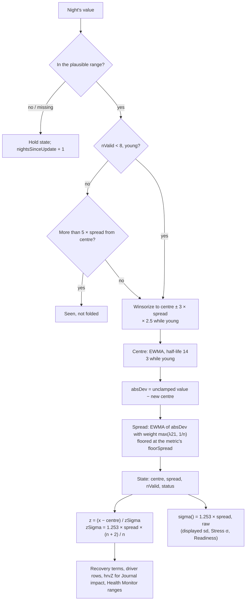

# Personal baselines

Code: `src/core/scoring/baselines.ts`. Tests: `baselines.test.ts`.

Almost every score in Pulse compares a value with *your* normal, not with everyone's. A baseline holds two numbers per
vital:
- the **centre**: what a usual night looks like;
- the **spread**: how much a usual night *wobbles*.

A score then asks "how many usual wobbles from normal is tonight?". This is the **z-score**:

    z = (tonight − centre) / σ,   σ = 1.253 × spread

1.253 = √(π/2) turns a mean absolute deviation into a Gaussian standard deviation.

The fold is a port of noop's `Baselines.kt` (a Winsorized EWMA), with two changes made in `SCORING_VERSION` 9:
- the spread is learned as a **running mean over the first nights** (§ Spread);
- z-scores carry a **short-history shrink** (§ The z shrink).

Both fix the same problem, explained in § Why.

## Flow

## State

| Field | Meaning |
|---|---|
| `baseline` | The centre |
| `spread` | The usual wobble, in mean-absolute-deviation units; σ = 1.253 × spread |
| `nValid` | Accepted nights so far: in range, and not rejected as a hard outlier |
| `nightsSinceUpdate` | Nights since the last accepted or seen value; drives `stale` |
| `status` | `calibrating` < 4 accepted nights; `provisional` 4–13; `trusted` ≥ 14; `stale` if > 14 nights without a value (and ≥ 4 accepted) |

## Formula, one night at a time (`update`)

1. **First value.** The centre is the value. The spread starts at the metric's `floorSpread`, and `nValid` = 1. Until
   a first value arrives, the centre is a placeholder at the middle of the plausible range.
2. **Missing or out-of-range value.** Nothing changes except `nightsSinceUpdate + 1`. Such a night does not count
   towards `nValid`, so it does not advance the running mean in step 6 either.
3. **Hard outlier** (only once settled, `nValid ≥ 8`, and only when rejection is on). A value more than 5 × spread
   from the centre is *seen*: `nightsSinceUpdate` resets to 0. It is not folded, so spread and `nValid` are untouched.
   Readiness re-folds with rejection off.
4. **Winsorize.** Clamp the value to centre ± 3 × spread. While young (`nValid < 8`) the band is 2.5 times wider.
5. **Centre.** centre ← λ_B × clamped + (1 − λ_B) × centre, where λ = 1 − 0.5^(1/half-life). The half-life is 14
   nights, or 3 while young.
6. **Spread** (*changed in version 9*). absDev = |unclamped value − new centre|, and

       w      = max(λ_S, 1 / n)        λ_S = λ(21 nights) ≈ 0.0325,  n = nValid before this night
       spread ← max(floorSpread, w × absDev + (1 − w) × spread)

   - On night 2, w = 1, so the floor seed drops out completely.
   - Up to night 31, w = 1/n, so the spread is the plain average of the deviations seen so far. It is floored on
     every night.
   - From night 31 on, 1/n < λ_S, and it is the same 21-night EWMA as before. The handover is continuous: the weight
     on new nights only falls.

`foldHistory(values)` runs `update` over nights oldest first. A day's scores use the state folded from earlier nights
only (AGENTS.md, Causality).

## The z shrink (*new in version 9*)

    zSpread(s) = spread × (n + k) / n          k = zShrinkK = 2,  n = max(nValid, 1)
    zSigma(s)  = 1.253 × zSpread(s)
    z          = (x − centre) / zSigma(s)  =  raw z × n / (n + k)

Widening σ by (n + 2)/n is the same as shrinking z by n/(n + 2):

| Nights | 7 | 10 | 14 | 30 | 60 | 120 |
|---|---|---|---|---|---|---|
| z multiplier | 0.78 | 0.83 | 0.875 | 0.94 | 0.97 | 0.98 |

The multiplier rises a little every night. There is no step when the baseline turns trusted.

**Where it applies**

| Consumer | Uses | Why |
|---|---|---|
| Recovery: HRV, RHR, resp (and effort) terms | `driverBaseline()` → `zSpread` | The score the user sees most |
| Charge driver rows and the saturation check | `driverBaseline(...).spread` in `drivers.ts` | They must agree with the score they explain |
| `hrvZ` stored on Recovery, used by Journal impact | `deviation()` → `zSigma` | Same z as Recovery |
| Health Monitor personal ranges | centre ± 2 × `zSigma` | "Out of range" means \|z\| > 2 on the same scale |

**Where it does not**

| Consumer | Uses | Why |
|---|---|---|
| Readiness HRV and RHR signals | its own raw 1.253 × spread | It re-folds a fixed trailing window of up to 30 rows, so its `nValid` never grows and the shrink would never fade. Readiness still gets the better spread from step 6. |
| Stress | `sigma()` | Its σ maps minute HR onto the 0–3 scale tuned in `stress.md`, and is kept raw for now. Its daytime-HR baseline does get the fix 1 spread, so its σ is no longer pinned near the floor in the first weeks. Adding the shrink here is a possible follow-up. |
| The `sd` shown in a baseline summary (`scores.ts`) | `sigma()` | The honest estimate of your wobble; the shrink is about how sure a single score can be |
| Illness signal | its own 30-row mean and SD | A separate estimator (`illness.ts`) |

## Why

### The problem (verified by simulation of the version 8 code)

Before version 9, the spread started at the floor and moved by a 21-night EWMA. Each night added only about 3 % new
information, so after 7 nights (the first night Recovery is shown) about 80 % of the spread was still the floor. For
anyone whose real wobble is larger than the floor, σ came out too small and every z too big.

The simulation used 3000 simulated users per row, each with Gaussian nights at a fixed true SD. **sd(z)** is the SD of
the next night's z, which should be about 1:

| True wobble | σ / true SD at 7 / 14 / 30 / 60 nights | sd(z) at 7 / 14 / 30 / 60 |
|---|---|---|
| HRV 10 ms | 0.70 / 0.76 / 0.86 / 0.94 | 1.61 / 1.40 / 1.25 / 1.11 |
| HRV 15 ms | 0.52 / 0.60 / 0.76 / 0.90 | 2.15 / 1.83 / 1.42 / 1.16 |
| RHR 4 bpm | 0.70 / 0.76 / 0.86 / 0.94 | 1.59 / 1.40 / 1.24 / 1.12 |
| HRV 4–6 ms (at or under the floor) | 1.1–1.6, the floor dominates | ≤ 1.0 |

So a new user with a lively HRV saw ordinary nights scored as 1.6–2× more unusual than they were, for the first one
to two months. That is exactly when first impressions form. Recovery swung red ↔ green, the Health Monitor ranges
were too tight, and the Journal compared over-sized HRV z-scores. Users whose wobble sits at or under the floor were
not affected.

### Fix 1: learn the spread from the nights you have

A running mean of the absolute deviations is the natural estimate when there are only a few nights. It needs no
stored history, because 1/n is enough. That matters because the pipeline folds one night at a time
(`stage2.ts`) and the state holds no raw values. Three options were simulated (HRV, true SD 10 ms):

| Option | σ / true at 7 / 14 / 30 nights | sd(z) at 7 |
|---|---|---|
| **Running mean, weight max(λ21, 1/n): chosen** | **1.02 / 1.01 / 1.01** | 1.20 |
| Seed from the first 4 nights' mean abs deviation, then EWMA-21 | 0.93 / 0.95 / 0.97 | 1.34 |
| Spread half-life 5 while n < 14, then 21 | 0.84 / 0.95 / 0.97 | 1.39 |

The running mean is unbiased from the start. It needs no buffer and no new constant, and it hands over to the
existing EWMA by itself.

### Fix 2: be more cautious while the history is short

Even a perfect estimator is noisy at 7 nights: both the centre and σ come from 7 values. With fix 1 alone, sd(z) is
still about 1.20 at night 7 and 1.12 at night 14. Shrinking z by n/(n + k) corrects for that. It is cheap, monotone,
and fades by itself.

**Why k = 2.** sd(z) with the shrink, using the version 9 code (3000 runs):

| True wobble | 7 nights | 14 | 30 | 60 |
|---|---|---|---|---|
| HRV 10 ms | 0.93 | 0.98 | 1.00 | 1.02 |
| HRV 15 ms | 1.02 | 1.02 | 1.01 | 1.02 |
| RHR 4 bpm | 0.94 | 0.98 | 1.00 | 1.04 |

To bring sd(z) back to 1 at 7–30 nights, k has to be about 1.5–2. The k = 4 first proposed gave 0.77 at night 7, so
early Recovery would sit near the middle whatever happened.

**Why not "only while provisional".** Stopping the shrink at 14 nights would change every z by 14 % overnight on
night 14 (a factor of 0.875 → 1). A continuous n/(n + k) has no such step.

### What it does to the demo data

On the 180-day seed:
- Strain and Sleep are unchanged.
- Recovery's mean day-to-day swing in the first three weeks drops from 23.4 to 17.7 points.
- Weeks 4–9 move 26.2 → 23.8.
- After about day 67, Recovery is within 0.4 points of before on average.
- Recovery bands (green / yellow / red) go from 62 / 80 / 28 to 61 / 85 / 24.

## Constants

| Constant | Value | Kind |
|---|---|---|
| `winsorK` | 3 | noop |
| `hardOutlierK` | 5 | noop |
| `minNightsSeed` / `minNightsTrust` / `staleDays` | 4 / 14 / 14 | noop |
| `earlyAdaptNights` / `earlyHalfLifeB` / `earlySpreadInflate` | 8 / 3 / 2.5 | noop |
| `halfLifeB` / `halfLifeS` | 14 / 21 nights | noop |
| Spread weight | max(λ(21), 1/n) | Pulse, version 9 (was λ(21)) |
| `zShrinkK` | 2 | Pulse, version 9: calibrated by simulation (§ Why) |
| Floor spreads | HRV 5 ms, RHR 2 bpm, resp 0.5, skin temp 0.3 °C, daytime HR 3 bpm, Effort 5 | noop `metricCfg` |

## Worked example

An HRV baseline after 7 nights of 50, 62, 44, 58, 47, 55, 41 ms (sample SD 7.66 ms):

| Night | Value | Centre | Spread v8 | Spread v9 |
|---|---|---|---|---|
| 1 | 50 | 50.00 | 5.00 | 5.00 (floor seed) |
| 2 | 62 | 52.48 | 5.15 | 9.52 (night 2's deviation alone) |
| 3 | 44 | 50.73 | 5.20 | 8.13 |
| 4 | 58 | 52.23 | 5.22 | 7.34 |
| 5 | 47 | 51.15 | 5.18 | 6.54 |
| 6 | 55 | 51.94 | 5.11 | 5.85 |
| 7 | 41 | 49.69 | 5.23 | 6.32 |

- Version 8: σ = 6.55 ms, so a night at 40 ms reads z = −1.48.
- Version 9: σ = 7.92 ms, close to the 7.66 ms sample SD, so the raw z = −1.22. With the shrink (× 7/9), z = **−0.95**.
- A night at 60 ms reads +1.57 in version 8 and **+1.01** in version 9.

## Edge rules

- **Below the floor.** A user whose real wobble is under the floor still gets σ at the floor (a test). Their z-scores
  are *smaller* than the truth. This is a separate question of tuning the floors, and is not changed here.
- **Rejected outliers and gaps** never advance the running-mean count (tests).
- **A constant history** stays on the floor, and z stays finite.
- **`zSpread` with `nValid` 0** uses n = 1, so it is finite. No consumer scores an unusable baseline anyway.

## Tests (`baselines.test.ts`)

- **Hand folds:**
  - the floor seed drops out on night 2;
  - the spread equals the plain mean of the first nights' deviations;
  - the floor binds on each night;
  - the 1/30 vs 1/31 handover to λ(21) is exact.
- **State handling:** gaps and out-of-range values hold the state; rejected outliers leave spread and count untouched.
- **Seeded simulation:**
  - σ after 7 nights in [8.5, 11.5] for a true HRV SD of 10 ms;
  - σ within 10 % of the truth at 7, 14, 30 and 60 nights for HRV 10 ms, HRV 15 ms and RHR 4 bpm;
  - sd(z) in (0.85, 1.1) with the shrink, and below the unshrunk sd(z);
  - a low-wobble user stays on the floor.
- **The shrink:**
  - the formula at several n, and the documented multipliers;
  - it rises strictly every night, with no step at night 14, and tends to 1;
  - `sigma()` stays raw;
  - `deviation()` shrinks z but not delta or ratio.
- **Downstream:**
  - `recovery.test.ts`: `driverBaseline`, the composite and the logistic inversion.
  - `drivers.test.ts`: the saturation check uses the shrunk z, and the driver points shrink.
  - `healthMonitor.test.ts`: the range is ± 2 × `zSigma`, and a widened early range is not flagged.
  - `readiness.test.ts`: Readiness learns the window's spread and has no shrink.

## Sources

- noop (`ryanbr/noop`), `Baselines.kt`: the Winsorized EWMA, floors, young regime and hard outliers.
- √(π/2) = 1.253: the Gaussian ratio of SD to mean absolute deviation.
- The n/(n + k) shrink is a simple stand-in for the extra uncertainty of a short sample (compare a Student-t
  predictive interval). k was fitted by the simulation above, not taken from a paper.
