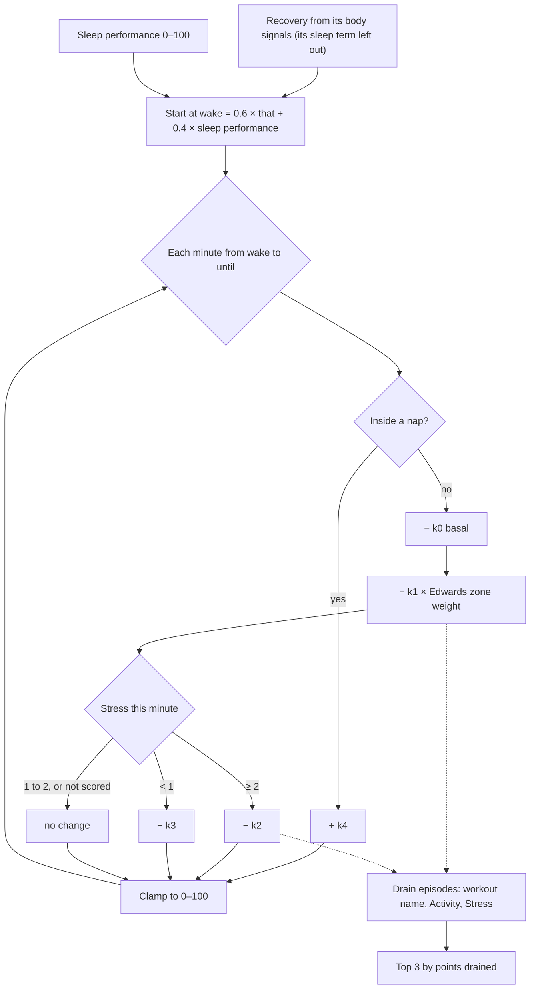

# Energy Bank

Code:
- `src/core/algorithms/energyBank.ts`;
- the start's input `recovery.withoutSleep` in `src/server/pipeline/scores.ts` (`scoreRecovery`).

Tests:
- `energyBank.test.ts`;
- "the Energy Bank counts last night's sleep once" in `pipeline.test.ts`.

The Energy Bank is a 0–100 reserve for the waking day. It starts at wake from how well your body recovered and how
well you slept, counting the sleep once. Time awake, heart-rate load and high stress spend it. Calm, still minutes and naps put a little back. The output is the intraday curve, the current value and the three biggest drains.

It is a heuristic with no published model behind it: the shape follows another app's Energy Bank, and the constants are tuned against the seed so that a typical day ends between 15 and 40.

## Flow

## Formula

1. **Start** (*scoring version 20*). E₀ = clamp(0.6 · R_body + 0.4 · sleep performance, 0, 100) at the minute of wake,
   which is the main sleep's end (`energyStart`).
   - **R_body** is today's Recovery computed without its own sleep term: `recovery()` with no `sleepPerf`. The
     remaining terms (HRV, resting HR, breathing, skin temperature) renormalise, as for any night with a missing
     input. The pipeline stores it as `recovery.withoutSleep`.
   - On a night without sleep data it equals Recovery.
   - Before version 20, E₀ used the shown Recovery, so last night's sleep counted twice (see "Why version 20").
2. **Each minute** *m* from wake until `until`:
   - **Inside a nap:** E += k₄. Nothing else applies.
   - **Otherwise:**
     - E −= k₀, the basal drain of being awake.
     - E −= k₁ × w(m), where w(m) is the Edwards zone weight, 0–5, of the minute's mean HR (`strain.zoneWeight`, by Karvonen %HRR).
     - If the minute's stress is ≥ 2, E −= k₂. If it is < 1 (calm and still), E += k₃. Medium stress and unscored minutes change nothing.
     - Since stress scoring version 13 ([stress](stress.md)), a "high" minute must be part of 2 or more in a row and is judged against your usual still level, so calm days drain less. In simulation, a calm desk day with everyday heart-rate changes ended at 30 instead of 25 (no stress drain at all: 36); on the demo data 96 of 170 days end inside 15–40.
   - Clamp E to [0, 100].
3. **Curve.** `curve[m]` is E at the end of minute *m*, and is `null` before wake and from `until` on. `current` is the last computed level.
4. **Drains.** Every k₁ or k₂ deduction is attributed to an episode:
   - HR load inside a workout goes to that workout's label, for example "Tempo run";
   - other HR load goes to "Activity";
   - high stress goes to "Stress".

   Minutes with the same label join one episode when the gap between them is at most 5 minutes. `topDrains` is the three episodes with the most points drained, largest first. The basal drain is not an episode, since it would top the list every day.

**The basal drain k₀ is not in the plan's spec.** Without it, a weekend rest day has almost no HR load and no stress, and it recharges all day from calm minutes, so it ends *above* where it started. That is the opposite of what a reserve should do. One extra constant fixes it.

## Inputs

| Input | Unit | Notes |
|---|---|---|
| `start` | unix seconds | Local midnight; the same minute grid as `stress()`. |
| `wake` | unix seconds | The main sleep's end. |
| `until` | unix seconds | Tonight's main-sleep start once known, else now (for today), else the day's end. |
| `recoveryWithoutSleep` | 0–100 | Today's Recovery from its body signals only (`recovery.withoutSleep`). Without a Recovery, the pipeline gives the Energy Bank a reason code. |
| `sleepPerformance` | 0–100 | Last night's sleep performance. |
| `load` | zone weight 0–5 per minute, or null | `minuteLoad(minuteMeanHr(hr, start, end), restingHR, maxHR)`, with the same resting HR and HRmax as Strain. |
| `stress` | 0–3 per minute, or null | `stress(...).minutes`. |
| `naps` | `{ start, end }[]` | Non-main sleep sessions after wake. |
| `workouts` | `{ start, end, label }[]` | Optional; only for drain labels. |

## Constants

All of these live in `energyBankConfig`.

| Constant | Value | Kind |
|---|---|---|
| `wRecovery`, `wSleep` | 0.6, 0.4 | spec. Since version 20, wRecovery applies to Recovery without its sleep term |
| `k0` | 0.04 per awake minute | *tunable*: 16 h awake costs 38 points |
| `k1` | 0.08 per minute per zone weight | *tunable*: a 45 min tempo run at about zone 3 costs 11–13 |
| `k2` | 0.08 per high-stress minute | *tunable*: an hour of high stress costs 4.8 |
| `k3` | 0.01 per calm still minute | *tunable*: 400 calm minutes give back 4 |
| `k4` | 0.25 per nap minute | *tunable*: a 30 min nap gives back 7.5, plus the 1.2 basal it skips |
| `episodeGapMin` | 5 | *tunable* |
| Stress thresholds | 1, 2 | from `stressConfig` |

**Calibration.** The constants were swept on `data/demo.db` with Recovery fixed at 60, because the demo DB had no `daily_scores` yet. Sleep performance came from `restFromTotals` on each main sleep. Over 178 scored days, the end-of-day level was:

| p10 | p25 | median | p75 | p90 | in [15, 40] |
|---|---|---|---|---|---|
| 14.2 | 20.9 | 27.2 | 31.3 | 36.8 | 152 of 178 |

The days below 15 are the training block (two sessions or long rides), the short-sleep week and the hardest weekday sessions. The days above 40 are the illness week, with naps and no workouts, and quiet weekend days. With real Recovery, the training block and illness days start lower, so their ends drop further. Re-check this table once U10 writes real Recovery.

## Edge rules

- **Wake before `start`** starts the curve at minute 0. **`until` before wake** gives an empty curve, and `current` is the start level.
- **A nap overlapping a workout** counts as a nap.
- **Clamping** applies each minute, so a drained bank recharges from 0, not from a negative value. Drain amounts are nominal, before clamping.

## Worked examples

1. **The test day.** Recovery from its body signals 70 and sleep performance 80 give E₀ = **74**. Awake 07:00–23:00 at medium stress with no load, it ends at 74 − 960 × 0.04 = **35.6**. A workout at zone weight 3 for 18:00–19:00 costs another 60 × 3 × 0.08 = 14.4, ending at **21.2**, and tops the drains as its own label.
2. **Seeded Wednesday, 2026-09-30, a rest day** (version 20).
   - Recovery is 91.9, or 94.0 from its body signals alone. Sleep performance is 90.4.
   - E₀ = 0.6 × 94.0 + 0.4 × 90.4 = **92.5**, and it ends at **51.8**.
   - Top drains: Stress 2.6, Stress 1.8, Activity 0.6.
   - Here the sleep term was *below* the other terms' average, so leaving it out raises the body-signal Recovery (see
     "Why version 20").
3. **Seeded Saturday, 2026-09-26, with a ride.**
   - Recovery is 56.6, or 55.0 from its body signals. Sleep performance is 90.9.
   - E₀ = **69.4**, and it ends at **36.6**.
   - Top drains: Ride 9.1, Activity 0.9.

## Why version 20: sleep counted twice

**The problem.** E₀ was 0.6 × Recovery + 0.4 × sleep performance, but Recovery already has a sleep term (weight 0.15,
against your usual night since version 17). With the real `recovery()` at typical baselines:
- one sleep-performance point moved E₀ by **0.69, not 0.4**. 42% of that came through Recovery;
- a bad night (88 → 60, normal HRV) cost **19.5** points of starting energy;
- sleep explained a third or more of E₀'s night-to-night variation in simulation (0.33–0.43, depending on the noise
  assumed).

**Three designs tested.** Simulated nights, and all 170 seed days replayed through the real `energyBank()` (the replay
matched the stored results to within 0.4 points):

| | v19: 0.6 × Recovery + 0.4 × sleep | Fix list: Recovery alone | **v20: 0.6 × Recovery without its sleep term + 0.4 × sleep** |
|---|---|---|---|
| Bad night (88 → 60), normal HRV | −19.5 | −13.9 | **−11.2** |
| The same bad night at HRV −2 … +2 SD | varies with HRV | −8.7 … −13.9 | **−11.2 every time** |
| HRV dip (−2 SD, resting HR up) with normal sleep | −24.6 | −41.1 | −27.2 |
| A chronic poor sleeper's usual night (78 vs 88) | −4.0 | 0 | −4.0 |
| Sleep's share of the variation (simulated nights) | 0.33–0.43 | 0.21 | 0.21–0.25 |
| Seed: mean start | 70.9 | 57.1 | **70.7** |
| Seed: days ending in 15–40 / at 0 (of 170) | 95 / 7 | 64 / **42** | 90 / 9 |

**Why "Recovery alone" was rejected** (the fix list's suggestion):
- **Sleep would count only relative to your usual.** Recovery's sleep term is relative to your own average, so a
  chronic poor sleeper's starting energy would never show their poor sleep.
- **The cost of a bad night would depend on HRV.** The logistic squashes the sleep term when HRV is far from usual.
- **The start would become mostly an HRV score.** An HRV dip with normal sleep would cost 41 points.
- **The scale would drop about 14 points.** 42 of 170 seed days would end at 0, and the drain constants would need
  re-tuning with nothing to tune them against.

**Why version 20:**
- Sleep counts once, at the intended 0.4 weight, linearly and whatever the HRV.
- The physiology part keeps the 0.6.
- The scale, and so the calibration of k₀–k₄, is unchanged.

**The cost of this design:**
- **E₀ uses a Recovery the app doesn't show.** `withoutSleep` is the weighted average of the body terms. It is not
  "Recovery minus sleep": when last night's sleep term was below the body terms' average, leaving it out *raises* the
  value (2026-09-30: 91.9 → 94.0). On the seed the two differ by 2.3 points on average, 6.7 at most.
- **Neither 0.4 nor 0.69 is validated.** Version 20 implements the intended weights; only outcome data (the planned
  "How do you feel? 1–5" check-in, fix #29) could show whether they are right.

## Sources

- Edwards S. *The Heart Rate Monitor Book*. 1993. Zone weights 1–5 by %HRR, ported in `src/core/scoring/strain.ts`.
- Another app Energy Bank: the design target only; no coefficients are used.
