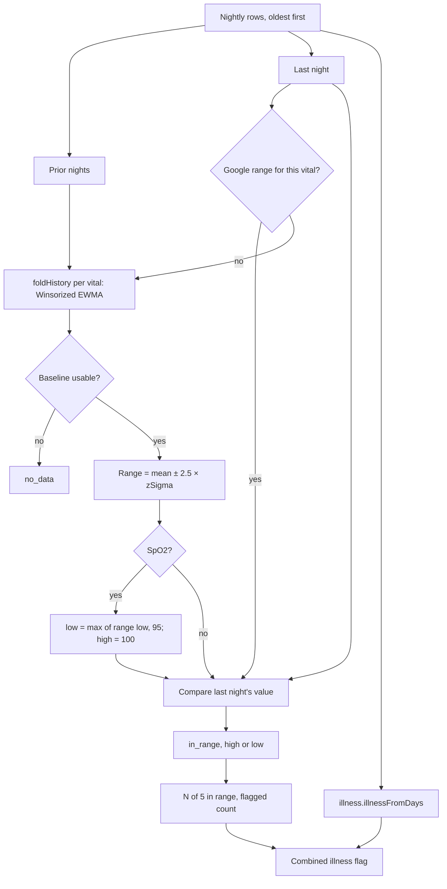

# Health Monitor

Code: `src/core/algorithms/healthMonitor.ts`. Tests: `healthMonitor.test.ts`.

The Health Monitor checks last night's five vitals against your own normal ranges and shows "N of 5 in range". The vitals are resting HR, HRV, respiratory rate, SpO2 and skin-temperature deviation. Where Google gives a range, Pulse uses it (resting HR and HRV from its personal-range roll-ups, skin temperature from its 30-night SD); every other range is your baseline mean ± 2.5σ (scoring version 16; widened a little while the baseline is young; see [baselines](baselines.md)), and SpO2 also has a fixed floor of 95 %. noop's illness signal is shown alongside as a combined flag. This is a wellness view, not a diagnosis.

## Flow

## Formula

0. **Google's range first.** The caller (`scores.ts` `googleRanges`) passes last night's ranges from Google: resting HR = `[rhr_range_low, rhr_range_high]` and HRV = `[hrv_range_low, hrv_range_high]` from the `dailyRollUp` personal ranges, and skin temperature = ± 2 × `temp_sd_c` (Google's 30-night SD of nightly − baseline) around 0, since the deviation is already relative to Google's baseline. A vital with one uses it as is (`rangeSource: "google"`), even before Pulse's baseline is usable; steps 1–2 are skipped for it. Google's skin-temperature range has no floor, so it can be narrower than Pulse's ±0.75 °C.
1. **Baselines.** For each vital, fold the prior nights' values, oldest first and excluding last night, through `baselines.foldHistory` with that vital's `MetricCfg`. This gives a Winsorized EWMA centre and spread, with hard outliers rejected once settled. Over the first ~30 nights the spread is the running mean of the nights' deviations, so it reflects your real wobble from the start ([baselines](baselines.md)).
2. **Range** = centre ± 2.5 × `baselines.zSigma(state)` (`rangeSigmas`; it was 2 before scoring version 16, see § Why ±2.5), where zSigma = 1.253 × spread × (n + 2) / n and n is the baseline's accepted nights. The (n + 2) / n factor is the short-history shrink every z-score uses: with 7 nights the range is 9/7 ≈ 1.29× the raw ±2.5σ, with 30 nights 1.07×, and it keeps fading. A night is flagged on the same scale as Recovery's z. The floor spreads keep σ from collapsing on smooth nightly values.
3. **SpO2** is one-sided. The low bound is max(centre − 2.5 × zSigma, 95), and the high bound is 100, so a high SpO2 is never flagged.
4. **Status.** The value is `low` below the range, `high` above it, and `in_range` otherwise. It is `no_data` when last night has no value or the baseline is not usable (fewer than 4 accepted nights, or stale).
5. **Counts.** `inRange` is the number of `in_range` vitals, shown as "N of 5". `flagged` is the number that are high or low.
6. **Illness.** `illness.illnessFromDays(days, journal)` runs over the same rows. It z-scores RHR, HRV, skin temperature and respiration against the 30 prior nights, and it is quiet until 14 of those nights have RHR or HRV. SpO2 is not one of its signals.

## Inputs

| Input | Unit | Notes |
|---|---|---|
| `days` | rows, oldest first | The last row is the night shown. Fields: `rhr` (bpm), `hrv` (ms), `resp` (breaths/min), `spo2` (%) and `skinTempDev` (°C). |
| `skinTempDev` | °C | `nightly_temp_c` minus Google's `baselineTemperatureCelsius` (its 30-night median), else minus Pulse's causal skin-temperature baseline: the same deviation Recovery and the illness signal use. |
| `ranges` | per vital | Google's ranges for last night (step 0); a vital without one keeps Pulse's. |
| `journal` | confounders | `alcohol`, `sauna`, `travelPhaseJump` and so on, passed to the illness signal, which then reports "suppressed" instead of "raised". |

**Which RHR.** The same resting HR as Recovery and the illness signal: Google's `daily-resting-heart-rate`, and `sessionRestingHR` only on a day Google has none.

**Unconfirmed.** The personal-range roll-ups are documented on `dailyRollUp` ("returned by default when rolling up data points from the `daily-resting-heart-rate` data type"), but the data types table lists only `list` for those two types. Until a real account syncs, it is not known whether Google answers, or whether each day's range covers that day. With no answer, the sync job records its error in Settings (Personal ranges) and Pulse's own range stays.

## Constants

| Constant | Value | Kind |
|---|---|---|
| `healthMonitorConfig.rangeSigmas` | 2.5 | version 16 (was 2, the spec's value); applied to `zSigma` (with the short-history shrink, `zShrinkK` = 2). Pulse's ranges only |
| `healthMonitorConfig.googleTempSdMultiple` | 2 | the skin-temperature range built from Google's 30-night SD (step 0); kept at 2 with Google's other ranges |
| `healthMonitorConfig.spo2FloorPct` | 95 | spec; a common cut-off for normal resting SpO2 |
| `healthMonitorConfig.spo2Cfg` | plausible 70–100, floor spread 0.5 | *tunable*; there is no noop config for SpO2 |
| `healthMonitorConfig.skinTempDevCfg` | plausible −5 to 5 °C, floor spread 0.3 | *tunable*; `skin_temp`'s floor, with bounds for a deviation |
| RHR, HRV, respiration configs | floor spreads 2 bpm, 5 ms, 0.5 | noop: `Baselines.kt` (`metricCfg`) |

**The floors set the narrowest range.** At each floor, on a long history, ±2.5σ is about ±6.3 bpm for RHR, ±15.7 ms for HRV, ±1.57 for respiration, ±1.57 points for SpO2 and ±0.94 °C for skin temperature (at ±2: ±5.0, ±12.5, ±1.25, ±1.25, ±0.75).

## Edge rules

- **A young baseline has a wider range**: by (n + 2) / n, so 1.5× at 4 nights and 1.29× at 7. A test checks that a night past the raw 2.1σ but inside the widened range is not flagged early on.
- **Fewer than 4 prior nights** with a value make that vital `no_data`, with no range, unless Google gave one.
- **A stale baseline** (no value for more than 14 nights) is also `no_data`, until it has refreshed.
- **`inRange` never counts `no_data`**, so a sparse night can show "3 of 5" with nothing flagged. The UI should show the no-data vitals as such, not as out of range.

## Worked examples

1. **Ordinary night** (a test). Forty nights with RHR around 55, HRV 60, respiration 14.5, SpO2 97 and skin temperature ±0.1 °C. A night at those values is **5 of 5**, with the illness signal quiet.
2. **SpO2 94** (a test). Nights alternate 92 and 98, so the personal range is wide and includes 94. The floor still makes it **low**, with range [95, 100].
3. **The seeded illness peak, 2026-08-04 on the demo database** (scoring version 16):

   | Vital | Value | Range | Source | Status |
   |---|---|---|---|---|
   | Resting HR | 62 | 52.4–60.7 | Google | high |
   | HRV | 41.0 | 37.1–67.9 | Google | in range |
   | Respiration | 16.0 | 13.1–16.4 | Pulse (±2.5σ) | in range |
   | SpO2 | 93.4 | 95.0–100 | Pulse (the 95 % floor binds) | low |
   | Skin temp | +0.66 | −0.5 to +0.5 | Google | high |

   That is **2 of 5 in range, 3 flagged**, and the illness signal reads **already unwell**, the same as at ±2: only
   Pulse's respiration and SpO2 ranges widened. The day before is 3 of 5 (SpO2 low, skin temperature high). Across
   the 180 demo days, flagged days went from 21 to 20: flags from Pulse's ranges 6 → 4, Google's unchanged at 23.
4. **A smooth flat history at full illness** (a test, built from the seed's `EFFECTS.illness`). Resting HR (+8) and
   SpO2 (−3) flag. Respiration (+1.5) and HRV (−15 ms) now fall just inside the floor-set ranges (±1.57 and ±15.7).
   At ±2 they flagged too (4 of 5). The illness signal is raised either way.

## Why ±2.5 (scoring version 16)

Tested with the real `healthMonitor()` on simulated healthy people (60 nights of baseline, then 30 scored nights;
RHR SD 2.5 bpm, HRV 15 %, respiration 0.5, SpO2 0.6, skin 0.25 °C). The noise model is an assumption until real data
exists.

| Healthy nights flagged | ±2 | ±2.5 |
|---|---|---|
| Pulse's ranges for all five | 10.5 % (1 in 10) | **3.1 % (1 in 32)** |
| Google's ranges for RHR, HRV and skin (modelled as mean ± 2 SD of 30 nights) | 18.8 % (1 in 5) | 17.2 % (1 in 6) |
| Pulse's ranges, heavy-tailed nights | 29.7 % | 19.3 % |
| SpO2 normal of 95.5 % | 27.7 % | 22.4 % (the 95 % floor alone flags about 20 %) |

| Illness caught | ±2 | ±2.5 |
|---|---|---|
| Full illness (the seed's effects), one night: any vital / 2+ vitals | 100 % / 95 % | 100 % / 82 % |
| Half severity, one night: any / 2+ | 77 % / 29 % | 57 % / 7 % |
| Half severity for 3 nights, caught by night 3 | 99 % | 91 % |

**Stricter rules were rejected.** Flagging only when the same vital is out 2 nights in a row, or when 2+ vitals are
out at once, cut false alarms to about 1 in 400. But they caught only about half of a mild 3-night illness.

**Applying ±2.5 only above the floor-based width was tested and not adopted.** It changed little: 2+ vitals caught
83 % against 82 %, and smooth people have no false alarms either way.

**Deliberately unchanged, pending real Fitbit Air data:**
- **Google's ranges** (RHR and HRV from its roll-up, and skin temperature at ± 2 of its 30-night SD). Their real width
  is unconfirmed until a real account syncs. Widening them blindly could hide real changes.
  - The skin-temperature range is built by Pulse from Google's SD (`googleTempSdMultiple`). It is the easiest of the
    three to widen once the data agrees.
- **The SpO2 95 % floor**, which flags people whose normal is 95–96 % on about 1 night in 5. It is safety-adjacent, so
  it should be decided on real nightly values, for example "below 95 % and below your own range", with a hard alert
  under about 92 %.

The Health Monitor count is a display: Recovery and the illness signal don't read it.

## Tests (`healthMonitor.test.ts`)

- `rangeSigmas` is 2.5. On a long history +2.2σ is in range and +2.6σ is flagged, high and low.
- The SpO2 low bound = max(centre − 2.5 × zSigma, 95), and SpO2 is never high.
- Google's range is used exactly as given, even when narrower.
- Respiration's range is at least ±1.57 (its floor).
- A simulation: about 3 % of healthy nights are flagged at ±2.5 against over 7 % at ±2. Full illness always flags
  one vital and in at least 75 % of people two.
- The seeded illness peak flags resting HR and SpO2, and the illness signal is raised.
- In `pipeline.test.ts`: Google's skin-temperature range stays ± 2 of its SD.

## Sources

- noop (`ryanbr/noop`), `Baselines.kt` (Winsorized EWMA, floor spreads), `IllnessSignalEngine.kt` and `V5HealthSignals.kt`, ported in `src/core/scoring/baselines.ts` and `illness.ts`.
- SpO2 floor: 95 % is the plan's spec, a common clinical cut-off for normal resting saturation at sea level. It is not taken from one paper.
- The reference app Health Monitor: the design target only.
