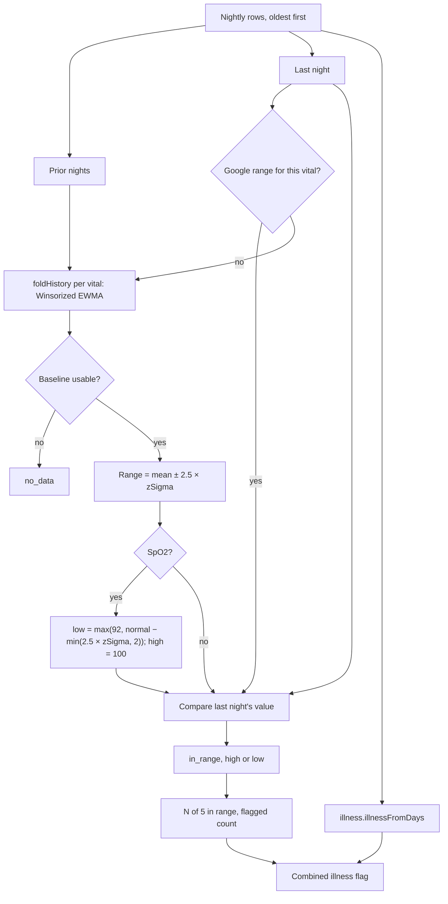

# Health Monitor

Code: `src/core/algorithms/healthMonitor.ts`. Tests: `healthMonitor.test.ts`.

The Health Monitor checks last night's five vitals against your own normal ranges and shows "N of 5 in range". The vitals are resting HR, HRV, respiratory rate, SpO2 and skin-temperature deviation. Where Google gives a range, Pulse uses it (resting HR and HRV from its personal-range roll-ups, skin temperature from its 30-night SD); every other range is your baseline mean ± 2.5σ (scoring version 16; widened a little while the baseline is young; see [baselines](baselines.md)), and SpO2 is judged against your own normal: low at 2 points below it (or below its personal range, if narrower) or below a 92 % safety floor (scoring version 22; it was a fixed 95 % floor). noop's illness signal is shown alongside as a combined flag. This is a wellness view, not a diagnosis.

## Flow

## Formula

0. **Google's range first.** The caller (`scores.ts` `googleRanges`) passes last night's ranges from Google: resting HR = `[rhr_range_low, rhr_range_high]` and HRV = `[hrv_range_low, hrv_range_high]` from the `dailyRollUp` personal ranges, and skin temperature = ± 2 × `temp_sd_c` (Google's 30-night SD of nightly − baseline) around 0, since the deviation is already relative to Google's baseline. A vital with one uses it as is (`rangeSource: "google"`), even before Pulse's baseline is usable; steps 1–2 are skipped for it. Google's skin-temperature range has no floor, so it can be narrower than Pulse's ±0.75 °C.
1. **Baselines.** For each vital, fold the prior nights' values, oldest first and excluding last night, through `baselines.foldHistory` with that vital's `MetricCfg`. This gives a Winsorized EWMA centre and spread, with hard outliers rejected once settled. Over the first ~30 nights the spread is the running mean of the nights' deviations, so it reflects your real wobble from the start ([baselines](baselines.md)).
2. **Range** = centre ± 2.5 × `baselines.zSigma(state)` (`rangeSigmas`; it was 2 before scoring version 16, see § Why ±2.5), where zSigma = 1.253 × spread × (n + 2) / n and n is the baseline's accepted nights. The (n + 2) / n factor is the short-history shrink every z-score uses: with 7 nights the range is 9/7 ≈ 1.29× the raw ±2.5σ, with 30 nights 1.07×, and it keeps fading. A night is flagged on the same scale as Recovery's z. The floor spreads keep σ from collapsing on smooth nightly values.
3. **SpO2** is one-sided (*scoring version 22*).
   - The low bound is max(**92**, centre − min(2.5 × zSigma, **2**)); the high bound is 100, so a high SpO2 is never
     flagged.
   - A value below 92 is low even before the baseline is usable.
   - The reading carries `usual` (the centre), so the screen can say "Below your usual (95.8%)".
   - **Home** names SpO2 only below 92, or at least 3 points below your usual (`spo2NeedsHome`); smaller dips show on
     the Health Monitor only.
   - *Since version 33* a lasting step bigger than the baseline's hard gate (a new device, a medicine) restarts it after 7
     rejected nights in a row, so Pulse's range follows within about 2 weeks instead of flagging every night for good
     ([baselines](baselines.md) § Why version 33). A severe illness of 7+ nights can restart a range too (about 15 % of
     cases), since the Monitor folds every night.
4. **Status.** The value is `low` below the range, `high` above it, and `in_range` otherwise. It is `no_data` when last night has no value or the baseline is not usable (fewer than 4 accepted nights, or stale).
5. **Counts.** `inRange` is the number of `in_range` vitals, shown as "N of 5". `flagged` is the number that are high or low.
6. **Illness.** `illness.illnessFromDays(days, journal)` runs over the same rows.
   - It z-scores RHR, HRV, skin temperature and respiration against 30 prior nights.
   - *Since version 23* those 30 nights **skip the 3 just before last night** (`illnessSkipNights`), so a running
     illness doesn't enter its own baseline.
   - It is quiet until 14 nights in that window have RHR or HRV (17 nights of history).
   - SpO2 is not one of its signals.
   - **Confounders** dampen the score ×0.45 and mark it "suppressed": alcohol, sauna or travel logged the day before,
     and *since version 23* **yesterday's hard or late workout**, detected by `load.hardOrLateWorkout`:
     - hard: 2+ Day Strain points over your typical session of the 28 days before;
     - late: a logged workout of 30+ minutes ending within 2 h of last night's sleep.

     It is named in the copy as "yesterday's hard or late workout", not as something you logged.
   - **An illness tag logged the day before overrides everything** (`alreadyUnwell`, from the journal's `illness`
     tag). Once the baseline is trusted, the level is "alreadyUnwell" whatever the score, and the other confounders
     don't apply. The copy is "Rest up - you logged feeling unwell", adding "and your numbers agree" when the score
     reaches mild with at least one signal. Before the baseline is trusted it stays quiet, like any other night.

## Inputs

| Input | Unit | Notes |
|---|---|---|
| `days` | rows, oldest first | The last row is the night shown. Fields: `rhr` (bpm), `hrv` (ms), `resp` (breaths/min), `spo2` (%) and `skinTempDev` (°C). |
| `skinTempDev` | °C | `nightly_temp_c` minus Google's `baselineTemperatureCelsius` (its 30-night median), else minus Pulse's causal skin-temperature baseline: the same deviation Recovery and the illness signal use. |
| `ranges` | per vital | Google's ranges for last night (step 0); a vital without one keeps Pulse's. |
| `journal` | context | From yesterday's journal tags and training (`scores.ts`): `alcohol`, `sauna`, `travelPhaseJump` (the travel tag) and `hardOrLateWorkout` dampen the illness signal and report "suppressed" instead of "raised"; `alreadyUnwell` (the illness tag) replaces the result (step 6). |

**Which RHR** (*since version 35*). The same resting HR as Recovery and the illness signal (`restingPair`,
`docs/algorithms/baselines.md` § Why version 35):
- **Fitbit's sleeping heart rate** (non-REM) once its own baseline is trusted. The tile then reads "Sleeping heart rate",
  and its range and 30-night trend are that series alone.
- **Before that**, or on a night without it, Google's `daily-resting-heart-rate`, else `sessionRestingHR`.

The two are never mixed in one history.

**Google's personal ranges never arrive.** A `dailyRollUp` on `daily-resting-heart-rate` or
`daily-heart-rate-variability` answers `UNSUPPORTED_DATA_TYPE_ACTION` ("supported: list, reconcile"; checked on a real
account 2026-10-03 and 2026-10-10). So the sync doesn't ask, and Pulse's own ranges are what real accounts see. The
code path stays for the demo, which generates them.

**Overnight curves** (*version 35*): the HRV and SpO2 sheets draw last night's samples (`hrv_days`, `spo2_days`),
clipped to the main sleep, with the median (HRV, which equals Google's nightly value) or the low (SpO2) marked. They are
shown only; nothing is scored from them.

## Constants

| Constant | Value | Kind |
|---|---|---|
| `healthMonitorConfig.rangeSigmas` | 2.5 | version 16 (was 2, the spec's value); applied to `zSigma` (with the short-history shrink, `zShrinkK` = 2). Pulse's ranges only |
| `healthMonitorConfig.googleTempSdMultiple` | 2 | the skin-temperature range built from Google's 30-night SD (step 0); kept at 2 with Google's other ranges |
| `healthMonitorConfig.spo2SafetyFloorPct` | 92 | version 22 (was the 95 % `spo2FloorPct`); the owner's choice over 90 (see § Why version 22) |
| `healthMonitorConfig.spo2MaxDropPct` | 2 points | version 22: a drop this far below your normal is low however variable your nights |
| `healthMonitorConfig.spo2HomeDropPct` | 3 points | version 22: Home names SpO2 below 92 or this far below your normal |
| `healthMonitorConfig.spo2Cfg` | plausible 70–100, floor spread 0.5 | *tunable*; there is no noop config for SpO2 |
| `healthMonitorConfig.skinTempDevCfg` | plausible −5 to 5 °C, floor spread 0.3 | *tunable*; `skin_temp`'s floor, with bounds for a deviation |
| RHR, HRV, respiration configs | floor spreads 1 bpm, 5 % of the centre (at least 1 ms), 0.5; RHR and HRV larger until 14 nights | version 36 for RHR and HRV (noop: 2 bpm, 5 ms; [baselines](baselines.md) § The floor); noop `metricCfg` for respiration |

**The floors set the narrowest range.** At each floor, on a long history, ±2.5σ is about ±3.1 bpm for RHR, ±16 % of the centre for HRV (±3.9 ms at 25 ms, ±7.8 at 50), ±1.57 for respiration, ±1.57 points for SpO2 and ±0.94 °C for skin temperature.

**Why low-HRV ranges narrowed (version 36).** The HRV floor was a fixed 5 ms, so ±2.5σ was at least ±15.7 ms on a long history and wider while young: the owner's range at 25 ms was 3.9–45.6 ms after 6 nights and could never flag. Healthy nights flagged never at 22 ms; a −25 % drop over three nights was never caught. With the floor at 5 % of the centre, ranges follow each person's own wobble: healthy nights flag about 1 in 42–64 at every HRV level, and a drop is caught as often at 22 ms as at 100 ms with the same night-to-night CV. The owner's range is 14.4–35.1 ms after 6 nights, projected about 19–31 at 30 nights. [baselines](baselines.md) § Why version 36 has the cohort table.

## Edge rules

- **A young baseline has a wider range**: by (n + 2) / n, so 1.5× at 4 nights and 1.29× at 7. A test checks that a night past the raw 2.1σ but inside the widened range is not flagged early on.
- **Fewer than 4 prior nights** with a value make that vital `no_data`, with no range, unless Google gave one.
- **A stale baseline** (no value for more than 14 nights) is also `no_data`, until it has refreshed.
- **`inRange` never counts `no_data`**, so a sparse night can show "3 of 5" with nothing flagged. The UI should show the no-data vitals as such, not as out of range.

## Worked examples

1. **Ordinary night** (a test). Forty nights with RHR around 55, HRV 60, respiration 14.5, SpO2 97 and skin temperature ±0.1 °C. A night at those values is **5 of 5**, with the illness signal quiet.
2. **SpO2 94** (a test). Nights alternate 92 and 98, a normal of 95 with a wide personal range.
   - The 2-point cap sets the low bound at 93, so 94 is **in range** and 92.9 is low.
   - Version 21's 95% floor made 94 low.
3. **The seeded illness peak, 2026-08-04 on the demo database** (scoring version 16):

   | Vital | Value | Range | Source | Status |
   |---|---|---|---|---|
   | Resting HR | 62 | 52.4–60.7 | Google | high |
   | HRV | 41.0 | 37.1–67.9 | Google | in range |
   | Respiration | 16.0 | 13.1–16.4 | Pulse (±2.5σ) | in range |
   | SpO2 | 93.4 | 95.0–100 | Pulse (the 95 % floor binds) | low |
   | Skin temp | +0.66 | −0.5 to +0.5 | Google | high |

   That is **2 of 5 in range, 3 flagged**, and the illness signal reads **already unwell**, the same as at ±2: only
   Pulse's respiration and SpO2 ranges widened. The day before is 3 of 5 (SpO2 low, skin temperature high). Across
   the 180 demo days, flagged days went from 21 to 20: flags from Pulse's ranges 6 → 4, Google's unchanged at 23.
4. **A smooth flat history at full illness** (a test, built from the seed's `EFFECTS.illness`). Resting HR (+8) and
   SpO2 (−3) flag. Respiration (+1.5) and HRV (−15 ms) now fall just inside the floor-set ranges (±1.57 and ±15.7).
   At ±2 they flagged too (4 of 5). The illness signal is raised either way.

## Why ±2.5 (scoring version 16)

Tested with the real `healthMonitor()` on simulated healthy people (60 nights of baseline, then 30 scored nights;
RHR SD 2.5 bpm, HRV 15 %, respiration 0.5, SpO2 0.6, skin 0.25 °C). The noise model is an assumption until real data
exists.

| Healthy nights flagged | ±2 | ±2.5 |
|---|---|---|
| Pulse's ranges for all five | 10.5 % (1 in 10) | **3.1 % (1 in 32)** |
| Google's ranges for RHR, HRV and skin (modelled as mean ± 2 SD of 30 nights) | 18.8 % (1 in 5) | 17.2 % (1 in 6) |
| Pulse's ranges, heavy-tailed nights | 29.7 % | 19.3 % |
| SpO2 normal of 95.5 % | 27.7 % | 22.4 % (the 95 % floor alone flags about 20 %) |

| Illness caught | ±2 | ±2.5 |
|---|---|---|
| Full illness (the seed's effects), one night: any vital / 2+ vitals | 100 % / 95 % | 100 % / 82 % |
| Half severity, one night: any / 2+ | 77 % / 29 % | 57 % / 7 % |
| Half severity for 3 nights, caught by night 3 | 99 % | 91 % |

**Stricter rules were rejected.** Flagging only when the same vital is out 2 nights in a row, or when 2+ vitals are
out at once, cut false alarms to about 1 in 400. But they caught only about half of a mild 3-night illness.

**Applying ±2.5 only above the floor-based width was tested and not adopted.** It changed little: 2+ vitals caught
83 % against 82 %, and smooth people have no false alarms either way.

**Deliberately unchanged, pending real Fitbit Air data:**
- **Google's ranges** (RHR and HRV from its roll-up, and skin temperature at ± 2 of its 30-night SD). Their real width
  is unconfirmed until a real account syncs. Widening them blindly could hide real changes.
  - The skin-temperature range is built by Pulse from Google's SD (`googleTempSdMultiple`). It is the easiest of the
    three to widen once the data agrees.
- **The SpO2 95 % floor**, which flags people whose normal is 95–96 % on about 1 night in 5. *Replaced in version 22*;
  see § Why version 22.

The Health Monitor count is a display: Recovery and the illness signal don't read it.

## Why version 22: SpO2 against your own normal

**The problem.**
- The low bound was max(your normal − 2.5σ, **95%**).
- Nightly averages run below daytime readings, so for anyone whose healthy normal is 94–96% the fixed floor bound
  almost every night.
- Each flag shows "Below 95%" on the Monitor and a Home banner naming Blood oxygen.

**Ordinary nights flagged**, with the real `healthMonitor()` (60 nights of history, 30 scored nights, 40 people;
night-to-night SD 0.8). The floor caused 100% of these flags:

| Normal SpO2 | 93 | 94 | 94.5 | 95 | 95.5 | 96 | 97 | 98 |
|---|---|---|---|---|---|---|---|---|
| v21 (95% floor) | 99% | 88% | 71% | 46% | 23% | 7% | 1% | 0% |
| **v22** | **9%** | **1%** | 1% | 1% | 1% | 1% | 1% | 1% |

**How many users.** Under *assumed* population distributions, version 21 flagged on most nights:
- 7% of young healthy adults (normal about 96.5 ± 1);
- 23% of a mixed adult population (96 ± 1.2);
- 59% of older adults (95 ± 1.2);
- 86% of people living at 1,500–2,000 m (94 ± 1.2).

Real Fitbit nightly values are needed to know the true share.

**But the floor also helped.** For a high-normal person (97), it is what caught a −2 drop. So "your own range only" is
not enough either.

**Options tested** (false-flag columns: normals of 93 / 94 / 95 / 96 / 97; drops from normals of 94 / 95.5 / 97):

| Low bound | False flags | −2 caught | −3 caught | Slow decline 96 → 90 over 6 weeks: nights < 92 flagged | A constant 91 |
|---|---|---|---|---|---|
| v21: max(personal, 95) | 99 / 88 / 46 / 7 / 1 | 100 / 95 / 41 | 100 / 100 / 86 | 100 | 100 |
| Personal range only | 0 | 30 | 69 | **4** | **2** |
| Personal + safety 92 | 7 / 1 / 0 / 0 / 0 | 41 / 30 / 30 | 86 / 69 / 69 | 100 | 92 |
| **v22: personal, drop capped at 2, + safety 92** | **7 / 1 / 1 / 1 / 1** | **42 / 40 / 40** | **87 / 82 / 82** | **100** | **92** |
| The same with safety 90 | 1 everywhere | 40 | 82 | 89 | 10 |

- **The personal range alone follows a slow decline down:** only 4% of nights below 92 were flagged.
- **Capping the drop at 2 points** catches dips that a variable person's wide range would hide.
- **92 rather than 90** was the owner's decision (2026-10-08):
  - it catches a decline the baseline follows, and a constant 91, which is low at sea level;
  - the cost is about 7–9% of nights for someone whose normal is 93;
  - at high altitude a normal of 90–92 is possible and will be flagged.

**The Home banner** (below 92, or 3+ below your normal), measured on the same simulations:

| | Banner rate |
|---|---|
| Ordinary nights, normals 95 / 97 | 0% |
| Ordinary nights, normal 93 | 11% (prototype) / 9% (v22 code) |
| Real drops −2 / −3 / −4 | 8% / 51% / 91% |

The Monitor still lists every low night.

**The real code** reproduces the table: 1% false flags at normals of 94–97 (9% at 93); −3 drops caught 84–88%, −2
drops 40–44%.

**On the seed:** at most 2 ordinary nights flag SpO2, and the illness peak still does.

## Why version 23: the illness signal faded during an illness, and hard workouts read as illness

**How it was tested.** A nightly-vitals simulator: 30 people for each of 4 profiles (smooth; typical; a noisy wrist
with heavy-tailed nights; a cycling woman with a luteal phase of skin +0.35 °C and resting HR +2.5). Nights carry
realistic variation (persistence 0.5, 5–15% missing) and events:
- alcohol;
- hard training;
- a very hard or late session (resting HR +6, HRV −30%);
- an altitude trip;
- full, mild and slow illnesses (full: resting HR +8, HRV −25%, respiration +1.5, skin +0.6 °C, SpO2 −2).

Effect sizes are assumptions. Everything ran through the real `healthMonitor()` and `illnessFromDays()`.

**1. The signal faded.** The window held the sick nights themselves, so by night 4 of a full illness the baseline had
absorbed it.

| Full illness | v22 | Skip 3 nights (v23) | Skip 6 |
|---|---|---|---|
| Sick nights reading mild or more | 33% | **54%** | 56% |
| From night 4 on | 22% | **54%** | 61% |
| Illnesses ever "raised" | 57% | **87%** | 87% |
| Mild illness ever mild or more | 27% | 33% | 33% |
| False: healthy nights / altitude trip / untagged alcohol | 0 / 13 / 17% | 0 / 22 / 17% | 0 / 21 / 13% |

- The altitude rise is real strain, and a travel tag suppresses it.
- 3 nights was chosen: 6 was no better and delays trust by 3 more nights.
- The real v23 code reproduces the 3-night column exactly.

**2. Hard or late workouts read as illness.** `hardOrLateWorkout` existed in the engine but was never set.
- After a very hard or late session the signal read mild **42%** of the time and raised 15–18%. With the context:
  **0%**.
- **The cost:** a real illness whose night follows a flagged session is not raised that night (it is caught on later
  nights in at least 80% of cases; a test). That's why "hard" means 2+ Day Strain points over your typical session.
- **On the demo data no day reaches that.** Its double-session days peak at about 1.8, and no workout ends within 2.8 h
  of bed, so on the demo data ordinary training never dampens the signal. A test moves one workout late on a copy of
  the database and checks the suppression end to end.
- **It is narrow only for that training pattern.** The late rule has no intensity condition: every logged workout of
  30+ minutes ending within 2 h of bed counts. Someone who trains in the evening has the signal dampened after each
  such session. The hard rule compares with your typical session, so someone who trains rarely, or whose sessions
  vary a lot, can pass 2 points on an ordinary-for-them day. On those nights a real illness reads "suppressed".

**Also tested, and held: "flag only after two nights in a row"** (fix #16). It only pays off if Google's ranges are
narrow, and it costs mild-illness detection:

| | One night (now) | Two in a row |
|---|---|---|
| Healthy nights flagged, Google-like ranges (30-night mean ± 2 SD, modelled) | 20% | 4% |
| Healthy nights flagged, Pulse's ranges | 4% | 1% |
| Full illness caught | 97–100% | 80–100%, about 1 night later |
| Mild illness caught, Google-like ranges | 87% | 50% |
| Mild illness caught, Pulse's ranges | 47% | 13% |

- **The wider of Google's and Pulse's ranges** brings false alarms to 3% with the same loss in mild-illness detection
  (37% by night 3).
- **Decide once a real Fitbit account shows how wide Google's ranges are.** With the model, 18–22% of healthy nights
  show a flag.

**Checked and fine:**
- no baseline contamination in the 2 weeks after an illness (1% flagged vs 2% without);
- a new user's first two weeks are quiet (1%);
- the luteal phase doesn't flag with Pulse's ranges (3%; skin temperature 10% with the modelled Google range).

## Tests (`healthMonitor.test.ts`)

- `rangeSigmas` is 2.5. On a long history +2.2σ is in range and +2.6σ is flagged, high and low.
- The SpO2 low bound = max(92, centre − min(2.5 × zSigma, 2)), and SpO2 is never high. Version 22 also tests:
  - a hand-computed bound;
  - the 92 floor binding for a normal of 93, and before any baseline;
  - `spo2NeedsHome`;
  - simulations: false flags ≤ 3% at normals of 94–98 (≤ 10% at 93); −3 drops caught ≥ 75% and −2 ≥ 35%; a slow
    decline below 92 flagged ≥ 95%; a constant 91 ≥ 85%.
- `home.test.ts`: on a recomputed copy of the seed, −2.5 is low on the Monitor ("Below your usual") but not on Home;
  −3.5 and 91.5 ("Below 92%") reach Home.
- `pipeline.test.ts`: at most 2 ordinary seed nights flag SpO2; the illness peak still does.
- Google's range is used exactly as given, even when narrower.
- Respiration's range is at least ±1.57 (its floor).
- A simulation: about 3 % of healthy nights are flagged at ±2.5 against over 7 % at ±2. Full illness always flags
  one vital and in at least 75 % of people two.
- The seeded illness peak flags resting HR and SpO2, and the illness signal is raised.
- In `pipeline.test.ts`: Google's skin-temperature range stays ± 2 of its SD.
- *Version 23:*
  - **`illness.test.ts`:** the 3 skipped nights don't change the score; trust needs 17 nights of history; the workout
    copy.
  - **`load.test.ts`:** the hard (2 vs 1.9 points) and late (1 h 50 vs 2 h 10; 30 vs 25 min) boundaries.
  - **`illness.sim.test.ts`:**
    - ≥ 45% of sick nights from night 4 read mild (v22: 22%);
    - ≥ 80% of illnesses raised (57%);
    - healthy nights quiet;
    - a very hard session ≥ 30% mild without the context and 0% with it;
    - an illness after a flagged session is still raised later.
  - **`pipeline.test.ts`:**
    - no seed training day counts as hard;
    - on a copy, a workout moved late makes an illness-like next night "suppressed" with the workout reason, while
      after a rest day it's "raised".

## Sources

- noop (`ryanbr/noop`), `Baselines.kt` (Winsorized EWMA, floor spreads), `IllnessSignalEngine.kt` and `V5HealthSignals.kt`, ported in `src/core/scoring/baselines.ts` and `illness.ts`.
- SpO2: the old 95 % floor was the plan's spec, a common cut-off for *awake* resting saturation at sea level. Nightly averages run lower than awake readings. The 92 % safety floor and the 2-point drop are Pulse's choices, tested below; neither is a clinical threshold, and the screen says the Monitor is not a diagnosis.
- The reference app Health Monitor: the design target only.
