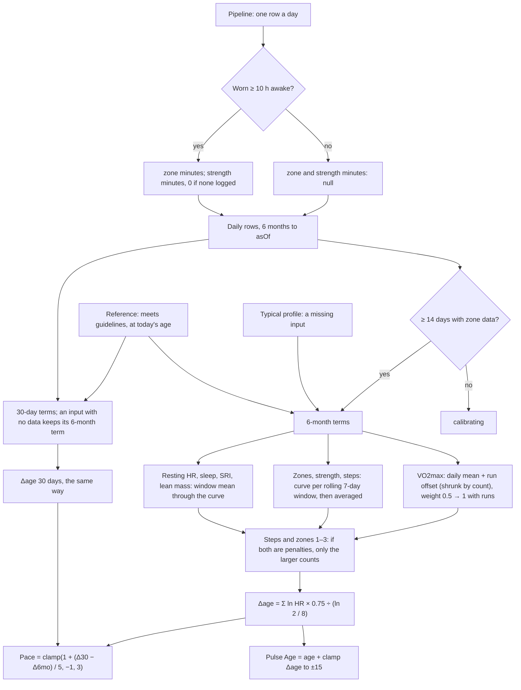

# Healthspan: Pulse Age and Pace of Aging

Code:
- `src/core/algorithms/healthspan.ts`;
- the VO2max references in `fitnessLevel.ts`;
- the per-day inputs in `src/server/pipeline/scores.ts` (`scoreHealthspan`, `awakeWornMin`).

Tests:
- `healthspan.test.ts` and `fitnessLevel.test.ts`;
- "Pulse Age on the seed" in `pipeline.test.ts`;
- "getHealthspan" in `queries/health.test.ts`.

**What it is.** An estimate built from published population hazard ratios. It is not a clinical biological age, and
the UI labels it as an estimate (KTD8).

**The method** follows noop's `VitalityEngine.kt`:
1. Each input maps to an all-cause-mortality log hazard ratio against a reference person.
2. The terms are summed and shrunk for overlap.
3. The sum is turned into years with the Gompertz law.

Ours differs from noop in the inputs, the dose-response curves (pinned below from the papers), the reference and the
gates.

**Scoring version 19** reworked it after `docs/handoff/pulse-age-issues.md` found 14 problems by testing. "Why
version 19" below has the before/after numbers.

## Flow

## Formula (scoring version 19)

**For each of the 9 inputs *i*, in a window (6 months, or 30 days for Pace):**

- **Most inputs** (resting HR, sleep, SRI, lean mass): ln HRᵢ = fᵢ(x̄ᵢ) − fᵢ(refᵢ).
  - x̄ᵢ is the window mean, and fᵢ the piecewise-linear curve below: linear between knots, flat beyond the ends.
- **Activity inputs** (zones 1–3, zones 4–5, strength, steps): the curve is applied to every trailing 7-day window
  ending inside the window that has at least 4 days with the input, and the ln HR values are averaged.
  - Zones and strength use the window's mean × 7 (min/week); steps use the mean, capped at the age plateau.
  - With too few days for any 7-day window, the plain window mean is used.
- **VO2max:** from the 6 months, n run readings with mean r̄, and the daily-estimate mean d̄.
  - Shrink factor s = n / (n + 3); offset = s · (r̄ − d̄); weight = 0.5 + 0.5 · s.
  - The window's value is its daily mean + offset, and ln HR = weight · (f(value) − f(ref)).
  - With no daily estimates, the window's run mean (or the 6-month one) at that weight. With no runs, the daily mean
    at 0.5.
- **A missing input** counts as the typical profile's value, marked `estimated`, at full weight.
- **Strength with no workout logged in the 6 months** is 0 years, marked `unlogged`.
  - Once one exists, days before the first logged workout are left out, and later days without one count as 0.
- **Steps and zones 1–3 count once:** when both are penalties, the smaller is set to 0 and marked `overlapped`.

**Then:**
- Δage = (Σ ln HRᵢ) × 0.75 ÷ (ln 2 / 8). Each input's contribution in years is its own share; they sum to the
  unclamped Δage.
- Pulse Age = age + clamp(Δage₆ₘₒ, −15, +15).
- Pace of Aging = clamp(1 + (Δage₃₀d − Δage₆ₘₒ) / 5, −1, 3).

**Notes:**
- Both Δage values use the reference at today's age, so steady inputs give Pace 1.0.
- Pace uses the unclamped Δage values, so a change still shows while Pulse Age sits at the clamp.
- ln 2 / 8 = 0.0866 per year, so one unit of ln HR is 8.66 years before the shrink, 6.49 after it.

## Inputs

`HealthspanDay` holds one row per local day. A null or absent field means there is no data that day.

| Input | Day field | Unit | Window value | Pipeline source |
|---|---|---|---|---|
| Sleep duration | `sleepHours` | h | mean | main sleep `asleep_min` / 60 |
| Sleep regularity | `sri` | SRI, −100..100 | mean | `sleepRegularityIndex` over the 7 days ending that day |
| Zones 1–3 | `zone13Min` | min/day | rolling 7-day windows, min/week | Pulse's `timeInZone`, zones 1–3: 50–80% of heart-rate reserve (`zones.ts`, as Strain). **Null unless the day was worn ≥ 10 h awake** |
| Zones 4–5 | `zone45Min` | min/day | rolling 7-day windows, min/week | the same, 80% of heart-rate reserve and above |
| Strength | `strengthMin` | min/day | rolling 7-day windows, min/week | `exercises` with a strength type. A logged workout always counts; 0 only on a day worn ≥ 10 h awake; else null |
| Steps | `steps` | steps/day | rolling 7-day windows, capped | `daily_metrics.steps` (Google counts them, so no wear rule) |
| VO2max | `vo2maxRun`, `vo2maxDaily` | mL/kg/min | the calibrated blend above | `daily_metrics.vo2max_run`, `vo2max_daily` |
| Resting HR | `restingHr` | bpm | mean | `daily_metrics.rhr_bpm` |
| Lean mass | `weightKg`, `bodyFatPct` | kg, % | mean FFMI = weight × (1 − fat/100) / height² | `daily_metrics`; height from the profile |

**Awake wear** (`awakeWornMin`): `hrMinutesAm + hrMinutesPm` minus the minutes of sleep sessions inside the day.
- A day with less than 600 minutes has null zone minutes, as a day with the band off does.
- On the demo database, every day worn around the clock passes. The three band-off days (540, 8 and 0 worn minutes)
  and today in progress do not.

## Dose-response curves

Each row is [x, HR]; the code stores ln HR. Approximations are marked.

| Input (unit) | Knots [x, HR] | Source | Notes |
|---|---|---|---|
| VO2max (mL/kg/min) | [10, 1], [80, 0.87²⁰] | Kodama 2009: RR 0.87 (0.84–0.90) per 1 MET higher | Exact log-linear per MET (3.5 mL/kg/min) |
| Resting HR (bpm) | [45, 1], [105, 1.09⁶] | Zhang 2016: RR 1.09 (1.07–1.12) per 10 bpm | Exact log-linear, flat outside 45–105 |
| Steps (steps/day) | [3553, 1], [5801, 0.60], [7842, 0.55], [10901, 0.47] | Paluch 2022: quartile medians and HRs vs Q1 | From quartiles; capped at the plateau (10,000, ramping to 8,000 between 55 and 65) |
| Sleep duration (h) | [5, 1.12], [7, 1], [8, 1], flat above | Cappuccio 2010: short RR 1.12 (1.06–1.18) | **Version 19: no long-sleep penalty** (was [9, 1.30]) |
| SRI | [50, 1.38], [65.10, 1], [75.62, 0.80], [80.99, 0.75], [85.22, 0.72], [89.80, 0.70] | Windred 2024, Tables 1–2 | Quintile medians. **Version 19:** the Q1–Q2 slope continued down to 50 (was flat below 65.1) |
| Zones 1–3 (min/week) | MVPA min/day × 7: [0, 1], [2, .89], [4, .79] … [24, .39] | Ekelund 2019, Suppl. Table 5 | Exact spline points; zones 1–3 as MVPA is an approximation |
| Zones 4–5 (min/week) | [0, 1], [112, 0.81], [225, 0.81 × 0.97] | Lee 2022: vigorous, adjusted for moderate | At category midpoints |
| Strength (min/week) | [0, 1], [40, 0.83], flat above | Momma 2022: nadir RR 0.83 at 40 min/week | **Version 19: no J-shaped upturn** (was back to RR 1 at 140) |
| Lean mass, FFMI (kg/m²) | per sex: [ref − 2.9, 0.70^−½], [ref + 2.9, 0.70^½] | Sedlmeier 2021: FFMI 21.9 vs 16.1 → HR 0.70 | **Version 19:** Sedlmeier's slope over ±half its span around each sex's reference (was one curve from 16.1, so women's low lean mass never counted) |

**Notes on the choices:**
- **Zones 1–3 against Ekelund MVPA.**
  - Ekelund's MVPA is accelerometer time at ≥ 3 METs. Zones 1–3 start at 50% of heart-rate reserve, so they miss
    moderate minutes at 40–50% (a brisk walk). This is part of why the zones 1–3 reference is 100 min/week, not 150.
  - The spline is flat from about 24 min/day.
- **Zones 4–5 against Lee 2022.** Lee's vigorous HRs are adjusted for moderate activity, so this term is the extra
  benefit of vigorous time on top of zones 1–3.
- **Strength.** Momma's authors call the high-volume upturn "unclear". Under the J-shape, 140+ min/week scored exactly
  like no strength at all (+1.6 years). WHOOP stops counting at 2 hours with no penalty.
- **Sleep duration.**
  - The long-sleep association is widely attributed to reverse causation: illness causes long sleep.
  - Cappuccio's durations were also self-reported, which reads 0.5–1 h longer than a wearable's time asleep.
  - Under the old curve, 9 h asleep cost +2.3 years against +0.5 for 6 h.
- **Lean mass needs height.** The cohorts index lean mass by height² (FFMI).

## Reference profile: a person who meets health guidelines (version 19)

The reference profile maps to Pulse Age = chronological age.

| Input | Reference (v19) | Was (v18) | Basis |
|---|---|---|---|
| VO2max | FRIEND **median** for age and sex; past 75, the 65 → 75 slope continued, floored at 15 | FRIEND 75th percentile, frozen after 75 | Kaminsky 2015; WHOOP's published VO2max targets sit near the median |
| Steps | **8,000**, ramping to **6,000** between 55 and 65 | 10,000; 8,000 from 60 (a step on the birthday) | Paluch 2022: the lower ends of the plateaus (8–10k under 60, 6–8k at 60+) |
| Resting HR | **60 men, 64 women** | 60 | Women's resting HR runs 3–5 bpm higher at the same fitness (WHOOP also uses 60 / 64) |
| Sleep duration | 7.5 h | 7.5 h | The middle of Cappuccio's 7–8 h band |
| SRI | **81.0** | 86.3 (UK Biobank 75th percentile) | Windred 2024's median |
| Zones 1–3 | **100 min/week** | 150 | WHO's 150 min of moderate activity, in heart-rate zone minutes from 50% of reserve, which undercount MVPA (WHOOP's own mapping also gave about 100) |
| Zones 4–5 | **15 min/week** | 75 | Ahmadi 2022: 15–20 min/week of vigorous activity is the smallest dose with lower mortality. The old 75 asked for *both* WHO options (150 moderate and 75 vigorous) |
| Strength | 40 min/week | 40 | Momma 2022 nadir; WHO: 2+ days a week |
| Lean mass (FFMI) | men 18.9, women 15.4 | the same | Schutz 2002 medians |

**Steps can now earn.** The reference (8,000) is below the cap (10,000), so 10,000 a day is worth about −0.9 years.
Before, the reference *was* the cap, and steps could only add years.

## VO2max calibration (version 19)

**Before:** if any run VO2max existed in the last 90 days, the 6-month VO2max was the mean of the run readings alone,
at full weight; otherwise the daily estimate at half weight.
- One run reading therefore replaced six months of estimates and doubled their weight. A run of 38 against a daily
  42 added **+2.2 years overnight**, and that reversed 90 days later.

**Now** the runs calibrate the daily estimate:
- the offset is the run mean's gap from the daily mean, shrunk by n / (n + 3);
- the weight grows from 0.5 towards 1 as runs accumulate (0.625 with one run, 0.75 with three, 0.99 with 100).

| One run reading on day 100 (daily 42) | v18 | v19 |
|---|---|---|
| Run reads 46 | −0.51 years overnight, back after 90 days | **−0.30**, no cliff |
| Run reads 38 | **+2.24** overnight, back after 90 days | **+0.14**, no cliff |

- **The 30-day window** (Pace) uses the same 6-month offset and weight. That window holds fewer runs, so its own count
  would weaken the term and push Pace above 1.0 for steady fitness (1.19 in a test).
- **k = 3, not 2:** with 2, one low reading moved Pulse Age 0.6 years.

## Gates and edge rules

- **No result before 14 days with zone data** in the 6 months (`minActivityDays`). The pipeline stores
  `calibrating` with `activityDays`, and the screen counts down 14 − that.
  - Version 18 showed a number from day 1. One day's workout became "315 min/week", and one rest day "0 zone
    minutes".
- **Provisional** with fewer than 20 days with any input; **Pace provisional** until the data spans 6 months.
- **No result** below 5 of 9 measured inputs, or for an invalid date.
- **Missing inputs** count as the typical profile, marked `estimated`.
- **The 30-day window** keeps an input's 6-month term when it has no data in the last 30 days.
- Days after `asOf`, and days 180 or more days before it, are ignored.

## Typical profile

A missing input counts as a typical person of your age and sex:

| Input | Typical value |
|---|---|
| VO2max | FRIEND median (now = the reference, so a missing VO2max is 0 years) |
| Resting HR | 65 men, 68 women |
| Steps | 6,800 |
| Sleep | 7.0 h |
| SRI | 81.0 |
| Zones and strength | the reference (they are only missing when the band was never worn ≥ 10 h awake) |
| Lean mass | the Schutz median (= the reference) |

Version 14's reasoning (missing = typical, not scaled up or treated as the reference) still holds; see "Why missing
inputs changed (version 14)" below.

## Why version 19

The real `healthspan()` was tested: probes, simulated people with realistic day-to-day noise, a simulated population,
and the demo database (`docs/handoff/pulse-age-issues.md`).

Every candidate fix was prototyped first. The prototype was a copy of the function with options; in "old" mode it
matched the real one exactly on 120 random cases. Then the final code was re-run through the same tests.

**Population assumptions.** The population is assumption-based, so its numbers show the shape, not exact real-world
values:
- VO2max around the FRIEND median, with the FRIEND spread;
- resting HR 63 / 66 ± 8; steps median 6,800 (5,500 at 60+);
- sleep 6.8 ± 0.6 h, SRI 78 ± 9;
- zones 1–3 median 60 min/week (30% none), zones 4–5 median 15 (50% none);
- 65% log no strength; 40% have a smart scale.

| Test | v18 | v19 |
|---|---|---|
| Population: median Δ (ages 25–85, both sexes) | +9.6 to +10.4 | **+4.3 to +5.2** |
| Population: share younger than their age | 0–1% | **8–14%** |
| Population: P10 / P90 | +5 / +14 | about −0.6 / +9 |
| Very active man of 40 (10,500 steps, 180 + 60 zone min, 60 min strength), VO2max P25 / P50 / P90 | +2.4 / +1.3 / −1.1 | **−2.5 / −3.6 / −6.0** |
| Sedentary man of 40 (3,000 steps, no exercise, resting HR 72, VO2max P25) | +15 (clamped) | +12.0 |
| WHOOP white paper's people, age 30 (WHOOP's own result): meets WHOOP's targets, man / woman (0 / 0) | +5.2 / +4.1 | **+0.2 / −1.3** |
| Typical WHOOP member, man / woman (−1.6 / −1.6) | +3.5 / +2.4 | **−2.4 / −4.2** |
| Typical US adult, man / woman (+6 / +7.5) | +11.9 / +14.1 | **+7.1 / +9.0** |
| One run VO2max reading (46 / 38 against daily 42) | −0.51 / +2.24 overnight, reversed after 90 days | **−0.30 / +0.14**, no cliff |
| First weeks: largest gap from the settled value (200 people) | median 3.4, P90 10.0, worst 11.5 (shown from day 1) | **0.4 / 0.7 / 1.1** (shown from day 14) |
| Active → sedentary: Δ change after 30 / 60 days | +0.3 / +0.5 | **+2.3 / +3.5** |
| Sedentary → active: Δ change after 30 / 60 days | −2.4 / −4.7 | −1.3 / −2.8 |
| Night-only wear on half the days, real activity unchanged | +2.1 years | **0** (those days are not activity days) |
| Lifting 60 min/week without logging it | +1.3 years | **0** (unknown) |
| Stable habits: SD / largest daily move / Pace range | 0.11 / 0.06 / 0.90–1.18 | **0.07–0.12 / 0.04 / 0.93–1.17** |
| Turning 60 (fixed habits) | −0.45 step | continuous |
| Demo user, latest day | +1.32 (jumps of 1.3, 1.0, 1.4, 0.6 years in week 1) | **−3.76**, no day-to-day move above 0.3 years |

**What changed and why:**
1. **The reference (the biggest change).**
   - Version 18 compared everyone with a fit person (VO2max P75, 10,000 steps, 150 + 75 zone minutes, SRI 86.3).
     Almost nobody scored younger, and the number told most people little.
   - **Fixing the curves alone with the fit reference left the population median at about +10 and 0–1% younger**, so
     the reference had to change.
   - The guidelines reference puts WHOOP's own example people within about 3 years of WHOOP's published values.
2. **VO2max calibration:** see above.
3. **Rolling 7-day windows for activity.**
   - The 6-month *mean* went into a concave curve, so a month without exercise barely moved it: a 150 → 125 min/week
     mean is still on the flat part.
   - Per-week curves see the bad weeks.
   - **Non-overlapping weekly blocks were rejected:** they raised the largest daily move to 0.16 years, against 0.04
     with rolling windows.
   - A weekend warrior (one long session a week) scores the same as daily sessions, since every 7-day window holds one.
   - Alternating good and bad weeks score worse than steady ones, which the per-week curve implies.
4. **The 14-day gate:** see "Gates".
5. **Wear.** Any heart rate used to make a day "worn", so a night-only day recorded 0 exercise.
6. **Strength unknown until logged** (the owner's decision, 2026-10-08).
   - There's no way to tell "doesn't lift" from "doesn't log it", so the term is 0 until a workout is logged, and days
     before the first one are left out.
   - Without that last rule, starting to log made the earlier months count as 0, cancelling a month of improvement
     (found in testing).
7. **Curves:** strength, sleep, lean mass, SRI, the resting-HR reference for women, and the VO2max reference past 75.
8. **Steps:** a ramp between 55 and 65 replaces the step at 60.

**Unchanged:**
- the ±15 clamp (1 of 4,000 simulated people reaches it now);
- Pace's formula;
- the 0.75 overlap shrink;
- the 8-year doubling;
- missing = typical.

## Why missing inputs and activity changed (version 14)

**Missing inputs.**
- Version 13 scaled the present terms by 9 / n. Counting a missing input as **a typical person** removed most of the
  bias when lean mass is missing (+1.3 → +0.2 ± 1.1 years).
- Treating missing as the reference read 2–3 years young.

**Steps and zones 1–3** both measure how active you are, so only the larger penalty counts. Counting both gave an
inactive person +14.1 years.

## Constants

| Constant | Value | Kind |
|---|---|---|
| `overlapShrink` | 0.75 | *tunable* (noop) |
| `doublingYears` | 8 | Finch 1990 |
| `clampYears` | 15 | *tunable* |
| `paceScaleYears`, `paceMin`, `paceMax` | 5, −1, 3 | *tunable* |
| `dailyVo2maxWeight` | 0.5 | *tunable* |
| `vo2maxRunPrior` (k) | 3 | v19; *tunable* |
| `ageWindowDays`, `paceWindowDays` | 180, 30 | |
| `activityWindowDays`, `minWindowDays` | 7, 4 | v19 |
| `minDays` | 20 | provisional below |
| `minActivityDays` | 14 | v19 |
| `minTerms` | 5 | |
| `steps` | cap 10,000 → 8,000; reference 8,000 → 6,000; ramp 55–65 | v19 (Paluch 2022) |
| `reference` | see the table above | v19 |
| `typical` | see "Typical profile" | v19: women's resting HR 68 |
| `healthspanWornAwakeMin` (pipeline) | 600 min | v19 |
| `fitnessLevelConfig.referencePercentile`, `minVo2max` | 50, 15 | v19 |

## Worked examples (each is a test, or uses numbers a test checks)

All examples are for a man of 35 at 1.80 m. His reference: VO2max 42.4, resting HR 60, 8,000 steps, 7.5 h, SRI 81,
100 / 15 / 40 min a week, FFMI 18.9.

1. **The reference profile:** every contribution is 0, Pulse Age is 35.0, and Pace is 1.0. The same holds at every age
   from 20 to 95, for both sexes.
2. **Resting HR 70:** +1 × ln 1.09 = 0.0862 ln HR, so +0.0862 × 0.75 ÷ 0.0866 = **+0.75 years**. A woman is +0.75 at
   74 bpm (her reference is 64).
3. **VO2max 49.4** (2 METs above the reference):
   - from daily estimates only: 2 × ln 0.87 × 0.5 → **−1.21 years**;
   - with daily 42.4 and six monthly runs at 49.4:
     - s = 6/9, so the value is 42.4 + ⅔ × 7 = 47.07;
     - the weight is 0.833;
     - **−1.34 years**, with Pace 1.00.
4. **A typical week:**
   - Inputs: daily VO2max 44, resting HR 62, 8,500 steps, 6.8 h, SRI 78, 120 / 30 / 60 min a week, 80 kg at 18% fat
     (FFMI 20.25).

     | Input | Years |
     |---|---|
     | Zones 1–3 (120 vs 100) | −0.74 |
     | Lean mass (20.25 vs 18.9) | −0.72 |
     | VO2max (44 vs 42.4, half weight) | −0.28 |
     | Zones 4–5 (30 vs 15) | −0.24 |
     | Steps (8,500 vs 8,000) | −0.22 |
     | SRI (78 vs 81) | +0.31 |
     | Resting HR (62) | +0.15 |
     | Sleep (6.8 h) | +0.10 |
     | Strength (60) | 0 |
     | **Δage** | **−1.64**, so Pulse Age is 33.4 (v18: **+3.77**) |

   - Without a height, lean mass counts as typical (0): **−0.92**.
5. **Pace:** take example 4, but for the last 30 days resting HR 58 and zones 4–5 at 75 min/week. Δ −1.80, Pace
   **0.83**.

## Sources

- Kodama S, et al. Cardiorespiratory fitness as a quantitative predictor of all-cause mortality and cardiovascular events in healthy men and women: a meta-analysis. *JAMA* 2009;301(19):2024–2035. doi:10.1001/jama.2009.681
- Zhang D, Shen X, Qi X. Resting heart rate and all-cause and cardiovascular mortality in the general population: a meta-analysis. *CMAJ* 2016;188(3):E53–E63. doi:10.1503/cmaj.150535
- Paluch AE, et al. Daily steps and all-cause mortality: a meta-analysis of 15 international cohorts. *Lancet Public Health* 2022;7(3):e219–e228. doi:10.1016/S2468-2667(21)00302-9
- Cappuccio FP, et al. Sleep duration and all-cause mortality: a systematic review and meta-analysis of prospective studies. *Sleep* 2010;33(5):585–592. doi:10.1093/sleep/33.5.585
- Windred DP, et al. Sleep regularity is a stronger predictor of mortality risk than sleep duration: a prospective cohort study. *Sleep* 2024;47(1):zsad253. doi:10.1093/sleep/zsad253 (Tables 1–2)
- Ekelund U, et al. Dose-response associations between accelerometry measured physical activity and sedentary time and all cause mortality: systematic review and harmonised meta-analysis. *BMJ* 2019;366:l4570. doi:10.1136/bmj.l4570 (Supplementary Tables 3 and 5)
- Lee DH, et al. Long-term leisure-time physical activity intensity and all-cause and cause-specific mortality: a prospective cohort of US adults. *Circulation* 2022;146(7):523–534. doi:10.1161/CIRCULATIONAHA.121.058162 (abstract figures)
- Momma H, et al. Muscle-strengthening activities are associated with lower risk and mortality in major non-communicable diseases: a systematic review and meta-analysis of cohort studies. *Br J Sports Med* 2022;56(13):755–763. doi:10.1136/bjsports-2021-105061
- Sedlmeier AM, et al. Relation of body fat mass and fat-free mass to total mortality: results from 7 prospective cohort studies. *Am J Clin Nutr* 2021;113(3):639–646. doi:10.1093/ajcn/nqaa339
- Schutz Y, Kyle UUG, Pichard C. Fat-free mass index and fat mass index percentiles in Caucasians aged 18–98 y. *Int J Obes* 2002;26(7):953–960. doi:10.1038/sj.ijo.0802037
- Lee DH, et al. Predicted lean body mass, fat mass, and all cause and cause specific mortality in men. *BMJ* 2018;362:k2575. doi:10.1136/bmj.k2575 (considered, not used)
- Finch CE, Pike MC, Witten M. Slow mortality rate accelerations during aging in some animals approximate that of humans. *Science* 1990;249(4971):902–905. doi:10.1126/science.2392680
- Bull FC, et al. World Health Organization 2020 guidelines on physical activity and sedentary behaviour. *Br J Sports Med* 2020;54(24):1451–1462. doi:10.1136/bjsports-2020-102955
- noop `android/app/src/main/java/com/noop/analytics/VitalityEngine.kt` (ryanbr/noop, PolyForm Noncommercial 1.0.0): the overlap shrink and the ln 2 / 8 conversion.
- Ahmadi MN, et al. Vigorous physical activity, incident heart disease, and cancer: how little is enough? *Eur Heart J* 2022;43(46):4801–4814. doi:10.1093/eurheartj/ehac572 (the zones 4–5 reference, version 19)
- WHOOP. The WHOOP Healthspan Feature (white paper, revised 2025-09-04): its guideline-based referent and targets, used as a cross-check (`docs/handoff/whoop-healthspan-white-paper.md`).
