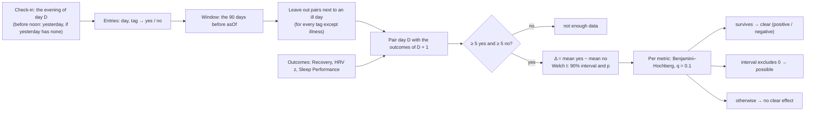

# Journal impact

Code:
- `src/core/algorithms/journalImpact.ts`;
- the statistics helpers in `src/core/algorithms/stats.ts`;
- the check-in day in `src/lib/journal.ts` (`checkInDay`) and `src/server/actions/journal.ts` (`loadCheckIn`).

Tests:
- `journalImpact.test.ts` and `stats.test.ts`;
- `src/lib/journal.test.ts`, `actions/journal.test.ts` and `CheckIn.test.tsx`;
- "Journal insights" and `teaserOf` in `queries/more.test.ts`;
- the journal-impact cases in `pipeline.test.ts`;
- `reports.test.ts`, `tools.test.ts`, `Evidence.test.tsx` and `DriverList.test.tsx`.

Journal impact shows how each logged behaviour (alcohol, late caffeine, meditation and so on) goes with the next
day's scores. For each tag it compares the days answered "yes" with the days answered "no", and reports the
difference in next-day Recovery, HRV z-score and Sleep Performance.

It is a plain two-group comparison, not a causal model, and the UI says so. Since scoring version 18, it also says
**how sure** each difference is:
- **clear:** it holds up after allowing for the many behaviours compared;
- **possible:** only its own interval excludes zero, so it may be chance;
- **no clear effect.**

## Flow

## Formula (scoring version 18)

1. **Window.** Behaviour days D with `asOf − 90 ≤ D ≤ asOf − 1`. The behaviour on day D is paired with the outcomes
   of day D + 1, so the newest pair ends on `asOf`. A check-in for today counts from tomorrow.
2. **Arms.** A tag present in a day's `tags` is an answer.
   - `true` or a number above 0 is "yes"; `false` or 0 is "no".
   - A tag missing from a day was not answered, and that day is left out for that tag.
3. **Illness exclusion** (`excludeAround: ["illness"]`). For every tag except illness itself, the pair (D, D + 1) is
   left out when illness was answered yes on D or on D + 1. The `nYes` / `nNo` counts are after this exclusion.
4. **Minimum.**
   - A tag needs at least 5 "yes" and 5 "no" days. Otherwise its status is `not_enough_data`.
   - Each metric is checked again on the days that have that metric the next day (for example, nights without
     HRV), and can fall back to `not_enough_data` on its own.
5. **Effect.**
   - `meanYes`, `meanNo` and Δ = `meanYes − meanNo`.
   - With s² as the sample variance (n − 1), v₁ = s²_yes / n_yes and v₂ = s²_no / n_no.
   - Then se = √(v₁ + v₂) and t = Δ / se.
   - The degrees of freedom are Welch–Satterthwaite: df = (v₁ + v₂)² / (v₁² / (n_yes − 1) + v₂² / (n_no − 1)).
6. **Interval and p.**
   - The 90% interval is Δ ± t₀.₉₅(df) × se.
   - p is the two-sided Student-t p-value of t at df.
   - If both arms are constant (se = 0), the difference is exact: p = 0 when Δ ≠ 0, and p = 1 when Δ = 0.
7. **Tiers.** Benjamini–Hochberg runs per metric, across every tag analysed for that metric.
   - Sort the m p-values and find the largest k with p₍ₖ₎ ≤ k / m × 0.1.
   - The k smallest are **clear**: `positive` / `negative` by the sign of Δ.
   - A test that isn't clear but whose 90% interval excludes 0 is **possible**: `possible_positive` /
     `possible_negative`.
   - Everything else is `no_clear_effect`.
   - Every clear effect has p ≤ 0.1, so its 90% interval excludes 0 too: clear is a subset of possible.
   - All three metrics are higher-is-better, so positive means good.
8. **Ranking.** Analysed tags with a Recovery Δ come first, by |Δ Recovery|, largest first. Then analysed tags without
   one, then `not_enough_data`. Ties go by tag name.

**Determinism.** There is no random resampling any more: the same data always gives the same result.

**Memoisation.** The pipeline stores each day's result with a key. Before version 18 the key was the hash of the
inputs only, so a new method with unchanged inputs would have kept the old stored results. The key is now
`sha([journalImpactConfig.version, inputs])`, and `version` (now 2) is bumped whenever the method changes.

## Why it changed

The tests below use simulated users through the real function: 90 days, 9 tags × 3 outcomes, answers on 85% of
days, Recovery with SD 18 and a lag-1 correlation of 0.4, HRV z following Recovery, and sleep independent. 300 users
per row.

### 1. It invented effects

The old method was a 1,000-resample percentile bootstrap at 90% with no multiple-comparison control.

- **The interval was too narrow.** With arms of 5 to 20 days, the percentile bootstrap undercovers: 12.5% of
  no-effect tests were labelled, against 10% intended (Hesterberg 2015).
- **Too many tests.** With 27 tests per user, **94% of users saw at least one invented "effect"**.
- **On the demo data,** "late meal improves sleep" was labelled positive. The seed generator gives late meals no
  effect.

| Design | No-effect tests labelled | Users with ≥ 1 false *clear* effect | Real −10: clear / clear-or-possible | Real −15: clear |
|---|---|---|---|---|
| v17: bootstrap 90% | 12.5% | 94% (no tiers) | — / 68% | 93% |
| **v18: Welch 90% + BH per metric** | possible 10.3%, clear 1.6% | **30%** | **28% / 65%** | 68% |

With no multiple-comparison control, about 30% of users would still see a false *clear* effect: the false-discovery
rate is 0.1 for each of 3 metrics. That is the price of finding real effects at all in 90 days.

**Designs tested and rejected:**

| Design | Why not |
|---|---|
| 95% interval, no tiers | 5.5% per test, but 65% of users still see ≥ 1 false effect; a real −10 is found in 51% of runs. |
| Benjamini–Hochberg over all 27 tests at once | A real −10 becomes clear in only 19% of runs. Per metric (9 tests) gives 30%. |
| BH at q = 0.2 | 49% of users with a false clear effect. |
| Minimum of 8 or 10 days per arm | No change in false labels. A rare habit (10% of days) is found in 16% of runs instead of 35%. |
| A minimum Δ (5 points) | Changes nothing once the interval is right: a significant Δ with SD 18 is already above 5. |
| Adjusting each outcome by its trailing 7- or 28-day mean | Lower power, and slightly more false labels (8.1% vs 7.2% at 95%). |
| Adjusting by weekday | Removes the weekend bias below, but also absorbs real effects of weekend habits (a true −10 reads −6.8). |
| An effective-n correction for autocorrelation (the research review's suggestion) | Not needed: with a lag-1 correlation of 0.4–0.9 and habits in runs or on weekends, at most 12.3% are labelled and ≤ 2% clear (a test covers the independent case). On the seed, Recovery's lag-1 correlation is 0.01. |

### 2. Illness distorted every other behaviour

People don't drink while ill, so for alcohol the "no" arm held the ill days and their low Recovery.
- In simulation, a true −10 read **−8.8**. With the exclusion it reads **−9.8**.
- On the seed, alcohol's Recovery Δ went from −18.3 to **−21.9**, and its "no" arm from 63 to 56 days.

### 3. Morning check-ins landed on the wrong day

The check-in saved to the day on screen, which is today. Someone logging last night's drinks the next morning saved
them under the morning's date, so they were paired with the *following* night. In simulation, a real −10 effect then
read **−0.4** and was found in 8% of runs.

The fix is in the check-in, not the analysis (`checkInDay`):
- **An explicit `?d=` wins.**
- **Otherwise, before 12:00 local time, with no check-in yesterday,** the sheet opens on yesterday evening.
- **Otherwise,** it opens on today.

The sheet says "Evening of Fri, Oct 2" and has a Yesterday / Today switch whenever the day is one of the two. The
switch is disabled while answers are unsaved.

### 4. The wording overstated

- The teaser said "alcohol lowers next-day Recovery by 18%". Recovery is in points, and the teaser could quote any
  labelled effect.
- It now quotes only a **clear** Recovery effect, the largest by |Δ|, in points: "Your clearest effect so far: alcohol
  lowers next-day Recovery by about 22 points."
- With only possible effects, it says how many there are and claims none.

### 5. The Insights averages could disagree with Δ

`getJournalInsights` recomputed "average with / without" from today's stored scores. After a rescore those could
differ from the stored Δ and interval. Each effect now stores `meanYes` and `meanNo`, and Insights shows those.

## On the demo database (as of 2026-10-02)

| Tag | Recovery Δ (v17 → v18) | HRV z | Sleep Performance |
|---|---|---|---|
| Illness | −24.1 negative → **clear negative** | clear negative | +1.4 positive → **possible** |
| Alcohol | −18.3 → **−21.9 clear negative** | clear negative | −2.7 negative → **possible negative** |
| Meditation | +13.4 → +10.6 clear positive | clear positive | none |
| Late meal | −8.0 none → −7.1 none | none | **+1.15 positive → none** (the false positive) |
| Others | none | none | none |

- Meditation's +10.6 is larger than the generator's built-in HRV × 1.05 would explain on its own. Its tags are drawn
  independently, so this is chance in this one seed, and an example of why a clear effect is still "not proof".
- Every other score is byte-identical (golden v18: only `journal_impact`, the reports' habit effects and the version
  stamp moved).

## Inputs

| Input | Shape | Notes |
|---|---|---|
| `entries` | `{ day, tags: Record<tag, boolean \| number> }[]` | One row per day with a check-in, built from `journal_entries` (values 0/1 or counts). |
| `outcomes` | `{ day, recovery, hrvZ, sleepPerf }[]` | One row per day, with nulls where a score is missing. Recovery and Sleep Performance are 0–100. `hrvZ` is the night's HRV z-score against its baseline (`baselines.deviation`, with the same short-history shrink as Recovery; see [baselines](baselines.md)). |
| `asOf` | `YYYY-MM-DD` | Usually today. For a report, the period's last day. |

## Outputs

`TagImpact[]`, one per tag answered in the window: `{ tag, status, nYes, nNo, effects }`.
- `effects` has an entry for `recovery`, `hrvZ` and `sleepPerf`.
- Each is `{ nYes, nNo, delta, meanYes, meanNo, ciLow, ciHigh, p, label }`. The numbers are null when the label is
  `not_enough_data`.
- `strengthOf(label)` gives `"clear"`, `"possible"` or null.

**Consumers:**
- **The teaser and reports** use clear effects only. Their `=== "positive" | "negative"` checks see only clear ones.
- **Insights** shows every analysed tag:
  - possible rows are drawn lighter, with a "Possible effect." caption;
  - their screen-reader sentence says "may have";
  - the detail sheet has a Strength row (Clear / Possible, keep logging / No clear effect).
- **The coach** gets `strength` with each effect, and is told not to present a possible effect as a finding.

## Constants

| Constant | Value | Kind |
|---|---|---|
| `journalImpactConfig.version` | 2 | Bumped with the method; part of the memo key |
| `windowDays` | 90 | *tunable*: about one season |
| `minDays` | 5 | *tunable*, per arm. 8 or 10 cost power for rare habits with no gain (above). |
| `ciLevel` | 0.9 | The "possible" threshold |
| `fdrQ` | 0.1 | BH false-discovery rate per metric: the "clear" threshold |
| `excludeAround` | `["illness"]` | Context tags whose neighbouring days are left out of other tags |
| `MORNING_ENDS_HOUR` | 12 | Before this local hour, an unasked-for check-in opens on yesterday when yesterday is empty |

## Limits

- **Association, not cause.** It does not adjust for other behaviours or training: a habit you tend to log on hard
  days can look harmful.
- **Weekend habits.** A habit mostly on weekends picks up whatever else weekends do to your Recovery. In simulation
  that was a +2.3-point bias, with a false *possible* label in 2% of runs and a false *clear* one in none.
- **Exaggerated effects.** A real effect is labelled only when the noise happened to make it look big, so labelled
  effects run larger than the truth. A real −10 that becomes clear reads about −14.6 on average. The interval in the
  detail sheet shows the plausible range.
- **Power.**
  - In 90 days a real 10-point effect is clear in about 28% of runs, and at least possible in about 65%.
  - A 15-point one is clear in 68%.
  - A 5-point one is rarely found.

## Worked examples (each is a test)

1. **Alcohol.**
   - Setup: 90 days with alcohol every 4th day; the next day loses 15 Recovery points, 1 HRV z and 8 Sleep
     Performance points on top of noise.
   - Result: all three are clear `negative`, with interval high < 0 and p < 0.001.
2. **A hand-computed Welch interval.**
   - Setup: yes = [50, 60, 70, 40, 55] and no = [70, 72, 68, 75, 65, 80].
   - Result:
     - Δ = −16.67, se = 5.451, df = 5.49, p ≈ 0.025;
     - the 90% interval is about −27.4 to −5.9;
     - alone, it is `possible_negative`.
3. **The thresholds.**
   - Setup: a moderate tag among 7.
   - Result:
     - p ≈ 0.046 is possible, since ranked first it needs ≤ 0.1 / 7 = 0.014;
     - p ≈ 0.003 is clear;
     - sleep labels are identical whether or not a strong Recovery effect sits beside them (each metric is its own
       family).
4. **Illness.**
   - Setup: 60 days with an illness week, and alcohol never logged while ill.
   - Result:
     - 7 pairs are left out of alcohol;
     - alcohol's Δ is its true −10, and above −7.5 without the exclusion;
     - illness itself is still analysed.
5. **A rare tag** with 2 "yes" days: `not_enough_data`, with n = 2 reported.

## Sources

- Welch BL. The generalization of "Student's" problem when several different population variances are involved.
  *Biometrika* 1947.
- Benjamini Y, Hochberg Y. Controlling the false discovery rate: a practical and powerful approach to multiple
  testing. *J R Stat Soc B* 1995.
- Hesterberg TC. What teachers should know about the bootstrap. *Am Stat* 2015 (the percentile interval's small-sample
  undercoverage).
- Press WH, et al. *Numerical Recipes*, the incomplete beta function (`betacf`), and Lanczos' ln Γ.
- Pulse's research review, `docs/research/stress-healthspan.md` (journal impact rows): it flagged the spurious-effect
  problem and suggested a Welch t-interval. The effective-n correction it also suggested was tested and not adopted
  (above).
