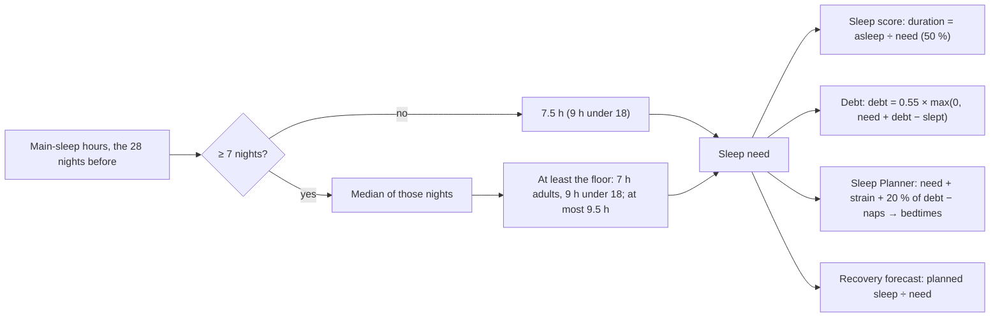

# Sleep need

Code: `src/core/scoring/sleep.ts` (`personalizedNeedHours`, `populationNeedFloorHours`; the debt ledger, `ledger`,
`creditedSleepMin`, `awakeAllNight`). Tests: `sleep.test.ts`, `sleep.allnighter.sim.test.ts`, a plan case in
`sleepPlanner.test.ts`, and "sleep need on the seed" and "a night spent awake" in `pipeline.test.ts`.

Sleep need is how much sleep, in hours **asleep** (not in bed), you need on a normal night. Everything about sleep
is judged against it.

## Formula (since scoring version 15; unchanged through version 31)

1. Take the main-sleep hours of the 28 nights before the scored night. Nights of 0 or less are ignored.
2. With fewer than 7 nights, the need is `max(7.5, floor)`.
3. Otherwise it is the **median** of those nights (`needQuantile = 0.5`, linearly interpolated), then:
   - at least the floor: **7 h** for adults 18 and over, or an unknown age; 9 h under 18;
   - at most 9.5 h.

Before version 15, it was the **upper quartile** (0.75), floored at **8 h**, and 8 h before 7 nights.

`defaultSleepNeedHours` (7.5) is also the default argument of `rest`, `ledger`, `debtSeries`, `restFromTotals` and
the forecast's `defaultNeedHours`. The pipeline always passes the personal need, so those defaults only matter to
direct callers and tests. noop's 8 h test cases now pass 8 explicitly.

## Why it changed

**The problem.** A healthy adult who reliably sleeps 7 h, inside the AASM / NSF 7–9 h range, was judged against
8 h:
- **73 minutes of permanent sleep debt**;
- a sleep score held at 85 (91.4 is the best reachable at 88 % efficiency);
- a Sleep Planner telling them to spend **9.4 h in bed** (bedtime 21:38 for a 07:00 wake).

**A second cause.** With ordinary night-to-night variation, the upper quartile kept everyone short of their own better
nights, whatever the floor. It also let one sick or catch-up week raise the need for the next month.

Simulated with the real `rest`, `ledger` and `sleepPlan`, 88 % efficiency, nights 30–45 of 60. Each cell is debt in
minutes / sleep score / planned hours in bed:

| Rule | 6.5 h steady | 7 h steady | 7.5 h steady | 8 h steady |
|---|---|---|---|---|
| v14: floor 8, upper quartile | 110 / 82.0 / 9.5 | **73 / 85.2 / 9.4** | 37 / 88.3 / 9.2 | 0 / 91.4 / 9.1 |
| Fix list: floor 7, upper quartile | 37 / 87.8 / 8.1 | 0 / 91.4 / 8.0 | 0 / 91.4 / 8.5 | 0 / 91.4 / 9.1 |
| Floor 7.5, median | 73 / 84.7 / 8.8 | 37 / 88.1 / 8.7 | 0 / 91.4 / 8.5 | 0 / 91.4 / 9.1 |
| **v15: floor 7, median** | 37 / 87.8 / 8.1 | **0 / 91.4 / 8.0** | 0 / 91.4 / 8.5 | 0 / 91.4 / 9.1 |

Sleepers varying ±0.5 h a night (one simulated person per cell, the test's seed). In brackets: the debt after 5 nights
1.5 h short.

| Rule | 6.5 h | 7 h | 7.5 h | 8 h |
|---|---|---|---|---|
| v14 | 107 / 82.6 / 9.5 (213) | 70 / 85.7 / 9.4 (176) | 33 / 88.5 / 9.2 (139) | 17 / 89.7 / 9.5 (124) |
| Fix list | 33 / 88.1 / 8.1 (139) | 17 / 89.4 / 8.3 (124) | 17 / 89.5 / 8.9 (124) | **17 / 89.7 / 9.5** (124) |
| Floor 7.5, median | 70 / 85.3 / 8.8 (176) | 33 / 88.3 / 8.6 (139) | 3 / 90.5 / 8.5 (105) | 3 / 90.7 / 9.0 (100) |
| **v15** | 33 / 88.1 / 8.1 (139) | **3 / 90.4 / 8.0** (105) | 3 / 90.6 / 8.5 (100) | 3 / 90.7 / 9.0 (100) |

- **The fix list's change alone** (floor 7) fixes perfectly steady sleepers, but leaves everyone who varies about
  17 min short. A healthy 8 h sleeper is still told to spend 9.5 h in bed.
- **v15** leaves the test's healthy 7–8 h sleeper with about 3 min of debt (under the 10-minute band, which counts as
  none). That is one seed. Across 200 simulated people varying ±0.5 h (Gaussian), the average debt is **9–10 min**
  (P90 16–18 min), and **debt shows (10 min or more) on about 40% of days**. The median need sits at the middle of
  your nights, so a run of below-median nights tips into a small debt that comes and goes. This is a known
  trade-off of the median, not yet addressed.
- **It still works where it should:**
  - a 6.5 h sleeper, below the recommended range, still carries about 33 min;
  - 5 short nights still raise debt to 100–139 min.
- **Robustness** (a test): 5 sick nights of 9.5 h barely raise the need 6 nights later, and raise it less than the
  upper quartile does. The test checks one steady (±0.3 h) sleeper, whose lift is at most 0.3 h. Across 200 people:
  - steady (±0.3 h) sleepers: median +0.07 h, P90 +0.16, worst +0.31;
  - more varied (±0.5 h) sleepers: median +0.12 h, P90 +0.27, worst +0.5.

**On the demo database** (180 days):

| | v14 | v15 |
|---|---|---|
| Days with sleep debt | 167 | 52 |
| Median debt | 44.5 min | 0 min |
| Mean sleep score | 88.8 | 91.6 |
| Mean Recovery | 58.8 | 59.9 (at most +2.4 on any day, through its sleep term) |

Strain is byte-identical.

**The evidence, and the decision.**
- AASM / SRS (Watson 2015) say adults need **at least 7 h**. The NSF (Hirshkowitz 2015) recommends 7–9 h for ages
  18–64 and 7–8 h for 65 and over.
- Pulse's research review (`docs/research/sleep.md`) had argued for keeping 8 h for ages 18–64, citing Kitamura 2016:
  in the lab, young men's optimal sleep was 8.4 h against a habitual 7.4 h, so habitual sleep may understate need.
- That was weighed and not adopted (owner's decision, 2026-10-07). A floor above the guideline minimum puts most
  healthy sleepers in permanent debt and pushes 9+ h in bed.
- A user who really needs more shows it: the median follows their own longer nights.

## Sleep debt: which nights count (scoring version 25)

**The ledger.** Over the last 14 nights with a value, each night: debt = 0.55 × max(0, need + debt − slept), and under
10 min clears to 0 (`ledger`). A night's "slept" is `creditedSleepMin`: the main sleep's minutes plus the previous
day's naps.

**null vs 0.**
- **null** is a night without data, and the ledger skips it. That covers no main sleep (the band off, a session not
  yet synced, a night Fitbit missed) and a main sleep with 0 minutes asleep.
- **0** is a measured night without sleep, and **counts** (*since version 25*). noop skipped 0 as well; Pulse never
  passes 0 for missing data.

### A night spent awake

**The problem (before version 25).** An all-nighter has no sleep session, so it was null and skipped. The worst night
added no debt, while a 1 h night added about 214 min (0.55 × (450 − 60) at 7.5 h). The Sleep screen also said
"band not worn".

**Why not count every night without a session.** Most nights without a session are nights without data. Counting
them as 0 would invent about 4 h of debt after every band-off night, and every morning before the night syncs. So a
night counts as spent awake only with **positive evidence** over its core, local 00:00–06:00 (`awakeAllNight`):
1. no sleep session of any kind touched 00:00–06:00 (main or nap, processed or not, from either wake day);
2. the band was worn: at least **300 of the 360 minutes** have heart rate (`wornMin`);
3. the median minute HR is at least **resting + 5 bpm** (`hrAboveRest`). Resting is the usable resting-HR baseline,
   else the day's resting HR;
4. at least **100 steps** (`minSteps`): up and about, not lying in bed.

Stage 1 stores the core's summary on each day (`strain.night`: `hrMinutes`, `medianHr`, `steps`; `nightSummary`).

**How the thresholds were chosen.** 00:00–06:00 was simulated minute by minute, 2,000 nights per class, through the
real functions. Assumptions:
- Google's resting HR ≈ sleeping HR + 3;
- awake and seated is 8–16 bpm over sleeping HR (4–8 for a low riser: beta-blockers, some older adults);
- half of sleeping nights have one bathroom trip of about 50 steps;
- a night up at a desk has a trip to the kitchen now and then.

| Rule (share of nights called "awake") | Asleep: ordinary / alcohol / sick / high fever / insomnia | Up at a desk | Up and active | Up, low HR rise |
|---|---|---|---|---|
| median ≥ resting + 8 | 0 / 21 / 26 / 79 / 0 % | 63 % | 100 % | 4 % |
| steps ≥ 300 | 0 % for all | 58 % | 100 % | 61 % |
| median ≥ resting + 8 *or* steps ≥ 300 | 0 / 21 / 26 / 79 / 0 % | 86 % | 100 % | 62 % |
| **median ≥ resting + 5 and steps ≥ 100** (chosen) | **0 % for all, fever included** | **88 %** | **100 %** | 24 % |

**Why this rule.**
- A wrong call needs a sleeping night with its session missing *and* passing the rule. HR alone can't tell a
  feverish sleeper from someone up at a desk, but sleepers don't take 100 steps.
- The chosen rule called no sleeping night "awake". So a night that hasn't synced yet, or that Fitbit missed, stays a
  night without data, as before.
- The nights it misses (a small HR rise, or very still) also stay without data: never worse than version 24.

**What changes after a night spent awake:**
- **Debt:** the night counts as 0 + the previous day's naps. At a 7.5 h need with no debt before, that is
  0.55 × 450 = 247.5 min, now more than the 1 h night's 214.5 (a test checks debt never falls as sleep falls).
- **Sleep need** is unchanged: the night isn't added to the 28 nights behind the median.
- **The Sleep screen** shows "Up all night" (`no_sleep`) for Sleep Performance and the night's vitals, and the debt
  for that day. Recovery shows "No HRV last night" instead of "band not worn".
- **Tonight's Sleep Planner** grows with the debt, within the version 24 time-in-bed cap.

**On the seed** no night qualifies (its nights without a session are band-off nights, with no HR), so the seed's debt
is unchanged.

**End to end on a copy of the seed** (a test), one night's session is deleted and up-and-about HR and steps written
over 00:00–06:00. That day reads `no_sleep`, its debt matches the ledger and rises by more than 150 min, and the next
day carries it. The control (session deleted, sleeping HR left) stays a night without data.

## Sleep Performance on a night without stages (scoring version 31)

Sleep Performance (`rest()`, `src/core/scoring/sleep.ts`) is 0.5 duration + 0.2 efficiency + 0.2 restorative + 0.1
consistency. The restorative part, `restorativeScore`, is the (deep + REM) share against 50 %, scaled down when deep
is under 13 %.

**When Fitbit doesn't stage a main sleep** (`stagesStatus` not SUCCEEDED, so deep and REM are null):
- if at least **5** of the last **28** staged main sleeps have a restorative component, the night takes their
  **median**: your usual (`usualRestorativeNights`, `minUsualRestorativeNights`);
- with fewer, the restorative weight is left out and the other three are renormalised (÷ 0.8).

The Sleep row's `restorative` says which: "measured", "usual" or "omitted". The Sleep page then notes under the dial
"No sleep stages last night: restorative sleep counted at your usual." or "…: scored on duration, efficiency and
consistency."

A deep or REM total that is known to be 0 is measured, not missing.

### Why version 31

**The problem.** The pipeline passed missing deep and REM to `rest()` as 0, so an unstaged night scored 0
restorative and lost 9–16 points. A missing measurement was scored as a terrible one. Through `sleepPerf` that also
lowered the personal sleep centre Recovery is scored against (audit R11), which raised every staged night's Recovery,
and it reached the Energy Bank start, journal outcomes and reports.

**How it was tested.** 200 simulated people per group, each with their own deep and REM shares and 28 staged nights
behind them. Each test night was scored with its real stages (the truth), then as if unstaged. Short, fragmented
3–4.5 h nights, which Fitbit often can't stage, were included. Estimate − truth:

| Method | Young (deep 17 %): bias / MAE | Middle (13 %) | Older (8 %) | Short nights, MAE |
|---|---|---|---|---|
| Version 30 (deep = REM = 0) | −15.8 / 15.8 | −13.1 / 13.1 | −8.9 / 8.9 | 8.8–15.9 |
| Leave it out and renormalise | +2.4 / 3.1 | +5.0 / 5.2 | +9.2 / 9.2 | 3.2–4.4 |
| A fixed restorative of 75 | −0.8 / 2.7 | +1.9 / 3.2 | +6.1 / 6.3 | 2.7–6.3 |
| **Your median of recent staged nights** | **0.3 / 1.6** | **0.2 / 1.8** | **−0.1 / 2.0** | **1.6–2.0** |

- **Renormalising**, which the research review suggested (`docs/research/sleep.md`), implicitly gives everyone a
  restorative score equal to their other components. That credits older people with a young person's deep sleep
  (+9).
- **A fixed value** is wrong by age.
- **The person's own median** is unbiased for every group, and stays within 2 points on short nights too.
- Renormalising is kept only as the fallback when there's nothing personal to go on, and the page says so.

**On the seed** every main sleep is staged, so no score moved; only the new `restorative` field ("measured") was
added.

**End to end on a copy of the seed** (a test), one night is unstaged. It reads "usual" and lands within 5 points of
its staged score; version 30's rule lost more than 10. The next day's sleep centre moves by under 0.01.

## Constants

| Constant | Value | Kind |
|---|---|---|
| Adult floor | 7.0 h asleep | AASM / NSF lower bound (version 15; was 8.0) |
| Under-18 floor | 9.0 h | unchanged (NSF teens 8–10 h) |
| `needQuantile` | 0.5 (median) | version 15; was 0.75 |
| `defaultSleepNeedHours` | 7.5 h | version 15; was 8.0; used before 7 nights |
| `minNeedNights` | 7 | unchanged |
| `maxNeedHours` | 9.5 | unchanged |
| Window | 28 nights | unchanged |

## Worked examples (each is a test)

1. **A steady 7 h sleeper:** need 7.0, debt 0, duration score 100. The Sleep Planner's 100 % plan is 7 / 0.88 =
   7.95 h in bed, bedtime 23:03 for 07:00. Version 14: 73 min of debt, about 9.4 h in bed.
2. **Nights 8.0, 8.1 … 8.6:** need is the median, **8.3** (version 14: the upper quartile, 8.45).
3. **Fewer than 7 nights:** 7.5 h; at age 16, 9 h.
4. **Chronic 6 h nights:** need 7 (the floor), so debt builds and the score shows the shortfall.

## Tests

- **`sleep.test.ts`:**
  - the floor by age;
  - the median on even and odd counts, ignoring nights of 0 or less;
  - the 7.5 h default and the 9.5 h cap;
  - a 45-night simulation:
    - a steady 7 h sleeper has no debt (version 14: 73.3 min);
    - healthy varied sleepers have ≤ 15 min (version 14: > 15 for an 8 h sleeper);
    - 6.5 h sleepers have ≥ 25 min;
    - 5 short nights give ≥ 90 min;
    - 5 sick nights move one steady sleeper's need ≤ 0.3 h, less than the upper quartile.
- **`sleepPlanner.test.ts`:** a 7 h sleeper's plan, 7.95 h in bed (version 14: > 9.3 h).
- **`pipeline.test.ts`:** on the seed, the stored need is ≥ 7 h, equals the median of the prior 28 nights, and is
  7.5 h in the first week.
- **`queries/sleep.test.ts`:** the first-week need is 450 min.
- noop's 8 h cases (`ledger`, `rest`) pass 8 explicitly and keep their exact values.

## Sources

- Watson NF, et al. Recommended amount of sleep for a healthy adult (AASM / SRS). *Sleep* 2015.
- Hirshkowitz M, et al. National Sleep Foundation's sleep time duration recommendations. *Sleep Health* 2015.
- Kitamura S, et al. Estimating individual optimal sleep duration and potential sleep debt. *Sci Rep* 2016 (weighed,
  not adopted; see above).
- noop (`ryanbr/noop`), `AnalyticsEngine.kt` `RestScorer` and `SleepDebt.kt`: the score and the debt ledger, ported
  in `src/core/scoring/sleep.ts`.
