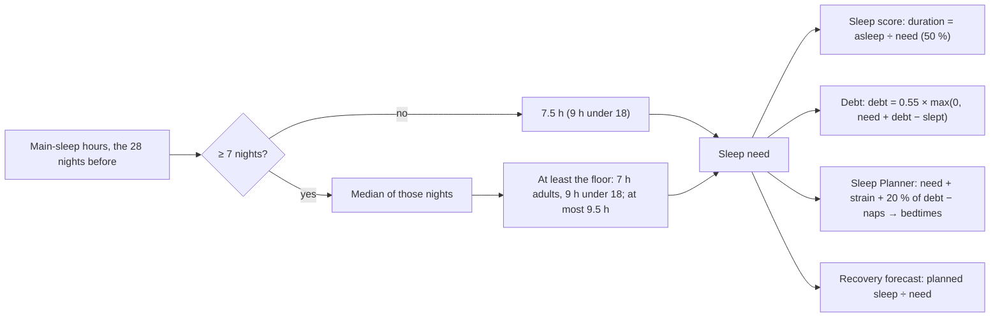

# Sleep need

Code: `src/core/scoring/sleep.ts` (`personalizedNeedHours`, `populationNeedFloorHours`). Tests: `sleep.test.ts`, a
plan case in `sleepPlanner.test.ts`, and "sleep need on the seed" in `pipeline.test.ts`.

Sleep need is how much sleep, in hours **asleep** (not in bed), you need on a normal night. Everything about sleep
is judged against it.

## Formula (scoring version 15)

1. Take the main-sleep hours of the 28 nights before the scored night. Nights of 0 or less are ignored.
2. With fewer than 7 nights, the need is `max(7.5, floor)`.
3. Otherwise it is the **median** of those nights (`needQuantile = 0.5`, linearly interpolated), then:
   - at least the floor: **7 h** for adults 18 and over, or an unknown age; 9 h under 18;
   - at most 9.5 h.

Before version 15, it was the **upper quartile** (0.75), floored at **8 h**, and 8 h before 7 nights.

`defaultSleepNeedHours` (7.5) is also the default argument of `rest`, `ledger`, `debtSeries`, `restFromTotals` and
the forecast's `defaultNeedHours`. The pipeline always passes the personal need, so those defaults only matter to
direct callers and tests. noop's 8 h test cases now pass 8 explicitly.

## Why it changed

**The problem.** A healthy adult who reliably sleeps 7 h, inside the AASM / NSF 7–9 h range, was judged against
8 h:
- **73 minutes of permanent sleep debt**;
- a sleep score held at 85 (91.4 is the best reachable at 88 % efficiency);
- a Sleep Planner telling them to spend **9.4 h in bed** (bedtime 21:38 for a 07:00 wake).

**A second cause.** With ordinary night-to-night variation, the upper quartile kept everyone short of their own better
nights, whatever the floor. It also let one sick or catch-up week raise the need for the next month.

Simulated with the real `rest`, `ledger` and `sleepPlan`, 88 % efficiency, nights 30–45 of 60. Each cell is debt in
minutes / sleep score / planned hours in bed:

| Rule | 6.5 h steady | 7 h steady | 7.5 h steady | 8 h steady |
|---|---|---|---|---|
| v14: floor 8, upper quartile | 110 / 82.0 / 9.5 | **73 / 85.2 / 9.4** | 37 / 88.3 / 9.2 | 0 / 91.4 / 9.1 |
| Fix list: floor 7, upper quartile | 37 / 87.8 / 8.1 | 0 / 91.4 / 8.0 | 0 / 91.4 / 8.5 | 0 / 91.4 / 9.1 |
| Floor 7.5, median | 73 / 84.7 / 8.8 | 37 / 88.1 / 8.7 | 0 / 91.4 / 8.5 | 0 / 91.4 / 9.1 |
| **v15: floor 7, median** | 37 / 87.8 / 8.1 | **0 / 91.4 / 8.0** | 0 / 91.4 / 8.5 | 0 / 91.4 / 9.1 |

Sleepers varying ±0.5 h a night. In brackets: the debt after 5 nights 1.5 h short.

| Rule | 6.5 h | 7 h | 7.5 h | 8 h |
|---|---|---|---|---|
| v14 | 107 / 82.6 / 9.5 (213) | 70 / 85.7 / 9.4 (176) | 33 / 88.5 / 9.2 (139) | 17 / 89.7 / 9.5 (124) |
| Fix list | 33 / 88.1 / 8.1 (139) | 17 / 89.4 / 8.3 (124) | 17 / 89.5 / 8.9 (124) | **17 / 89.7 / 9.5** (124) |
| Floor 7.5, median | 70 / 85.3 / 8.8 (176) | 33 / 88.3 / 8.6 (139) | 3 / 90.5 / 8.5 (105) | 3 / 90.7 / 9.0 (100) |
| **v15** | 33 / 88.1 / 8.1 (139) | **3 / 90.4 / 8.0** (105) | 3 / 90.6 / 8.5 (100) | 3 / 90.7 / 9.0 (100) |

- **The fix list's change alone** (floor 7) fixes perfectly steady sleepers, but leaves everyone who varies about
  17 min short. A healthy 8 h sleeper is still told to spend 9.5 h in bed.
- **v15** leaves healthy 7–8 h sleepers with about 3 min of debt (under the 10-minute band, which counts as none).
- **It still works where it should:**
  - a 6.5 h sleeper, below the recommended range, still carries about 33 min;
  - 5 short nights still raise debt to 100–139 min.
- **Robustness** (a test): a week of 9.5 h sick nights raises next month's need by at most 0.3 h, less than the upper
  quartile does.

**On the demo database** (180 days):

| | v14 | v15 |
|---|---|---|
| Days with sleep debt | 167 | 52 |
| Median debt | 44.5 min | 0 min |
| Mean sleep score | 88.8 | 91.6 |
| Mean Recovery | 58.8 | 59.9 (at most +2.4 on any day, through its sleep term) |

Strain is byte-identical.

**The evidence, and the decision.**
- AASM / SRS (Watson 2015) say adults need **at least 7 h**. The NSF (Hirshkowitz 2015) recommends 7–9 h for ages
  18–64 and 7–8 h for 65 and over.
- Pulse's research review (`docs/research/sleep.md`) had argued for keeping 8 h for ages 18–64, citing Kitamura 2016:
  in the lab, young men's optimal sleep was 8.4 h against a habitual 7.4 h, so habitual sleep may understate need.
- That was weighed and not adopted (owner's decision, 2026-10-07). A floor above the guideline minimum puts most
  healthy sleepers in permanent debt and pushes 9+ h in bed.
- A user who really needs more shows it: the median follows their own longer nights.

## Constants

| Constant | Value | Kind |
|---|---|---|
| Adult floor | 7.0 h asleep | AASM / NSF lower bound (version 15; was 8.0) |
| Under-18 floor | 9.0 h | unchanged (NSF teens 8–10 h) |
| `needQuantile` | 0.5 (median) | version 15; was 0.75 |
| `defaultSleepNeedHours` | 7.5 h | version 15; was 8.0; used before 7 nights |
| `minNeedNights` | 7 | unchanged |
| `maxNeedHours` | 9.5 | unchanged |
| Window | 28 nights | unchanged |

## Worked examples (each is a test)

1. **A steady 7 h sleeper:** need 7.0, debt 0, duration score 100. The Sleep Planner's 100 % plan is 7 / 0.88 =
   7.95 h in bed, bedtime 23:03 for 07:00. Version 14: 73 min of debt, about 9.4 h in bed.
2. **Nights 8.0, 8.1 … 8.6:** need is the median, **8.3** (version 14: the upper quartile, 8.45).
3. **Fewer than 7 nights:** 7.5 h; at age 16, 9 h.
4. **Chronic 6 h nights:** need 7 (the floor), so debt builds and the score shows the shortfall.

## Tests

- **`sleep.test.ts`:**
  - the floor by age;
  - the median on even and odd counts, ignoring nights of 0 or less;
  - the 7.5 h default and the 9.5 h cap;
  - a 45-night simulation:
    - a steady 7 h sleeper has no debt (version 14: 73.3 min);
    - healthy varied sleepers have ≤ 15 min (version 14: > 15 for an 8 h sleeper);
    - 6.5 h sleepers have ≥ 25 min;
    - 5 short nights give ≥ 90 min;
    - a sick week moves the need ≤ 0.3 h, less than the upper quartile.
- **`sleepPlanner.test.ts`:** a 7 h sleeper's plan, 7.95 h in bed (version 14: > 9.3 h).
- **`pipeline.test.ts`:** on the seed, the stored need is ≥ 7 h, equals the median of the prior 28 nights, and is
  7.5 h in the first week.
- **`queries/sleep.test.ts`:** the first-week need is 450 min.
- noop's 8 h cases (`ledger`, `rest`) pass 8 explicitly and keep their exact values.

## Sources

- Watson NF, et al. Recommended amount of sleep for a healthy adult (AASM / SRS). *Sleep* 2015.
- Hirshkowitz M, et al. National Sleep Foundation's sleep time duration recommendations. *Sleep Health* 2015.
- Kitamura S, et al. Estimating individual optimal sleep duration and potential sleep debt. *Sci Rep* 2016 (weighed,
  not adopted; see above).
- noop (`ryanbr/noop`), `AnalyticsEngine.kt` `RestScorer` and `SleepDebt.kt`: the score and the debt ledger, ported
  in `src/core/scoring/sleep.ts`.
