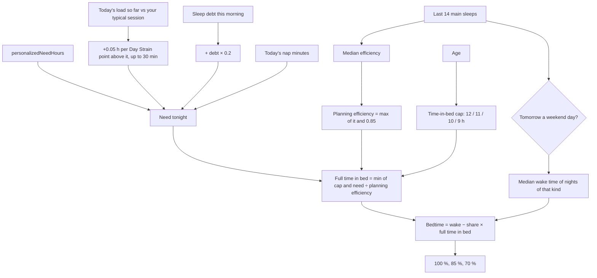

# Sleep Planner

Code: `src/core/algorithms/sleepPlanner.ts`. Tests: `sleepPlanner.test.ts`, `sleepPlanner.sim.test.ts` (simulated
sleepers), "the Sleep Planner on the seed" in `pipeline.test.ts`, and `src/server/queries/plan.test.ts` (what the
screen shows).

The Sleep Planner answers "when should I go to bed tonight?". It works out tonight's sleep need, then counts back from your typical wake time for tomorrow, allowing for your usual sleep efficiency, to give bedtimes that deliver 100 %, 85 % and 70 % of that need.

**Since scoring version 24 time in bed is bounded.** Bedtimes never plan on less than 85 % efficiency, and time in
bed is capped by age. Before, the people who slept worst were sent to bed earliest: 12.6 h in bed and an 18:26
bedtime for someone sleeping 5 h at 60 % efficiency. See § Why version 24.

## Flow

## Formula

1. **Need tonight**, in minutes:

   need = baseline + strain + debt − nap, floored at 0, where:
   - **baseline** = `personalizedNeedHours` × 60: the median of the last 28 nights' sleep, floored at 7 h asleep for adults (9 h under 18) and capped at 9.5 h; 7.5 h before 7 nights (scoring version 15; it was the upper quartile with an 8 h floor; see [sleep-need](sleep-need.md)).
   - **strain** = min(30, 0.05 h × 60 × `strainPointsAbove(todayLoad, typicalSession)`): 3 minutes per Day Strain point that today's load (TRIMP so far) goes above your **typical training session** (`typicalSession`, the median of the training days in the 28 days before today, as Strain Target uses). Both are converted to the 0–21 scale through `trimpToStrain` and `toStrainScale`. A rest day, a routine session or a day not yet past your session adds 0; a light day never lowers the need. *Before scoring version 12* it compared with the 28-day **average** Strain, rest days included (see § Why the strain term changed).
   - **debt** = 0.2 × this morning's sleep debt in minutes (`ledger(...).magnitudeMin`). Since version 25 a night spent awake counts as 0 h in that debt ([sleep-need](sleep-need.md) § A night spent awake), so the evening after an all-nighter plans more sleep. Most of the repayment comes from the ledger, not this term: each night the ledger keeps only 0.55 of what is still owed (`DEBT_CARRY`), so the next debt is 0.55 × 0.8 = 0.44 × this one when you sleep the 100% plan. A 105-minute debt goes 105 → 46 → 20 → 9 (under the 10-minute band), cleared in about **3 nights**; sleeping exactly your baseline need clears it in about 4 (0.55 per night).
   - **nap** = today's minutes asleep in naps.
2. **Typical wake time.** Over the last 14 main sleeps, take the median local wake time of the nights whose wake day is the same kind as tomorrow: weekday (Monday to Friday) or weekend (Saturday and Sunday). If none of the 14 is of that kind, use all 14.
3. **Efficiency** = the median of the same nights' efficiency (asleep ÷ in bed). With none, use 0.9.
   - *Since version 24* bedtimes use the **planning efficiency** = max(efficiency, 0.85)
     (`minPlanningEfficiency`). `efficiencyFloored` is true when the median was under 0.85.
4. **Time-in-bed cap** by whole years of age (*since version 24*, `inBedCapHours`): **12 h** under 14, **11 h** for
   14–25, **10 h** for 26–64, **9 h** from 65, and 10 h when the age is unknown.
5. **Bedtimes** for share X ∈ {1, 0.85, 0.7}:
   - full time in bed = min(cap, need ÷ planning efficiency), and `capped` is true when the cap was the smaller;
   - time in bed = X × full time in bed, and bedtime = wake − time in bed;
   - `sleepMin` = X × need, or, when capped, time in bed × planning efficiency (less than X × need).

   Uncapped, this is exactly X × need ÷ planning efficiency, the version 23 formula whenever efficiency is 0.85 or
   more. Capped, the tiers are shares of the cap, so the three bedtimes stay apart (Peak is at the cap).

`bedtimeMin` is minutes from the wake day's local midnight, so −90 is 22:30 the evening before. `(bedtimeMin + 1440) % 1440` gives the clock time. Keeping the sign means the three bedtimes always sort earliest first, even across midnight.

## Inputs

| Input | Unit | Notes |
|---|---|---|
| `baselineNeedHours` | hours | `personalizedNeedHours(nightlyHours, age)`, the same need the debt ledger used. |
| `todayLoad` | TRIMP, or null | Today's load so far (`strain.trimp`; 0 when worn with too little heart rate). null skips the strain term. |
| `typicalSession` | TRIMP, or null | `typicalSession` over the 28 days before today. null skips the strain term. |
| `debtMin` | minutes | This morning's debt magnitude. |
| `napMin` | minutes | Asleep minutes in today's non-main sessions. |
| `nights` | `{ day, wakeMin, efficiency }[]`, oldest first | Recent main sleeps. `day` is the wake day, `yyyy-MM-dd`. `wakeMin` is the **local** wake time in minutes after midnight; U10 converts from unix seconds in the user's time zone. The last 14 are used. |
| `wakeDay` | `yyyy-MM-dd` | Tomorrow, the morning being planned for. |
| `age` | whole years, or null | Sets the time-in-bed cap (*version 24*). The pipeline passes `d.age.whole`. |

## Outputs

`{ needMin, parts, wakeMin, weekend, efficiency, planningEfficiency, efficiencyFloored, inBedCapMin, capped, plans }`.
Each plan is `{ share, sleepMin, inBedMin, bedtimeMin }`. The Recovery forecast reads only `needMin`, which the bounds
don't touch.

**On screen** (`planVM`, `src/server/queries/common.ts`):
- each goal's caption is the share of need it delivers, `round(sleepMin ÷ needMin × 100)` %: its share uncapped, less
  when capped;
- when `efficiencyFloored`: "You've been awake in bed for a good part of recent nights. These bedtimes plan for 85% of
  your time in bed asleep. Going to bed earlier usually adds time awake, not sleep.";
- when `capped`: "Time in bed is capped at {cap} h for your age."

## Constants

All of these live in `sleepPlannerConfig`.

| Constant | Value | Kind |
|---|---|---|
| `hoursPerStrainPoint` | 0.05 h per Day Strain point above your typical session | *tunable* (spec); no published source |
| `maxStrainMin` | 30 | Pulse v12: bounds an extreme day |
| `debtRepayShare` | 0.2 | *tunable* (spec) |
| `windowNights` | 14 | spec |
| `defaultEfficiency` | 0.9 | *tunable*: a typical healthy-adult efficiency, used only before any night has one |
| `shares` | 1, 0.85, 0.7 | spec |
| `minPlanningEfficiency` | 0.85 | version 24; cited: the ≥ 85 % efficiency target of CBT-I sleep restriction (Edinger 2021) |
| `inBedCapHours` | 12 h under 14, 11 h for 14–25, 10 h for 26–64, 9 h from 65 | version 24; cited: the upper "may be appropriate" sleep duration (NSF, Hirshkowitz 2015) |
| `unknownAgeCapHours` | 10 | version 24: the adult value |

## Edge rules

- **No nights** give `wakeMin: null` and no plans. The need is still returned.
- **A big nap** can bring the need to 0, which gives every bedtime at the wake time.
- **One glitchy night** (efficiency 0.05 while it is the only night) used to give 150 h in bed. It is now planned at
  0.85: 8.8 h for a 7.5 h need (a test).
- **The cap is on time in bed, not on need.** A large debt still raises `needMin` (and the forecast); the cap only
  stops the bedtime moving earlier.
- **The median of an even count** is the mean of the middle two, so a wake time can fall on a half minute.

## Worked examples

1. **The base case** (a test). Need 8 h, no debt, today's load equal to your typical session, no nap: need = **480 min**. Tomorrow is a weekday, with a typical wake of 07:00 and efficiency 0.9. The 100 % bedtime is 07:00 − 480 / 0.9 = 07:00 − 533.3 min = **22:07** the evening before.
2. **A heavier day.** Need 8 h, 60 min of debt (+12), Day Strain 16 against a typical session of 10 (+6 × 0.05 h = +18 min), and a 20 min nap (−20): need = **490 min**. With a weekday wake of 07:00 and efficiency 0.9:

   | Share | Asleep | In bed | Bedtime |
   |---|---|---|---|
   | 100 % | 490 min | 544.4 min | **21:56** |
   | 85 % | 416.5 min | 462.8 min | **23:17** |
   | 70 % | 343 min | 381.1 min | **00:39** |

3. **A weekend morning** (a test). With weekend wakes at 09:00 and weekday wakes at 07:00, the same need gives bedtimes exactly 2 h later on a Friday night than on a Wednesday.

## Why version 24: time in bed was unbounded

**The problem.** Time in bed was share × need ÷ your median efficiency, with no bound. Low efficiency and debt both
push the bedtime earlier, so the people who slept worst got the most extreme advice. For insomnia that is the
opposite of CBT-I (cognitive behavioural therapy for insomnia), which limits time awake in bed. It is the first-line
treatment (AASM guideline, Edinger 2021).

**How it was tested.** A copy of `sleepPlan` with switchable options; in "current" mode it matched the real function
on every night. The setup:
- 40 simulated people per profile, nights 30–59 of 60;
- a wake time of 07:00 ± 20 min;
- need and debt from the real `personalizedNeedHours` and `ledger`;
- each person's own mean sleep (± 0.3 h) and efficiency (± 0.03), with nightly noise.

Durations and efficiencies are assumptions that fit each picture.

| Profile (age) | Version 23: in bed, mean / max | Version 23 bedtime: median / earliest | Version 24: in bed, mean / max | Version 24 bedtime | Need reached at own efficiency |
|---|---|---|---|---|---|
| Healthy, 7.5 h at 90 % (35) | 8.3 / 9.5 h | 22:43 / 21:22 | unchanged | unchanged | 100 % |
| Insomnia, 6 h at 70 % (45) | 10.4 / 11.6 h | 20:36 / 19:20 | **8.5 / 9.0 h** | 22:30 / 21:41 | 82 % |
| Severe insomnia, 5 h at 60 % (50) | 12.6 / 14.9 h | 18:26 / 16:08 | **8.8 / 9.5 h** | 22:12 / 21:35 | 70 % |
| New parent, 5 h at 72 % (32) | 10.5 / 12.4 h | 20:33 / 18:41 | **8.8 / 9.4 h** | 22:11 / 21:28 | 84 % |
| Teen, 6.5 h at 80 % (16) | 12.0 / 13.8 h | 19:04 / 17:03 | **11.0 / 11.0 h** | 20:01 / 19:27 | 92 % |
| Teen, 8.8 h at 90 % (16) | 10.2 / 11.2 h | 20:46 / 19:33 | 10.2 / 11.0 h | 20:46 / 19:48 | 100 % |
| Older, 6.5 h at 78 % (72) | 9.1 / 10.5 h | 21:51 / 20:33 | 8.4 / 9.0 h | 22:36 / 21:48 | 92 % |
| Long sleeper, 9.3 h at 90 % (22) | 10.3 / 11.5 h | 20:37 / 19:13 | 10.3 / 11.0 h (capped 5 % of nights) | 20:37 / 19:35 | 100 % |
| Long sleeper, 9.3 h at 90 % (40) | 10.3 / 11.4 h | 20:44 / 19:20 | 9.9 / 10.0 h (capped 74 %) | 21:03 / 20:23 | 98 % |
| 8 h sleeper at 85 % (70) | 9.4 / 10.6 h | 21:32 / 20:05 | 8.9 / 9.0 h (capped 84 %) | 22:01 / 21:30 | 95 % |

Extreme inputs, 07:00 wake:

| Case | Version 23 | Version 24 |
|---|---|---|
| Need 9.5 h, 300 min debt, maximum strain, 60 % efficiency, age 30 | 18.3 h in bed, bedtime 12:40 | 10 h, 21:00 |
| One night at 5 % efficiency (the only night) | 150 h | 8.8 h, 22:11 |
| After an all-nighter (debt 513 min), 90 %, age 30 | 10.2 h, 20:46 | 10 h, 21:00 |

**"Need reached at own efficiency"** is the median share of need the Peak plan would deliver if you slept at your own
efficiency. Below 100 % is the point: for someone at 60–70 % efficiency, the plan stops promising the full need
through more time in bed. "Need tonight" still shows the full need.

**Options tested:**

| Option | Result | Chosen? |
|---|---|---|
| Efficiency floor 0.85 alone | Fixes insomnia, new parents and the glitch night. The extreme case still gives 12.9 h (18:08), and teens 11.3 h. | Part of it |
| Floor 0.80 instead | 0.5 h more in bed for insomnia (9.0 h), 0.6 h for new parents | No: CBT-I aims for ≥ 85 % |
| Floor + a flat 10 h cap (11 h under 18) | Caps a healthy 22-year-old 9.3 h sleeper on 81 % of nights (96 % of need) | No |
| Floor + an 11 h backstop for all | The extreme case still gives 11 h (about 20:00) | No |
| **Floor 0.85 + the NSF age cap** | As in the tables | **Yes** (user's choice) |
| Cap the debt term at 60 min | No change in any realistic profile, and it would move `needMin` and the forecast | No |

**Trade-offs:**
- The age cap binds for healthy long sleepers past its age band: a 40-year-old 9.3 h sleeper reaches 98 % of need,
  a 70-year-old 8 h sleeper 95 %. Both sit at the top of the NSF range for their age, so spending even longer in bed
  isn't advised for them.
- About 5 % of a "healthy" group's nights change: those people sleep at about 84 % efficiency, just under the floor.
- **Teens still get early bedtimes.** A 16-year-old who sleeps 6.5 h has the 9 h need floor, so even capped at 11 h
  the bedtime is about 20:00 at a 07:00 wake. That comes from the sleep need floor (see [sleep-need](sleep-need.md)),
  not from this planner, and is left open.
- **On the seed nothing moves.** The seed's efficiency is 0.92–0.96, so no day is floored or capped. Only the new
  fields change, and Golden 24 records them.

## Why the strain term changed (scoring version 12)

Tested on the real function, five trainer types and the 180-day demo database:

| Before (vs the 28-day average day) | After (vs your typical session) |
|---|---|
| A moderate trainer's **routine** session added +8 min; a daily trainer's identical session added 0 (no rest days in their average) | A routine session adds 0 for everyone; 1.5× / 2× / 3× your session add about 3 / 5 / 8 min for every trainer type |
| Extra sleep on 83 of 174 seed days (p90 12.4, max 15.3 min) | 38 of 174 days (p90 1.8, max 5.5 min): only the days that really were harder |
| A plan made in the morning counted the morning's tiny load against the average | Load below your usual session counts as 0, so the plan only grows once today passes your usual session |

The 3 minutes per point is kept from before; there is no published rate, and the demo data cannot calibrate it.

## Sources

- Hirshkowitz M, et al. National Sleep Foundation's sleep time duration recommendations: methodology and results
  summary. *Sleep Health* 2015;1:40–43. The "may be appropriate" upper bounds behind `inBedCapHours`.
- Edinger JD, et al. Behavioral and psychological treatments for chronic insomnia disorder in adults: an American
  Academy of Sleep Medicine clinical practice guideline. *J Clin Sleep Med* 2021;17(2):255–262. CBT-I and sleep
  restriction, which aims for ≥ 85 % efficiency (`minPlanningEfficiency`).
- noop (`ryanbr/noop`), `AnalyticsEngine.kt` `RestScorer` (sleep need) and `SleepDebt.kt` (14-night ledger), ported in `src/core/scoring/sleep.ts`.
- The reference app Sleep Planner: the design target (Peak, Perform and Get By, at 100 %, 85 % and 70 %); no the reference app coefficients are used.
