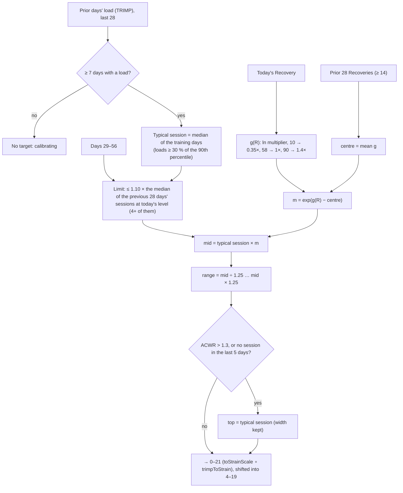

# Strain Target

Code: `src/core/algorithms/strainTarget.ts`. Tests: `strainTarget.test.ts` (and the "scale contracts" in
`pipeline.test.ts`).

Strain Target is today's recommended Day Strain range, on the reference app's 0–21 scale. Since `SCORING_VERSION` 11
it is worked out in **linear heart-rate load (TRIMP)** and converted to 0–21 only for display:
- it starts from your **typical training session**;
- scales it by how today's Recovery compares with **your own recent Recoveries**;
- gives a range about **one Strain point** wide;
- holds it at your typical session while your load is climbing fast or while you come back from a break.

Every design choice was checked by simulation. § Why explains each one with numbers.

## Flow

## Formula

1. **Inputs:**
   - `priorLoad`: each earlier day's TRIMP (`strain.trimp`; 0 = worn with too little heart rate, null = band off);
   - `priorRecovery`: earlier days' Recovery scores;
   - today's `recovery`;
   - yesterday's `acwr` (on TRIMP).
2. **Typical session (`ref`).**
   - Take the days with a load among the last 28. Fewer than 7 → no target, reason `calibrating`.
   - Training days are the loads ≥ 30 % of that window's 90th percentile.
   - `ref` is their median.
   - With fewer than 14 days with a load the target is still the person's own, tagged as an estimate (`coldStart`).
3. **Progression limit** (*since version 26*). Compare sessions with sessions:
   - the earlier sessions are the loads of days 29–56 at least `trainingDayShare` (30 %) × today's `ref`;
   - if days 29–56 hold at least 14 loads **and** at least 4 such sessions (`minEarlierSessions`, about one a week),
     `ref = min(ref, 1.10 × the median of those sessions)`;
   - otherwise there is no limit: those weeks were a low period (a beginner, or a break with the band on), not a
     smaller habit to grow from.
   - It is still a **ceiling tied to days 29–56**, not a smooth +10 % per 28 days. After a real jump in session size
     (100 → 200), the target is held at 110 until the bigger sessions reach days 29–56, then steps up.
   - *Before version 26* the limit used days 29–56's typical *day*. After a low month that was a rest day, so the
     target sat near rest level (Strain about 5–6) for up to 5 weeks, then jumped about 6 points (§ Why version 26).
4. **Recovery multiplier.**
   - `g(R)` is linear in ln between the anchors (10, ln 0.35), (58, 0) and (90, ln 1.4), and flat outside them.
   - With at least 14 prior Recoveries, `centre` = the mean of `g` over the last 28; otherwise 0.
   - `m = exp(g(R) − centre)`.
5. **Range.** `mid = ref × m`, then `[mid / 1.25, mid × 1.25]`.
6. **Holds.**
   - If ACWR > 1.3 (`acwrRule: "capped"`), or none of the last 5 days was a training day, worn or not
     (`"returning"`), then `top = min(top, ref)` and `bottom = min(bottom, top / 1.5625)`, so the width is kept.
   - "capped" wins the label when both apply.
7. **Display.**
   - Each bound goes through `toStrainScale(trimpToStrain(x))`.
   - A range below 4 or above 19 is **shifted** into [4, 19], never squeezed.
   - `base` = the typical session on 0–21.

As multiples of the typical session (uncentred, or on a day at your own usual Recovery = 1×):

| Recovery | 15 | 35 | 58 | 66 | 67 | 80 | 95 |
|---|---|---|---|---|---|---|---|
| Range × typical session | 0.31–0.49 | 0.48–0.76 | 0.80–1.25 | 0.87–1.36 | 0.88–1.37 | 1.01–1.58 | 1.12–1.75 |

The same multiples hold for every user type; that is a test.

## Why

### What was wrong (version 10, verified)

The target was the mean 0–21 Strain of the last 28 days, × green 1.0–1.25 / yellow 0.8–1.0 / red 0.5–0.75, at least
2 points wide (widened downward), with fixed new-user ranges. Strain is a log of load, so in real load:

| Check | Version 10 |
|---|---|
| Green top, as × a typical session | light trainer 0.84×, moderate 0.79×, heavy 1.34×, **daily trainer 3.03×** |
| Red | 0.03–0.21× a session |
| Recovery 66 → 67 | the range jumps by about 2 Strain points (the top nearly triples in load) |
| New users, days 8–14, green | 14–18 = **372–2,024 TRIMP**, against a typical seed day of 26 and a hard one of 161 |
| A user following the target, 26 weeks | **collapses to rest-day load** (the mean of logs, rest days included, is far below a session; widening downward compounds it) |

### What the fix list suggested, and how it held up

The suggestion was 1.3–1.5× "usual load" on green and 0.3–0.6× on red.

- **"Usual load" as the mean daily load fails.** It counts rest days, so green asked for 0.73–0.84× a normal session.
  The reference has to be a *training session*.
- **As the 75th-percentile day** it worked statically, but following it compounds: the 75th percentile of your own
  followed sessions ratchets up. After 6 months: ×1.9 (4 sessions a week), ×10 (daily), ×30 (daily with good
  Recovery).
- **Fixed multipliers by colour compound for anyone whose Recovery sits off-centre.** Always-green users are pushed
  ×2–8. Chronically low-Recovery users (sleep, stress) are told to train less and less: ×0.08. Hence centring on your
  own 28 days.
- **"At least 2 points wide, widened downward"**: 2 points on the log scale is a 2.3× span of load. Widening only
  downward pulls the middle down, and on its own drags followers to about 5 %. Hence a symmetric ÷1.25 … ×1.25
  (about 1 point).
- **"Return after illness"** was not covered. The 75th-percentile design asked for 1.2–1.4× a usual session straight
  after 10 sick days. Hence the "returning" hold. A first version ("5 of the last 7 days near rest") fired on 45 of 170
  seed days, because ordinary 2–3-session weeks look like that. It now needs 5 days in a row without a session: 6 seed
  days, all straight after the illness and the band-off days.

### What the chosen design does

**Following it exactly for 26 weeks, with a Recovery that drops when load ramps (the typical session at the end ÷ the
start):**

| Sessions a week | Seed Recovery | +12 (sleeps well) | −12 (stressed) | −25 |
|---|---|---|---|---|
| 2 | ×1.42 | ×1.66 | ×1.08 | ×0.69 |
| 4 | ×1.45 | ×1.67 | ×0.77 | ×0.51 |
| 7 | ×2.11 | ×2.01 | ×1.39 | ×0.71 |

- Any target built on your own history drifts a little when followed exactly. The progression limit (at most
  1.10 × the typical session of days 29–56) bounds the upside; it can also hold the target down after a low month
  (step 3).
- Centring stops the collapse for low-Recovery users (×0.08 before).
- Real users don't follow exactly, and the test asserts ×0.6–1.8.

**On the 180-day demo database** (medians, as × the typical session):

| Band | Days | Range | Width |
|---|---|---|---|
| Red | 21 | 0.43–0.68 | 1.04 points |
| Yellow | 93 | 0.74–1.15 | 1.05 |
| Green | 56 | 1.08–1.69 | 1.05 |

- The seed's 28-day centring is about 0.91, so these sit a little above the uncentred table.
- Capped on 30 days, "returning" on 6.
- Days 8–14 are the person's own (for example 11.3–12.4 on a green day), not 14–18.

## Why version 26: the progression limit held beginners and returners at rest level

**The problem.** The limit capped today's typical session at 1.1 × the typical session of days 29–56. That is the
median of the window's loads at or above 30 % of its own 90th percentile. When those weeks were a low period, that
median is a rest day:
- a sedentary person who starts training;
- a break of 4+ weeks with the band on (injury, illness).

The target sat near rest level for weeks, then jumped in one day once the new sessions reached days 29–56.

**How it was tested.** A copy of `strainTarget` with switchable options matched the real one on every call. The
setup: 30 simulated people per case, rest days log-normal around TRIMP 8, sessions ± 20 %, Recovery 58, ACWR 1.
"Pinned" counts the days the typical session sat more than 3 Strain points under the session the person was really
doing.

| Case | Version 25: days pinned per person / largest 1-day jump | Version 26 |
|---|---|---|
| Beginner: 70 sedentary days, then 3×/week at 120 | 24.2 / 5.9 | **0 / 0.4** |
| Beginner who ramps: 4 weeks at 60, then 120 | 18.1 / 5.1 | 0.1 / 2.6 |
| 28-day break with the band on, back at the same level | 10.6 / 6.1 | **0 / 0.5** |
| 42-day break with the band on | 23.3 / 6.0 | **0 / 0.3** |
| 42-day break, back easier (70 for 3 weeks, then 118) | 3.0 / 4.9 | 0 / 0.6 |
| Steady 4×/week; weekend warrior 1×/week; sudden doubling 100 → 200 | — | unchanged |
| Following the target for 26 weeks (end ÷ start, Recovery shift 0 / +12 / −12) | 1.41 / 1.27 / 1.08 | **1.41 / 1.27 / 1.08** |

In the ramping beginner's case the 2.6-point step is the limit doing its job on a real doubling: 60 → 120 is held
at 66 until the 120s reach days 29–56.

**Options tested:**

| Option | Result | Chosen? |
|---|---|---|
| No limit | Fixes every low-period case, but the 26-week drift rises to 1.65 / 1.32 / 1.15 | No: the limit's job is real |
| Keep the old earlier "typical session", but only with ≥ k sessions at today's level in days 29–56 | k = 3 still jumps 5 points: 3 sessions among 25 rest days leave a rest-level 90th-percentile threshold | No |
| **Median of days 29–56's sessions at today's level, with ≥ 4 of them** | As in the table | **Yes** |

**Not fixed here.** A once-a-week beginner still sees one jump of about 6 points when the third session enters the
window, with or without any limit (4.6 with none). That is `typicalSession` switching from rest days to sessions,
not the limit.

**On the seed** one day of 180 moves: on 2026-05-18 the typical session is 11.25 instead of 11.37. The median of
the earlier month's sessions is a little lower than its old "typical session". The seed never has a low month with
the band on, so nothing else changes.

## Constants (`strainTargetConfig`)

| Constant | Value | Why |
|---|---|---|
| `windowDays` | 28 | readiness' chronic window |
| `minDays` / `estimateBelowDays` | 7 / 14 | the target first appears on day 8 (Recovery needs 7 nights) |
| `trainingDayShare` | 0.3 | separates rest days (seed 4–9 TRIMP) from sessions (30–300) |
| `maxGrowth` | 0.10 per 28 days | bounds the closed-loop drift (above) |
| `minEarlierSessions` | 4 | version 26: about one session a week in days 29–56 before the limit applies; 3 still let a mostly-rest window hold a beginner down |
| `anchors` | 10 → 0.35×, 58 → 1×, 90 → 1.4× | 58 is Recovery for a night exactly at your baselines; the ends follow the fix list's red/green intent, applied to a *session* |
| `minRecoveriesToCentre` | 14 | half the window |
| `width` | 1.25 | symmetric, about 1 Strain point |
| `acwrCapAbove` | 1.3 | Gabbett 2016's sweet-spot edge |
| `breakDays` | 5 | longer than an ordinary gap between sessions (≤ 3 days on the seed) |
| `min` / `max` | 4 / 19 | display bounds (spec) |

## Worked examples

Each is a test, or was computed with the real function. The typical session is 118 TRIMP (11.3 on 0–21): 4
sessions and 3 rest days a week.

1. **A normal night (R 58), no centring yet:** **10.8–11.8**.
2. **Green (R 80):** **11.3–12.4**.
3. **Red (R 20):** **8.8–9.9**.
4. **R 80 with ACWR 1.4:** the top held at the session, **10.3–11.3**, "capped".
5. **R 80 after 5 days without a session:** **10.3–11.3**, "returning".
6. **R 80 for someone whose usual Recovery is 40:** **12.2–13.3**. Far better than *their* normal, so more.
7. **Day 8 (7 days of history), R 80:** **11.3–12.4**, tagged as an estimate. Version 10 gave 14–18.

## Not changed here

The Sleep Planner's extra sleep for a hard day and the Recovery forecast's strain nudge still use Effort in Strain
points. Re-tuning them is a separate fix (they were not tested here).

## Sources

- Gabbett TJ. The training–injury prevention paradox. *Br J Sports Med* 2016;50(5):273–280 (the 1.3 edge).
- Edwards S. *The Heart Rate Monitor Book*, 1993 (TRIMP).
- The reference app's Strain Coach: the design target only; none of its coefficients are used.
