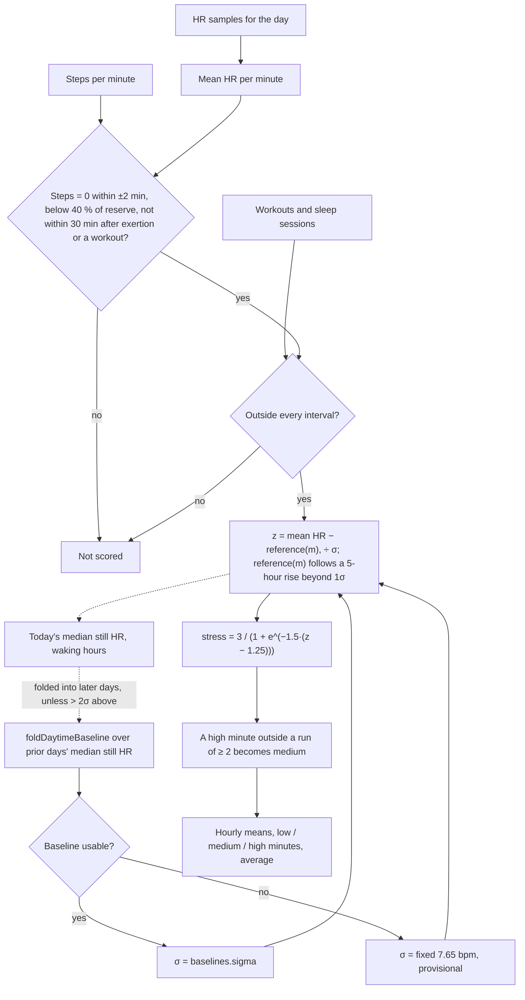

# Stress Monitor

Code:
- `src/core/algorithms/stress.ts`;
- the baseline gate in `src/core/scoring/stressBase.ts` (`foldableStillMedian`);
- the exertion masking in `src/server/pipeline/stage1.ts`.

Tests:
- `stress.test.ts`;
- `stress.sim.test.ts`, on generated days (`__sim__/days.ts`);
- "Stress on the seed" in `pipeline.test.ts`.

The Stress Monitor scores each still, awake minute on a 0–3 scale from how far its heart rate sits above your usual still heart rate. It follows noop's HR-only `DaytimeStress` path, which has no R-R intervals and therefore no RMSSD term, with two changes:

- **Movement is excluded, not guessed.** noop has to infer motion from the strap. We have Fitbit's per-minute steps, so any minute with steps nearby is simply not scored.
- **Our own 0–3 mapping.** noop's `squash` puts a minute at baseline at 1.5, the middle of the scale. The reference app reads a calm minute near 0, so we shift the logistic: a still minute at your usual level reads 0.4, and +3σ reads 2.80.
- **Your usual still level, not your calmest hour** (*scoring version 13*). The reference folds each day's median still-minute HR. Before, it folded the 10th percentile of the hourly means.
- **"High" needs 2 minutes in a row** (*version 13*). A lone high minute reads as medium.
- **Exertion is not stress** (*version 21*). Minutes at 40% or more of heart-rate reserve, and the 30 minutes after an
  exertion run or a logged workout, are not scored.
- **A slow rise is the day's level, not stress** (*version 21*). Each minute's reference follows the previous 5 hours'
  still heart rate once it sits more than 1σ above your usual level. Heat, caffeine through the day and illness stop
  reading as hours of stress; episodes of minutes to a couple of hours still stand out.
- **Abnormal days stay out of the baseline** (*version 21*). A day more than 2σ above it is not folded in.

It is a wellness estimate from heart rate alone, not a measure of psychological stress. **"High" means your heart rate stayed well above your usual still level for a few minutes.** Stress does that, but so can standing still, talking, a meal, caffeine, heat or getting ill; heart rate alone cannot tell them apart (§ Why).

## Flow

## Formula

1. **Minute grid.** Minute *m* covers [`start` + 60m, `start` + 60m + 60), where `start` is local midnight. Its HR is the mean of the samples inside it. A minute without a sample is not scored.
2. **Still and awake.** A minute is scored only when:
   - it and the 2 minutes on each side have 0 steps;
   - it does not overlap any workout or sleep session (main sleep or nap). A minute that is only partly covered is
     excluded;
   - *(version 21, `exertion`)* its mean HR is below resting + 0.4 × (max − resting);
   - it is not in the 30 minutes after an exertion run of ≥ 10 minutes (1-minute gaps allowed), or after a logged
     workout's end.

   The pipeline applies this masking in stage 1, which sees every minute's HR. Stage 2 scores the stored still
   series.
3. **Reference and σ.**
   - The daytime baseline is `foldDaytimeBaseline` over the earlier days' **median still HR** (step 6). When it is usable (at least 4 accepted days, not stale), the reference is its centre and σ = `baselines.sigma(baseline)` = 1.253 × spread. The `daytime_hr` floor spread of 3 bpm keeps σ at 3.76 bpm or more. Since scoring version 9, the spread is the running mean of the first days' deviations (no slow climb from the floor; [baselines](baselines.md)). Stress keeps the raw σ: it does not apply the n / (n + 2) z shrink that Recovery uses.
   - Otherwise σ is a fixed **7.65 bpm** (15 / 1.96), and the result is marked **provisional**. The reference is the baseline centre if it has accepted any day, else today's own median still HR (step 6).
4. **z** = (minute mean HR − reference(*m*)) ÷ σ.
   - *Version 21:* reference(*m*) = reference + max(0, median of the still minutes in [*m* − 300, *m*) − reference −
     1σ), once that window holds at least 30 still minutes; otherwise the reference.
   - The window is trailing only, so a minute's score never changes as the day goes on.
   - `referenceHr` (stored) stays the baseline reference.
5. **Stress** = 3 / (1 + e^(−k(z − z₀))), with k = 1.5 and z₀ = ln(6.5) / 1.5 ≈ 1.248, so z = 0 reads 0.4. It lies in (0, 3).
6. **Run rule.** A minute ≥ 2 that is not inside a run of at least 2 consecutive scored minutes ≥ 2 is set to 1.99 (medium). An unscored minute breaks a run. Every consumer (the counts, the chart, the Energy Bank) sees the same minutes.
7. **Daily median still HR** (`stillMedianHr`). The median HR of today's still minutes in waking hours (06:00–22:00 local), with at least 60 of them, else null. Stage 2 folds these, oldest first and excluding today, with `foldDaytimeBaseline` to get the next day's baseline. *Version 21:* through `foldableStillMedian`, which folds null instead when the day sits more than 2σ above a usable baseline with at least 7 days behind it (an illness week otherwise raised the reference and hid stress for weeks). The old **daily aggregate** (the 10th percentile of the waking hours' still-minute means, each hour needing 15 still minutes) is still computed and stored, but no longer sets the reference.
8. **Summary.** Minutes at low (< 1), medium (1 to < 2) and high (≥ 2), the mean over scored minutes, and the mean of each hour since `start`, for the chart.

**Why our own aggregate.** noop's `dayDaytimeAggregate` gates each hour on 300 HR samples, which assumes 1 Hz strap data, and it includes walking minutes. Our seed writes HR every 15 s (240 per hour), so that gate never passes, and walking HR is not resting HR. The aggregate here gates on still minutes instead, so it works at any sample rate. The fold, the centre, the spread and the percentile are still noop's.

## Inputs

| Input | Unit | Notes |
|---|---|---|
| `start`, `end` | unix seconds | Local midnight and the next local midnight. A DST day has 1,380 or 1,500 minutes. |
| `hr` | `{ ts, bpm }[]` | The day's `hr_samples`. |
| `steps` | steps per minute, indexed like the grid | `steps_minutes` only stores non-zero minutes, so missing entries count as 0. |
| `excluded` | `{ start, end }[]`, unix seconds | Every workout (`exercises`) and every sleep session (main and naps) that touches the day. |
| `baseline` | `BaselineState` | `foldDaytimeBaseline` over the `stillMedianHr` of every earlier day, oldest first. A day without one is `null`. |

## Constants

All of these live in `stressConfig`.

| Constant | Value | Kind |
|---|---|---|
| `k` | 1.5 | *tunable* |
| `z0` | ln(6.5) / 1.5 ≈ 1.248 | *tunable*; a minute at your usual still level reads 0.4 (version 13; was 1.5 against the calmest hour) |
| `minHighRunMin` | 2 | version 13; *tunable* |
| `minMedianMinutes` | 60 | version 13 |
| `stillWindowMin` | 2 | spec (±2 minutes) |
| `mediumFrom`, `highFrom` | 1, 2 | spec |
| `minHourStillMinutes` | 15 | *tunable*: a quarter of the hour, so a mostly moving hour does not set the resting floor |
| `fallbackSigmaBpm` | 7.65 | 15 / 1.96, so that +15 bpm lands on stress 2.0 under our curve (noop's intent for its fixed σ) |
| Waking hours, P10 | 06–22, 0.1 | noop: `isWakingHourOfDay`, `daytimeHRAggregatePercentile` |
| `exertionShare` | 0.4 of heart-rate reserve | version 21; *tunable* (0.35 cost older adults' stress) |
| `exertionTailMin`, `exertionRunMin` | 30, 10 min | version 21; *tunable* |
| `rollWindowMin`, `rollAllowanceSigma`, `rollMinStill` | 300 min, 1σ, 30 | version 21; *tunable* (120 / 180 min absorbed long stress) |
| `foldGateSigma`, `foldGateMinDays` | 2σ, 7 days | version 21 (`stressBase.ts`) |

**The fallback σ under our mapping.** noop chose 21.64 bpm so that +15 bpm lands on 2.0 under *its* squash. Under ours, 2.0 needs z = 1.96, which is +42 bpm at that σ, so provisional days read mostly low. We therefore use 15 / 1.96 = 7.65 bpm, so that +15 bpm lands on 2.0 under our curve.

That was meant to make the first days read like later ones. **They don't: provisional days read low.** Once the baseline is usable, σ in the simulation is 3.8–4.4 bpm (mostly at its 3.76 floor), so 7.65 bpm is about twice as wide. On day 0 the reference is also today's own median still HR, which includes the stress itself. Measured with the stress simulator (`src/core/algorithms/__sim__/days.ts`; 7 kinds of people × 6 runs, a realistic mix of days before):

| Days of history | Provisional | Stress minutes caught on a stressful workday | High minutes on a calm desk day (median) |
|---|---|---|---|
| 0–3 | all | 31–38% | 2–4 |
| 4 | none | 71% | 56 |
| 7 / 14 / 7 weeks | none | 72% | 61–65 |

So the first four days under-report both real stress and everyday background. The Stress screen marks them provisional.

## Edge rules

- **No HR**, a moving minute, a workout or sleep gives `null` for that minute. These minutes are not counted in any band or in the average.
- **No reference.** With no accepted baseline day and no aggregate today, every minute is `null`.
- **DST.** Hours are minutes since local midnight ÷ 60, so on a DST day the hours after the change are labelled one off. This is marked with a `ponytail:` comment.
- **Levels never reach 0 or 3 exactly**, because the logistic is open at both ends.

## Worked examples

With a trusted baseline of 70 bpm and σ = 4 bpm:

| Minute HR | z | Stress | Band |
|---|---|---|---|
| 70 (your usual still level) | 0 | **0.40** | low |
| 73.1 | 0.79 | 1.00 | medium starts |
| 76 | 1.5 | **1.78** | medium |
| 76.8 | 1.71 | 2.00 | high starts (for 2+ minutes in a row) |
| 82 | 3 | **2.80** | high |

During the fallback, with the reference still 70 and σ = 7.65 bpm, 82 bpm gives z = 1.57 and stress = **1.85** (medium).

**On the seed** (version 13, last 21 days of the demo database, 10th–90th percentile):
- the reference sits at about 74 bpm (the median still level), with σ at the 3.76 bpm floor;
- a weekday with scripted desk stress has 151–427 low, 1–208 medium and 24–85 high minutes, averaging 0.36–1.31;
- a weekend day has 0–7 high minutes;
- the short-sleep week averages 0.84–2.17, and the illness peak 2.59.

The seed's daytime HR is unrealistically clean (about 1.6 bpm of minute noise, no meals, standing, talking or coffee), so these figures say little about real days. See § Why.

## Why the reference and the run rule changed (scoring version 13)

**The problem.**
- "High" started 1.96σ above the *calmest hour* (P10 of the hourly means), with σ the day-to-day wobble of that
  aggregate, on its 3 bpm floor (σ = 3.76).
- A typical still minute already sits 2–4 bpm above the calmest hour, so "high" began only about 4–6 bpm above an
  ordinary minute.

Simulated calm days with no stress at all (60 days per row, built with the real `stress()` and `energyBank()`; the
everyday effects are assumptions until real data exists):

| Calm day | High min, v12 → v13 | Real +15 bpm 30-min episode caught, v12 → v13 | Energy Bank at 23:00, v12 → v13 |
|---|---|---|---|
| Demo-like (noise 1.6) | 5 → 0 | 100 % → 100 % | 34 → 35 |
| Mild everyday changes | 73 → 29 | 100 % → 91 % | 29 → 33 |
| Typical (lunch +7, standing still 10 % at +10, 1 h talking +6, coffee +3, noise 3.5) | 116 → 53 | 99 % → 93 % | 25 → 30 |
| Lively | 127 → 57 | 98 % → 85 % | 24 → 30 |

- Each everyday effect alone added 30–65 high minutes in version 12; even +3 bpm of coffee added about 31.
- The Energy Bank effect was real but moderate: calm days still ended inside its 15–40 target.

**Rejected options** (typical / lively calm days: false high minutes, share of a real episode caught):
- **σ from the minute-to-minute wobble within each day (floor 4):** 30 / 87 % and 16 / **30 %**. On lively days your
  everyday wobble swallows real stress.
- **The fix list's full set** (that σ with a floor of 3, plus a 3-minute rule): 22 / 60 % and 12 / **19 %**. With
  the floor of 3 it also *raised* false highs on clean days (23 vs 5).

Heart rate alone cannot separate a +10–15 bpm stress episode from standing still or talking of the same size, so no
setting removes the false alarms without hiding real stress. The remaining tuning needs real Fitbit data and journal
tags (fix #27).

## Why version 21: everyday heart-rate rises read as stress

**How it was tested.** `src/core/algorithms/__sim__/days.ts` generates minute-level days for 12 kinds of people:
- typical, athlete, older adult, high and low stress-reactors, noisy and clean wrist HR, standing and active jobs,
  early bird, night owl, heavy coffee.

Each day carries labelled psychological-stress episodes and everyday effects with onset and offset kinetics. **Effect
sizes are assumptions:**

| Effect | Size |
|---|---|
| Meals | +4–8 bpm for about an hour |
| Coffee | +3–7 bpm for 2–3 h |
| Talking | +4–8 bpm |
| Standing still | +8–12 bpm |
| A hot afternoon | +7–10 bpm |
| Illness / hangover | +9–12 / +5–7 bpm all day |
| Walking | +18–28 bpm, with a 2–3 min tail |
| Workouts | logged and unlogged, with a 12-minute recovery tail |
| A loose band | single-minute spikes |
| Real stress | +8 to +22 bpm by person, for 3 minutes to 2.5 hours |

**The protocol:**
- each person is warmed up over 7 weeks of realistic mixed weeks;
- then 19 scenarios are scored as the pipeline scores them;
- the demo data was not used, since its daytime HR is too clean.

**Before (version 20):**
- **Slow rises read as stress.** A heavy-coffee day had **306** high minutes, more than a really stressful day (145).
  A hot afternoon had 182, and illness and hangover days 610–774, nearly all day.
- **Exercise read as stress.** Unlogged rides and weights had 105–119; the tail after a logged run, 74.
- **The Energy Bank inherited it.** Coffee days ended at 13. Illness days hit 0 at about 13:30 and sat there for
  about 9 hours, since Recovery had already lowered the start.
- **An illness week could enter the baseline:** for the athlete, stress caught the week after fell from 78% to 70%.
- **Re-tuning the threshold could not fix this:**

| "High" from | Calm false highs | Coffee | Hot | Stress caught: typical / low-reactor / older |
|---|---|---|---|---|
| +5 bpm | 83 | 360 | 236 | 83 / 62 / 62% |
| +6.4 (the σ floor; v20) | 58 | 303 | 179 | 76 / 50 / 51% |
| +8 | 35 | 235 | 119 | 69 / 40 / 39% |
| +12 | 8 | 100 | 41 | 42 / 19 / 21% |

**After (version 21, the real code on the same days):**

| | v20 | v21 |
|---|---|---|
| False high minutes per day: calm / coffee / hot | 58 / 306 / 182 | 57 / 133 / 135 |
| Illness / hangover | 763 / 610 | 156 / 152 |
| Unlogged weights / ride / tail after a logged run | 105 / 119 / 74 | 69 / 56 / 54 |
| Real stress caught: most people / low-reactor / older / short spikes / 2.5 h episode / busy parent | 79 / 44 / 63 / 62 / 93 / 64% | 74 / 42 / 60 / 61 / 82 / 62% |
| Energy Bank end (median): calm / stressful / coffee | 30 / 25 / 13 | 30 / 27 / 28 |
| Illness day: hits 0 at / minutes at 0 | 13.6 h / 566 | 19.4 h / 200 (hangover 43) |
| Stress caught the week after illness (athlete) | 78 → 70% | 78 → 78% |

**Options rejected:**
- an exertion bound of 35% of reserve: older adults' stress caught 57%;
- rolling windows of 120 / 180 minutes: the 2.5-hour episode caught 43 / 59%;
- a 360-minute window: more false alarms on hot days;
- an allowance of 0–0.5σ: stress caught fell to 58–68%;
- gating the baseline at 1.5σ: no better than 2σ.

**Still open:**
- **Calm days keep about 56 high minutes.** Meals, standing and talking are episodes of the same size and length as
  stress, so heart rate alone can't separate them.
- **Per-person sensitivity.** σ sits at its 3-bpm floor for everyone, so "high" is +6.4 bpm for all, and a low
  reactor's stress (+8 bpm) is caught about 40% of the time. Telling a low reactor from a calm person needs labels:
  the planned "How do you feel? 1–5" check-in (fix #29) would let the threshold be fitted per person.
- **The effect sizes above are assumptions.** Tuning the new constants on real Fitbit data is what remains of
  fix #27.

## Tests

- **`stress.test.ts`:**
  - the 0.4 midpoint;
  - two high minutes in a row stay high, and a lone one reads medium;
  - the run rule's edges;
  - `stillMedianHr` (waking still minutes only, needs 60);
  - the fallback reference;
  - a deterministic desk-day simulation: at most 60 % of version 12's high minutes, a +15 bpm episode ≥ 80 % high, a
    clean day ≤ 5 high minutes, and the Energy Bank inside 15–40.
- **`stress.test.ts` (version 21):**
  - the exertion bound and its tails (10 vs 9 minutes, logged workouts, 1-minute gaps);
  - a +22 bpm stress response still scored;
  - the rolling reference: hand-computed, an episode left alone, the 30-minute minimum, the incremental median vs a
    naive sort;
  - `foldableStillMedian`.
- **`stress.sim.test.ts`** (generated days): false-high bounds per scenario, real-stress recall (including the 2.5-hour
  episode and the older adult), the Energy Bank on coffee, calm and illness days, the athlete after illness, and
  sustained stress. 9 of its 15 tests fail on version 20; the 6 that pass both ways guard recall.
- **`pipeline.test.ts`:**
  - the stored stress series never holds a lone high minute (allowing for 2-dp rounding), and the daily counts match
    the series;
  - *v21:* the 30 minutes after each seeded workout, and every exertion minute, are not still;
  - the seed's illness week doesn't move the reference.

## Sources

- noop (`ryanbr/noop`), `DaytimeStress.kt` HR-only mode (L176–183) and `DaytimeBaselines.kt`, ported in `src/core/scoring/stressBase.ts`.
- The reference app Stress Monitor (2023): a 0–3 scale, with calm minutes near 0. The design target only; no the reference app coefficients are used.
