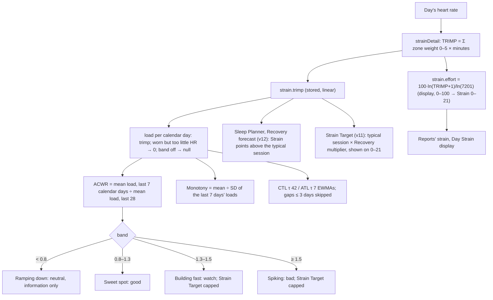

# Training load: ratio, monotony, fitness / fatigue / form

Code:
- `src/core/scoring/readiness.ts` (ACWR, monotony)
- `src/core/scoring/trainingLoad.ts` (CTL / ATL / TSB)
- `src/core/scoring/strain.ts` (`strainDetail`, the daily TRIMP)
- `src/server/pipeline/scores.ts` (`scoreTrainingLoad`)

Tests: `readiness.test.ts`, `trainingLoad.test.ts`, `strain.test.ts`, and `pipeline.test.ts` ("scale contracts").

Training load answers three questions about your heart-rate load:
- **Training balance (ACWR):** is this week's load above or below what you are used to?
- **Monotony:** is every day the same?
- **Fitness, fatigue and form (CTL / ATL / TSB):** long-term load, short-term load, and the gap between them.

Since `SCORING_VERSION` 10, all three run on each day's **linear load (TRIMP)**, not on the 0–100 Effort behind the
0–21 Strain. § Why explains the change.

## Flow

## Which load each feature uses

| Feature | Input | Why |
|---|---|---|
| ACWR, `acwrPrior`, monotony | TRIMP | They are ratios of load. On a log scale every change shrinks (§ Why). |
| CTL / ATL / TSB | TRIMP | Banister's model is defined on linear load |
| Strain Target | TRIMP (since v11), displayed on 0–21 | Its typical session and multipliers are in load; see [strain-target](strain-target.md) |
| Sleep Planner extra need | TRIMP vs the typical session (since v12), in Strain points | 3 min per point above your session, up to 30; see [sleep-planner](sleep-planner.md) |
| Recovery forecast | TRIMP vs the typical session (since v12), in Strain points | −3 per point above your session, never positive; see [recovery-forecast](recovery-forecast.md) |
| Reports' "avg strain", Day Strain | Effort → 0–21 | Display |

## Formula

**Daily load.**
- `strainDetail()` returns `{ effort, trimp }`. `trimp` is the TRIMP whose log map is Effort: Edwards zone-minutes,
  or Banister above its resting floor.
- Stage 1 stores it as `daily_scores.strain.trimp`. It is null exactly when Effort is null.
- Stage 2 feeds one row per calendar day: `load = trimp`; `0` when the band was worn but there was too little heart
  rate for Effort (a measured rest day); `null` when the band was off (`hrCount` 0).
- **"Worn" means any heart-rate sample in the calendar day** (`hrCount > 0`, `scores.ts`), sleep included. So:
  - a day worn only in bed (the night's samples after midnight) is a **measured rest day**: its load is its small
    TRIMP or 0, not null, although the day's activity was never seen;
  - a day worn for an hour is the same.

  This pulls acute and chronic loads down for people who take the band off by day, and makes their ACWR swing.
  A wear threshold is not applied here (Pulse Age uses ≥ 600 awake minutes, `healthspanWornAwakeMin`).
- **Today's row is the load so far.** The pipeline scores today while it is still going, so this morning's row
  holds only the hours since midnight, usually close to 0. Acute load, ACWR, form and readiness read lower in the
  morning than they will that evening.

**ACWR** (coupled, Gabbett's form), evaluated on `today`:

    acute   = mean load over the days with a load among the 7 calendar days ending today
    chronic = mean load over the days with a load among the 28 calendar days ending today
    ACWR    = acute / chronic           (needs ≥ 4 loads in the 7, ≥ 14 in the 28, and chronic ≥ 30)

**A light load** (*since version 27*, `acwrChronicFloor = 30` TRIMP a day): when chronic is under 30,
- if acute ÷ 30 ≥ 1.3, ACWR = acute ÷ 30. That is a jump that is large in absolute terms, banded as usual (building
  fast or spiking), and the signal's evidence carries `floor: 30`;
- otherwise ACWR is **null** and `lightLoad` is true. There is no band, no readiness signal, and no Strain Target cap.
  Fitness and Reports show "Light load: too little training load to compare weeks".

- Rows after `today` are ignored.
- Before version 10 the windows were "the last 7 / 28 rows with a value", so unworn days pulled in older days.
- With all 28 days observed and k times your usual load this week, ACWR = 4k / (k + 3). For example, 2× reads
  **1.60** and 3× reads 2.00.

**Bands** (`acwrBand`, unchanged edges):

| ACWR | Band | Readiness flag | Strain Target | Words (Fitness / Reports) |
|---|---|---|---|---|
| < 0.80 | `LOAD_RAMPING_DOWN` | **neutral** (was watch) | **no change** (was +10 %) | Detraining / Undertrained |
| 0.80–1.29 | `LOAD_SWEET_SPOT` | good | no change | Optimal / Balanced |
| 1.30–1.49 | `LOAD_BUILDING_FAST` | watch | upper bound capped at the base (above 1.3) | Pushing / Overreaching |
| ≥ 1.50 | `LOAD_SPIKING` | bad | capped | High risk / Overreaching |

**Monotony** (Foster):

    monotony = acute mean / sample SD of the loads in the 7 days     (same gates as ACWR)

- At ≥ 2.0 it adds a "watch".
- An SD at or below 1e-9 × max(1, mean) counts as zero, so there is no monotony. Before, identical days left an SD of
  about 1e-14 from rounding, and the value came out around 3 × 10¹⁵.

**Fitness / fatigue / form** (`trainingLoad.evaluate`):

    CTL ← CTL + (1 − e^(−1/42)) × (load − CTL)
    ATL ← ATL + (1 − e^(−1/7))  × (load − ATL)
    TSB = CTL − ATL

- Both are seeded with the mean of the first 7 loads of the run.
- **The run** walks back from today day by day. A day with no load (missing row or null) is a **gap**: no point and no
  EWMA step. The run ends only after more than `maxGapDays` = 3 gap days in a row.
- `contiguousDays` is the number of days with a load in the run. The state is `building` from 14 days and
  `established` from 42.
- Before version 10, any single gap ended the run. That threw away all history and blanked the chart for 14 days.
- Values are now in TRIMP units. On the seed, CTL runs from about 50 to 110.

## Why

### The problem (verified on version 9)

- **Effort is a log map of TRIMP.** It is `100·ln(TRIMP+1)/ln(7201)`, chosen so the 0–21 Strain feels like WHOOP's.
  It works for display, but a ratio of logs is not a ratio of loads.
- **Example:** with a usual week of 4 workouts at 118 TRIMP and 3 rest days at 9 (seed-typical: Effort 53.8 / 25.9):

| This week | ACWR on Effort (v9) | ACWR on TRIMP (v10) | Monotony on Effort (v9) | Monotony on TRIMP (v10) |
|---|---|---|---|---|
| Usual | 1.00 | 1.00 | **2.81** (watch) | 1.22 |
| Workouts 1.5× | 1.05 | 1.32 | 2.56 | 1.17 |
| Workouts 2× | 1.08 | 1.57 | 2.43 | 1.14 |
| Workouts 3× | **1.12** (sweet spot) | **1.96** (spiking) | 2.28 | 1.12 |
| Everything 2× | 1.13 | **1.60** | 3.25 | 1.22 |
| No rest days, usual sessions | 1.20 | 1.42 (building fast) | — | — |

- Rest days and workout days look alike on Effort (26 vs 54), so the week's SD is small and monotony is high every
  week.
- A real spike barely moves the ratio.

### On the 180-day demo database

The seed's 3-week training block runs 2026-05-25 to 06-14.

| | v9 (Effort) | v10 (TRIMP) |
|---|---|---|
| ACWR days: sweet / ramping down / building fast / spiking | 141 / 20 / 6 / **0** | 91 / 46 / 14 / **16** |
| Peak ACWR (in the training block) | 1.35 | 1.98 |
| Days with monotony ≥ 2 | **147 / 167** | 17 / 167 (mostly the block's no-rest weeks) |
| Days fitness / fatigue / form unavailable | 27 (the first 13, plus 14 after one band-off day on 2026-09-09) | 13 (the first 13 only) |
| Strain Target capped / lifted | ratio above 1.3 on 6 days / below 0.8 on 20 | capped 30 / lifted 0 |

Recovery, Effort, Sleep, Energy Bank, Stress and the Health Monitor are unchanged (the golden and parity tests).

### Decisions

1. **Coupled 7/28, not "last 7 ÷ the 3 weeks before".**
   - With all 28 days observed, the uncoupled ratio U and the coupled C are tied exactly: U = 3C / (4 − C).
   - So uncoupled with edges 0.75 / 1.44 / 1.80 puts every day in the same band as coupled with 0.8 / 1.3 / 1.5. They
     differ only in the number shown (2× load: 1.60 vs 2.00) and when data is missing.
   - Coupled keeps the published edges, the Fitness gauge (0.5–2.0) and the copy.
   - The literature's objection to coupling (Lolli 2019: spurious correlation with injury) is about injury studies,
     not about banding a day.
2. **Ramping down is information only.**
   - On linear load a ratio under 0.8 is every deload, illness or holiday week: 46 of 153 seed days.
   - As a "watch" it would nag on 30 % of days.
   - Strain Target's +10 % lift would push harder right after illness.
   - The band and its words stay. The high side is unchanged.
3. **Fitness carried across short gaps.** A missing day is unknown, not a rest day: it neither adds load nor decays
   it. Three days covers a weekend without the band; longer gaps restart, since the averages would be stale.

## Why version 27: a light load has no ratio

**The problem.** ACWR's only guard was chronic > 0. For someone whose days are nearly all rest, acute ÷ chronic is
the ratio of two near-zero means, so it is noise:
- after weeks of rest-level days (about 3 TRIMP), one 40-TRIMP walk read **spiking** for 30 of 30 simulated people,
  and readiness turned "strained";
- steady sedentary days read building fast or spiking 13 % of the time.

**How it was tested.** 30 simulated people per case through the real `evaluate`; the prototype's "version 26" mode
matched it on every day. Daily TRIMP is log-normal: rest days around 4, walks and sessions as named.

**A floor in the denominator** (acute ÷ max(chronic, F)) stops the false spikes, but moves every low-load person into
"ramping down", which the app shows as "Undertrained: your load dropped below your usual". At F = 30, that was 98.6 %
of a 2 × 50 light trainer's days and 84 % of an older daily walker's. Rejected.

**No band at all under F** misses real spikes: a sedentary person who starts running 5 days a week read nothing 40 %
of the time at F = 30. Rejected.

**The chosen hybrid.** No ratio under F, unless acute ÷ F is itself a jump. Shares of days:

| Case | Version 26: spiking / building | F = 20 | **F = 30** | F = 40 |
|---|---|---|---|---|
| Weeks of rest, one 40-TRIMP walk | 100 / 0 | light | **light** | light |
| Steady sedentary (an occasional 15-TRIMP walk) | 4.2 / 8.5 (and 23 % ramping down) | light | **light** | light |
| Older adult's daily walk (about 25) | 2.2 / 9.0 | 0.8 / 5.2, 67 % light | **light** | light |
| Light trainer, 2 × 50 a week | 0 / 1.7 | 96 % light | **light** | light |
| Sedentary starts walking 40 a day | 98.6 / 1.0 | 67.1 / 4.8 | **8.1 / 31.0** | 0 / 0.2 |
| Sedentary starts running 5 × 120 a week | 100 spiking | 100 | **100** | 100 |
| Light 2 × 50 → 5 × 100; regular 3 × 100 → 6 × 150 | 89 / 84 spiking | unchanged | **unchanged** | about unchanged |
| Moderate 3 × 80 (chronic about 36) | 95 % sweet spot | unchanged | **unchanged** | 90 % light |
| Regular 4 × 118 | 98 % sweet spot | unchanged | **unchanged** | unchanged |

**Why F = 30:**
- 20 still calls a new daily walk "spiking" two-thirds of the time.
- 40 hides a moderate 3-sessions-a-week trainer.
- 30 TRIMP a day is about 3.5 h a week of easy walking, under the guideline 150 min of moderate activity. Below it
  a load *ratio* says little; the absolute load matters more.

The sedentary walker who starts 40 a day is a real 10× jump, so "building fast" (and on the heaviest weeks
"spiking") is fair there.

**On the seed** the chronic load is 44–155 a day, so nothing changes. Only the new `lightLoad` field (false) is
added to `training_load` and the reports.

## Constants

| Constant | Value | Kind |
|---|---|---|
| `acuteWindow` / `chronicWindow` | 7 / 28 calendar days | noop (calendar days: Pulse, v10) |
| `minAcute` / `minChronic` | 4 / 14 days with a load | Pulse v10 / noop |
| ACWR band edges | 0.8 / 1.3 / 1.5 | Gabbett 2016 (team-sport injury data, a rule of thumb) |
| `monotonyWatch` | 2.0 | Foster 1998 |
| `monotonySdEpsilon` | 1e-9 (relative) | Pulse v10 |
| CTL / ATL τ | 42 / 7 days | TrainingPeaks / Coggan convention |
| `primeDays` / `minimumDays` / `establishedDays` | 7 / 14 / 42 | noop |
| `maxGapDays` | 3 | Pulse v10 (noop: 0) |
| Strain Target `acwrCapAbove` | 1.3 | spec (the lift below 0.8 is removed; since v11 a cap holds the top at your typical session) |

## Worked examples (each is a test)

1. **Twice the usual load for a week.** Three usual weeks, then every day doubled: ACWR = (2 × 71.3) / ((3 × 71.3 +
   2 × 71.3) / 4) = **1.60**, spiking. On Effort it read 1.13, the sweet spot.
2. **An unworn day inside the week.** 21 days at 100, then a week at 10 with one day off:
   - acute = 10, the mean of the 6 worn days. By rows it would have reached back to a 100.
   - chronic = (2100 + 60) / 27 = 80.0.
   - ACWR = 0.125: ramping down, neutral.
3. **One band-off day** (seed day 156). `contiguousDays` on day 156 equals day 155's, and day 158's is two more. The
   state stays `established`. Before, it dropped to 0 and was unavailable for 14 days.

## Edge rules

- Fewer than 4 loads in the last 7 days, or fewer than 14 in the last 28: no ratio and no monotony.
- A chronic mean of 0 (four weeks of measured rest): no ratio, and since version 27 it is a light load (`lightLoad`).
- Rows after `today` never count.
- A gap at the target day itself is carried: the result ends on the last day with a load.
- A config without `maxGapDays` behaves as noop (any gap restarts). An invalid value fails closed
  (`INVALID_CONFIGURATION`).

## Sources

- Gabbett TJ. The training-injury prevention paradox. *Br J Sports Med* 2016 (the ACWR edges).
- Lolli L, et al. Mathematical coupling causes spurious correlation within the conventional ACWR. *Br J Sports Med*
  2019.
- Foster C. Monitoring training in athletes with reference to overtraining syndrome. *Med Sci Sports Exerc* 1998
  (monotony).
- Banister EW, Calvert TW. The impulse–response model; Coggan / TrainingPeaks for the 42 / 7-day constants.
- Edwards S. *The Heart Rate Monitor Book*, 1993 (zone-weighted TRIMP).
- noop (`ryanbr/noop`): `ReadinessEngine.kt`, `TrainingLoadEngine.kt`, ported with the version 10 changes above.
