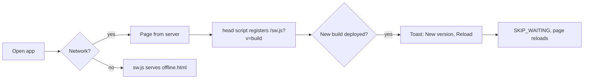
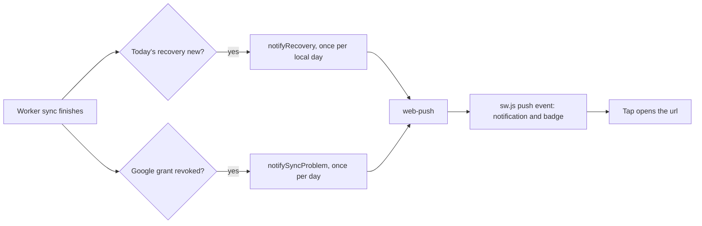
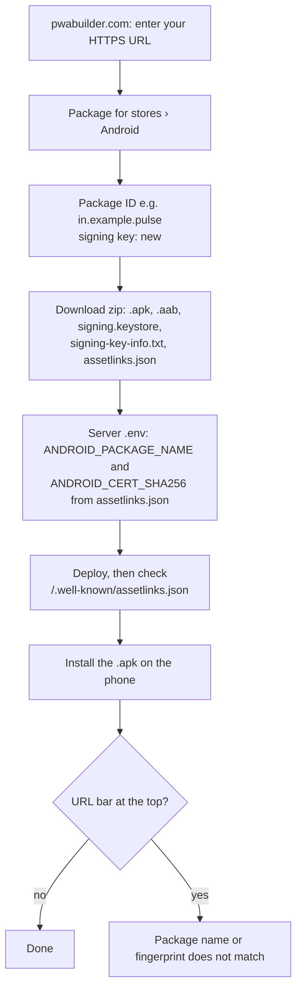

# Pulse as an installed app (PWA)

Pulse installs as an app from the browser: on Android (Chrome) and iPhone/iPad (Safari, Add to Home Screen), and on
desktop. It can also be wrapped into an Android APK with PWABuilder. This guide covers what makes that work, how to
configure and rebrand it for your fork, how to test it, and what each platform will not do.

## What is in it

| Piece | Where | Notes |
|---|---|---|
| Manifest | `src/app/manifest.ts` | Name, `id`, scope, portrait, `dir`, `display_override`, shortcuts (Check in, Recovery, Sleep), screenshots, `launch_handler`. Open to signed-out visitors, so install works from `/login`. |
| App icons | `public/icons/icon-*.png`, `icon-maskable-*.png` | The mark only. `any` for browsers and desktop; `maskable` keeps the mark inside the 80% safe zone and is what Android uses for the home-screen icon **and** its launch screen. |
| Shortcut icons | `public/icons/shortcut-*.png` | Glyphs in deep brand tones on transparent: Android draws them on its own grey disc. |
| iOS launch screens | `public/splash/`, `src/app/launch-screens.json` | 92 images: every iPhone and iPad, portrait and landscape, light and dark, with the mark and the PULSE wordmark. Linked from `src/app/layout.tsx`. |
| Service worker | `public/sw.js` | Caches only `/_next/static/*` and `/offline.html`, never pages or health data. Shows the offline page when the network is gone. Receives Web Push. |
| Registration | `src/lib/sw.ts` (head script), `src/components/pwa/PwaRuntime.tsx` | Production builds only. The `<head>` script registers `/sw.js?v=<build id>` on load; `PwaRuntime` watches it for updates ("New version available · Reload"), shows the offline toast, and turns a stale-build Server Action error into a reload prompt. |
| App lifecycle | `src/components/shells/AppLifecycle.tsx` | Signed-in screens: refresh after 5 min in the background, clear the app badge, send queued check-ins, pull down to sync. |
| Offline check-ins | `src/lib/offline-queue.ts` | Check-in answers saved offline stay in `localStorage` and are sent when the connection returns. |
| Install and notifications UI | Settings › App (`src/app/(app)/settings/AppSettings.tsx`), `src/lib/install.ts`, `src/lib/push-client.ts` | Install button where the browser offers one, the Share › Add to Home Screen steps on iOS, the notifications switch. |
| Push backend | `src/server/push.ts`, `src/app/push/route.ts` | "Recovery ready" once per local day, "Pulse can't sync" once per day when the Google grant is revoked. |
| Android app link | `src/app/.well-known/assetlinks.json/route.ts` | Digital Asset Links for an APK (see [Android APK](#android-apk-with-pwabuilder)). 404 until configured. |
| Touch details | `src/lib/haptics.ts`, `src/hooks/use-online.ts`, `src/components/ui/chart.tsx` | Haptics on key taps, online state, chart tooltips that let go after a touch. |





## Configure

All optional. Everything else works with no configuration.

| Variable | What it turns on |
|---|---|
| `APP_URL=https://…` | Required in practice: install, the service worker and push need HTTPS (or `localhost`). |
| `VAPID_PUBLIC_KEY`, `VAPID_PRIVATE_KEY`, `VAPID_SUBJECT` | Notifications. Make the keys once with `npx web-push generate-vapid-keys`; the subject is `mailto:you@example.com`. Set all three or none. Changing the keys drops every existing subscription. Without them the switch in Settings is hidden. |
| `ANDROID_PACKAGE_NAME`, `ANDROID_CERT_SHA256` | Serves `/.well-known/assetlinks.json` for your APK. Set both or neither. |

## Rebrand it for your fork

Every asset is generated from a few sources, so a fork changes those and regenerates.

1. **Name and colours.** `src/app/manifest.ts` (`name`, `short_name`, `description`, `background_color`,
   `theme_color`) and `metadata` / `viewport` in `src/app/layout.tsx`. Keep the name short: Android prints it on its
   launch screen in the system font.
2. **Mark.** `src/app/icon.svg` is the favicon. The PNG icons draw the same two pills from coordinates in
   `scripts/gen-pwa-assets.py` (`mark()`), so change both together.
3. **Launch screen lockup.** `scripts/pwa/lockup-light.svg` and `lockup-dark.svg`: the mark over the wordmark, one
   per colour scheme.
4. **Shortcut glyphs.** `scripts/shortcuts/*.svg` (lucide icons) and their colours in `scripts/gen-pwa-assets.py`.
5. **Regenerate:** `pnpm pwa:assets`. It runs `scripts/gen-pwa-assets.py` (icons; needs Python with Pillow and
   `rsvg-convert` from `brew install librsvg`) and `scripts/gen-ios-splash.mjs` (iOS launch screens via
   [pwa-asset-generator](https://github.com/elegantapp/pwa-asset-generator) through `pnpm dlx`; it downloads a
   headless Chrome the first time).
6. **Bump `V`** in `src/app/manifest.ts`. Android and its install service cache icons by URL, so a new picture
   needs a new `?v=`.
7. **Screenshots.** `public/screenshots/*.webp` (shown in Chrome's install sheet) come from `docs/screenshots/`.
   Their declared `sizes` in the manifest must match the files.

## Test it

The service worker, the update toast and the offline page run only in a production build:

```sh
pnpm build && pnpm start   # http://localhost:3000
```

`pnpm dev` covers everything else (manifest, install UI, launch screens, layout).

**On a phone.** A plain `http://192.168.x.x` address is not a secure origin, so Chrome refuses to install
("This app cannot be installed") and there is no service worker or push. Use one of:

- **Chrome flag** (Android): `chrome://flags/#unsafely-treat-insecure-origin-as-secure`, add `http://<your-ip>:3000`,
  enable and relaunch.
- **USB:** `adb reverse tcp:3000 tcp:3000`, then open `http://localhost:3000` on the phone.
- **Tunnel:** `cloudflared tunnel --url http://localhost:3000` gives an HTTPS URL (push works there too). Add its host
  to `DEV_ORIGINS` for the dev server.

**Simulators.**

- iOS Simulator: Safari can open `http://localhost:3000` directly. Add to Home Screen with "Open as Web App" on.
- Android Emulator: an image without the Play Store cannot make a real WebAPK. The app installs as a Chrome
  shortcut (a Chrome badge on the icon) with no shortcuts and the old-style splash, so test those on a real phone.

**After changing an icon or launch screen,** delete the installed app and add it again. iOS stores the launch
screen when the app is added (including which colour scheme), and Android bakes icons and shortcuts in at
install.

**Automated tests:**

- `src/app/manifest.test.ts`: the manifest's shape, and that every icon, shortcut icon and screenshot exists.
- `src/lib/offline-queue.test.ts`, `src/server/push.test.ts`, `src/server/config.test.ts`.
- `e2e/pwa.spec.ts`: everything is served without a session, the 92 launch screen links. The offline-page test runs
  only against a production build (`E2E_PROD=1 pnpm e2e`).
- [PWABuilder's report card](https://www.pwabuilder.com/reportcard) is a good outside check of a deployed site.

## Android APK with PWABuilder

PWABuilder wraps the site in a Trusted Web Activity: an Android app that opens your Pulse full screen in Chrome.
The web app inside is the same deployed site, so code changes reach the APK with every deploy. Only a change to the
manifest, the icons or the package needs a new APK.



1. Deploy the site with HTTPS, then open `https://www.pwabuilder.com`, enter its URL and choose **Package for
   stores › Android**.
2. Pick a package ID (reverse domain, e.g. `in.example.pulse`). Let PWABuilder create a new signing key.
3. Download the zip. It holds the `.apk` (install directly), the `.aab` (only for Google Play), the
   `signing.keystore` with its passwords in `signing-key-info.txt`, and an `assetlinks.json`.
4. In the server's `.env`, set:

   ```sh
   ANDROID_PACKAGE_NAME=in.example.pulse
   ANDROID_CERT_SHA256=AB:CD:...   # sha256_cert_fingerprints from the zip's assetlinks.json; comma-separate several
   ```

   Deploy, then check that `https://<your-host>/.well-known/assetlinks.json` shows them.
5. Copy the `.apk` to the phone and open it (allow installs from that source). Uninstall the browser-installed PWA
   first, or you will have two icons.
6. **Keep `signing.keystore` and its passwords safe and out of the repo.** An update to the APK must be signed with
   the same key. If the key is lost, users must uninstall and reinstall.

If the app opens with a URL bar, Android could not verify the link. The package name or the fingerprint does not
match what the server serves, or the server is not serving it yet. Google Play re-signs apps, so a Play build adds
Play's app signing fingerprint to `ANDROID_CERT_SHA256` as well.

## What each platform does

| | Android (Chrome) | iPhone / iPad (Safari) |
|---|---|---|
| Install | Install prompt; Settings › App has the button | Share › Add to Home Screen ("Open as Web App" on) |
| Launch screen | Built from the maskable icon and `background_color`; no text | `public/splash` image for the exact device, in the system colour scheme at the time it was added |
| Long-press shortcuts | Yes (manifest `shortcuts`) | No: Safari ignores them; the menu offers only Edit Home Screen, Share and Delete |
| Push notifications | Yes | Only from the Home Screen app, iOS 16.4+ |
| App badge | Yes | Yes |
| Offline page | Yes | Yes |

## Decisions and dead ends

- **No route cross-fade.** React View Transitions snapshot the page, and the glass nav and headers
  (`backdrop-filter`) flickered on every route change. A cross-fade would need every sticky and glass element
  named separately.
- **Icons carry no name.** On Android 12+ the launch screen is the home-screen icon, so a name on the launch screen
  means a name on the home screen too.
- **Pages and data are never cached** by the service worker: they are private, and a shared cache would show stale
  scores.
- **Coach actions live in the header.** A sticky in-page toolbar's resting position depended on the banners above it.

## Troubleshooting

- **Hydration mismatch in dev after many edits:** the dev server is serving stale compiled code. Restart
  `pnpm dev` (delete `.next` if it persists).
- **"Failed to fetch RSC payload … Load failed":** a request was cut off (a full reload, or the network resuming
  after the app was in the background). Next falls back to a full navigation; nothing is lost.
- **New icon or launch screen not showing:** reinstall the app, and check that `V` in `manifest.ts` was bumped.
- **`scripts/deploy.sh` says "nothing to do":** the checkout is already at `origin/main`; pass `--force` to rebuild.
