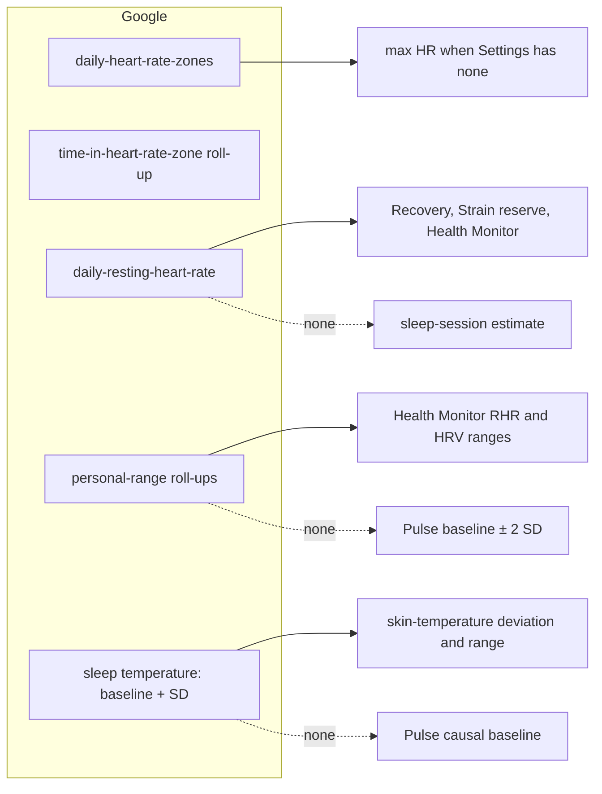

# Google's numbers vs Pulse's own algorithms

Rule (owner, 2026-10-03): where the Google Health API already gives a value, Pulse uses it instead of computing its own. Pulse computes only what Google does not expose. This audit maps every number Pulse computes against the API ([data types](https://developers.google.com/health/data-types), [data points](https://developers.google.com/health/reference/rest/v4/users.dataTypes.dataPoints), [daily roll-ups](https://developers.google.com/health/reference/rest/v4/users.dataTypes.dataPoints/dailyRollUp)), read 2026-10-03.

## Not in the API (Pulse must compute these)

The Fitbit / Google Health app shows several scores that the API does not expose as data types. None of the 44 data types, and none of the roll-up values, carry them:

| Fitbit app score | Pulse's own | Why Pulse computes it |
|---|---|---|
| Cardio Load, Target Load | Strain, Strain Target, Training load (ACWR) | No `cardio-load` type. Pulse derives load from heart-rate samples |
| Daily Readiness | Recovery | No readiness type |
| Sleep Score | Sleep performance, sleep need, Sleep Planner | `sleep` gives sessions and stages, not a score |
| Stress Management Score (EDA) | Stress Monitor | No stress or EDA type; Pulse's stress is HR-based |
| (none) | Energy Bank, Pulse Age, Sleep regularity (SRI), HR recovery, Behaviour Insights, Fitness level percentile | No Google equivalent |

## Google gives it: switch to Google's

Status as of 2026-10-03 (`SCORING_VERSION` 6). "Done" means implemented and exercised by the demo seed and tests; every row still needs a real account to confirm Google's shapes (see the end).

| Pulse computed | Google provides | Change | Status |
|---|---|---|---|
| HR zones from % of an estimated max HR (Tanaka 208 − 0.7 × age), `src/core/scoring/zones.ts` | `daily-heart-rate-zones`: the user's Karvonen zones per day (LIGHT, MODERATE, VIGOROUS, PEAK, each min/max bpm) | Use Google's zone bounds per day for time-in-zone, zone charts and per-activity zones; fall back to Pulse's only on days without a Google record | **Reversed 2026-10-05.** Zones are Pulse's five on heart-rate reserve (resting + 50/60/70/80/90% of max − resting), the same as Strain, for one system across the app. Google's bounds are still synced but not used for zones |
| Max HR estimate when the user set none | PEAK zone's upper bound in `daily-heart-rate-zones` | Use it as max HR when the profile has none (user's own still wins) | **Reversed 2026-10-05.** Real accounts show a flat 220 at the top of PEAK (and 30 at the bottom of LIGHT) for every user, so it is not a measurement. Max HR is the user's own, else Tanaka (`SCORING_VERSION` 8) |
| Zones 1–3 and 4–5 minutes for Pulse Age, from HR samples | `time-in-heart-rate-zone` roll-up (duration per zone type per day) | Zones 1–3 = LIGHT + MODERATE, 4–5 = VIGOROUS + PEAK, from Google's roll-up | **Reversed 2026-10-05.** Pulse Age and Strain's zone rows read Pulse's own time in zones 1–3 and 4–5. The roll-up is still synced (the AZM metric page shows it) |
| Skin-temperature deviation against Pulse's own causal baseline | `daily-sleep-temperature-derivations.baselineTemperatureCelsius` (30-day median) and `relativeNightlyStddev30dCelsius` | Deviation = nightly − Google's baseline; the Health Monitor range from Google's 30-day SD | **Done.** Stored as `temp_baseline_c` / `temp_sd_c`. Recovery, the illness signal and Health Monitor use nightly − Google's baseline; the range is ± 2 × Google's SD (no floor), and Recovery's skin-temperature band uses the same SD. Pulse's baseline stays as the fallback for a night without Google's |
| Health Monitor ranges for resting HR and HRV (own baseline ± 2 SD over 60 nights) | Daily roll-up `restingHeartRatePersonalRange` and `heartRateVariabilityPersonalRange` (min/max) | Use Google's personal ranges for those two vitals; respiratory rate and SpO2 keep Pulse's (no Google range) | **Done, unconfirmed.** The `dailyRollUp` reference says these values are "returned by default when rolling up data points from the `daily-resting-heart-rate` [`daily-heart-rate-variability`] data type", so Pulse rolls up those two types (jobs `rhr-personal-range`, `hrv-personal-range`, ranges of 14 days) into `rhr_range_*` / `hrv_range_*`. The data types table lists only `list` for them, so Google may refuse: then the job's error shows under Settings › Personal ranges (optional, never turns the sync dot red) and Pulse's own range stays |
| Recovery's resting HR from Pulse's sleep-session estimate (`sessionRestingHR`), daily RHR as fallback | `daily-resting-heart-rate` | Daily RHR first, the session estimate only on days Google has none | **Done**, for Strain's heart-rate reserve too (`restingHrSource: "daily"`), Health Monitor and My Dashboard |
| Calories, steps, distance, active minutes, AZM, VO2max, HRV, respiratory rate, SpO2, sleep stages | Already Google's | No change | No change |

Recovery, Strain, Sleep performance and the other scores stay Pulse's own, but their inputs come from Google wherever a row above applies. Each switch changes stored scores, so it bumped `SCORING_VERSION` to 6.

## Open points

- Google's Karvonen zones need the user's resting HR and max HR that Fitbit holds. A user who sets max HR in Pulse Settings may disagree with Fitbit's. Rule: the Pulse profile's explicit max HR wins over Google's; otherwise Google's.
- `time-in-heart-rate-zone` covers all day. Pulse's per-activity zone time still needs HR samples, but uses Google's zone bounds.
- The personal-range roll-ups appear in `DailyRollupDataPoint`, and its field docs name the path: a `dailyRollUp` on `daily-resting-heart-rate` / `daily-heart-rate-variability` (or the rollup type identifiers `resting-heart-rate-personal-range` / `heart-rate-variability-personal-range`). Not on `heart-rate`, which returns `heartRate`. The data types table still lists only `list` for those two types, so this is unconfirmed until a real account syncs.
- Causality: Google's skin-temperature baseline (a 30-night median) and its personal ranges may include the night itself. They arrive with that day's record, so a day's scores still depend only on that day and earlier days.

## Needs a real account to confirm

- `daily-heart-rate-zones`, `time-in-heart-rate-zone` and the personal-range values are mapped from the reference pages only (fixtures in `src/server/sources/google/__fixtures__` are shaped from them, not recorded).
- Whether PEAK's `maxBeatsPerMinute` is the max HR Fitbit uses, and whether a zones record arrives every day.
- Whether `dailyRollUp` answers on the two daily types with ranges, and over what window a day's range is computed.
- Whether a day with no zone time is omitted from the `time-in-heart-rate-zone` roll-up or comes with an empty list (both read as "no Google value", and Pulse's own count fills in).
- Strain itself (a TRIMP-style sum over HR reserve) stays Pulse's; only its zone bounds and max HR come from Google.
